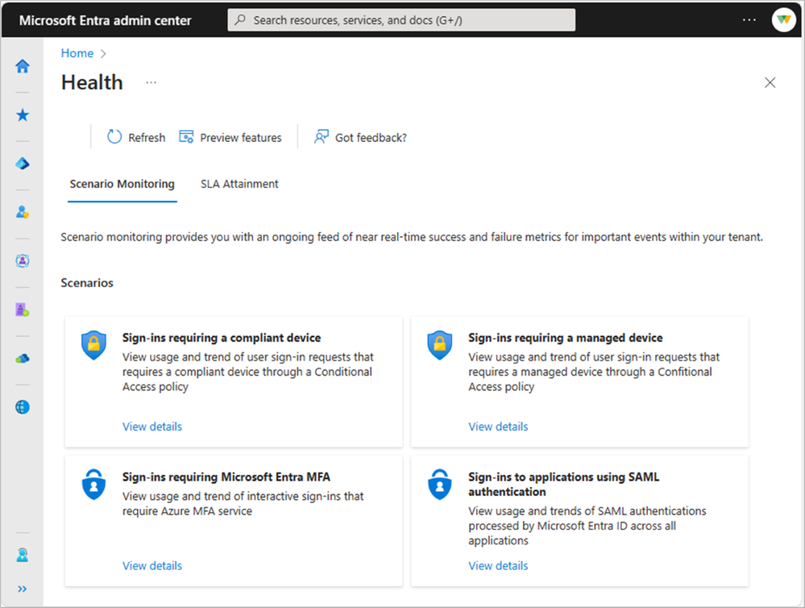
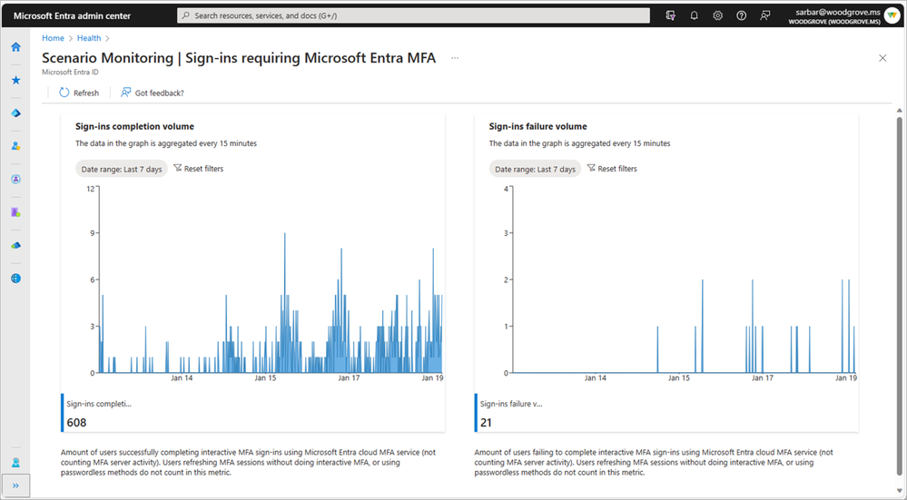

# テナントの正常性の透明性と監視

こんにちは、Azure Identity サポート チームの 名取 です。

本記事は、2024 年 5 月 8 日に米国の Microsoft Entra Blog で公開された [Tenant health transparency and observability](https://techcommunity.microsoft.com/t5/microsoft-entra-blog/tenant-health-transparency-and-observability/ba-p/4127612) を意訳したものになります。ご不明点等ございましたらサポート チームまでお問い合わせください。

----

今までの回復性に関するブログ記事では、[地域ごとに分離された認証エンドポイント](https://jpazureid.github.io/blog/azure-active-directory/microsoft-entra-resilience-update-workload-identity-authentication/)に関する最新のアップデートや、昨年の業界初の[バックアップ認証サービス](https://jpazureid.github.io/blog/azure-active-directory/advances-in-azure-ad-resilience/)に関する発表など、継続的に耐障害性と信頼性に関する改善に努め、最新の情報をお伝えしてきました。このような、水面下でのイノベーションにより、毎月世界全体で安定した非常に高い可用性の提供を実現しております。

この記事では、Microsoft Entra がどのようにして可用性と耐障害性を確保しているかをお客様にもお分かりいただけるよう、概要をお話ししてまいりたいと思います。これは、障害が発生した際に弊社が説明責任を果たせるようにするためというだけでなく、お客様のテナントにてどのようなアクションを取ることで正常性を高めていけるのかということを、よりよく理解するためでもあります。グローバル レベルでは、過去の可用性を [SLA レポート](https://learn.microsoft.com/ja-jp/entra/identity/monitoring-health/reference-sla-performance)で確認することが可能です。認証の可用性が、お約束している 99.99% ([2021年春に開始](https://techcommunity.microsoft.com/t5/microsoft-entra-blog/99-99-uptime-for-azure-active-directory/ba-p/1999628)) を大きく上回り、ほとんどの月で 99.999% に到達しています。しかし、各テナントのレベルで可用性を確認しなければ、説得力も実効性もありません。自社テナントのアプリやデバイスを使うユーザーに対する稼働時間はどうなのか？サインインの数が急増したときに自社のテナントはきちんとそれに対応できているのか？というのが大事なポイントなのです。

お客様からは、クラウドに移行した際の耐障害性について詳細情報を知りたいというお話をいただきます。オンプレミスの世界では、ID の正常性の監視はそのオンプレミス環境内で、完全にお客様の管理下で行われます。運用における障害検知などはすべてその企業の IT 部門の内部で行われていました。現在のように外部のクラウドベースの ID サービスを使い、さらに外部との依存関係が複数あるような環境では、オンプレミスの世界と同じか、もしくはそれ以上の透明性を実現する必要があると弊社では考えています。

各ユーザーがセキュリティを損なうことなくシームレスで持続的なアクセスを維持できるよう、IT 部門と開発者の皆様が懸命に取り組んでくださっていると思います。侵入やリスクを阻止しながら、ユーザーへの負担を最小限にしつつ、適切なユーザーにアクセスを許可するということは、テナントを運営していくために非常に重要なことです。お客様が Microsoft の ID サービスを使用する際には、サービス低下が発生した際には弊社がそれを検知し、その事象から学びを得て、継続的にサービスを改善していくという責任ある対応を期待されるはずです。また、人間に頼ったやり取りでは限界があることも認識しています。

このような課題に対応するため、当社はきめ細かな監視と自動化を取り入れるよう努めています。複雑なシステムでは、どれほど耐障害性を高めても予期せぬことが起こりえるという前提を弊社では取り入れています。耐障害性だけでなく、インシデントを検出し、効果的に対応し改善しながら、お客様も同様の対応ができるように支援する必要があります。このアプローチの例としては、テナント内の正常性モニタリング機能の展開に加え、迅速なインシデント検出と通知のための投資という二つが挙げられます。

まずは、Premium ライセンスを持つテナントの自動正常性モニタリングから始めたいと思います。テナント レベルの正常性監視により、お客様は認証とアクセスに関するユーザー体験の品質をお客様自身で確認することができます。また、Microsoft Entra 管理センターまたは MS Graph API を利用することで、テナント管理者が調査や障害の影響を減らすための行動をとれるようになります。

Premium ライセンスをお持ちのお客様が主要な認証シナリオを監視できるよう [予め正常性メトリクスを計算しておき](https://learn.microsoft.com/ja-jp/entra/identity/monitoring-health/concept-microsoft-entra-health)、それを複数まとめたものをお客様に提示するという取り組みがその一つです。これは、テナントの正常性とサービスの耐障害性に関して透明性を高めていくという投資として最初に取り組んだものになります。これらの新しい正常性メトリクスは、アクティビティ ログから関連するシグナルを抽出し、特定の注目すべきシナリオに関してまとめた情報を 15 分ごとに極力遅延なく提供するというものです。 

正常性のメトリクスは、その粒度が細かく、さらにシナリオに特化したものであるため、2023 年にリリースされた [月次テナントレベルの SLA レポート よりも、一歩踏み込んだものといえます](https://techcommunity.microsoft.com/t5/microsoft-entra-blog/increasing-transparency-into-azure-active-directory-s-resilience/ba-p/2147047)。正常性メトリクスは、当社がこれまで提供し、改善を続けてきたアクティビティ ログ データを補完するものでもあります。サインイン ログでは、特定のサインイン方法を抜き出して、成功と失敗の増加を監視するなど、お客様にて独自の計算メトリクスを構築して監視することが可能です。弊社が予め計算しておくメトリクスを使用すれば、お客様は Microsoft が定義した正常性の指標をすぐに活用でき、当社が大規模に開発している機能を活用しながら、アクティビティ ログに対してより深い調査を行うことができるようになります。全体像を把握するために、両方のオプションを利用することをお勧めします。

最初のパブリック プレビュー提供中に、高可用性の維持に関連して、以下の正常性メトリクスをリリースいたします:

・多要素認証 (MFA)
・条件付きアクセス ポリシーでカバーされているデバイスのサインイン  
・条件付きアクセス ポリシーで準拠済みと判定されたデバイスへのサインイン  
・SAML (Security Assertion Markup Language) サインイン   
  
まず認証関連のシナリオから始める予定です。これはすべてのお客様にとって認証が業務遂行に必要不可欠であるためです。ただし、エンタイトルメント管理やディレクトリ構成、アプリの正常性のような分野の他のシナリオも、データの異常パターンに対応するためのスマートな検出機能とともに、今後追加される予定です。Microsoft Entra 管理センター、Azure Portal、M365 管理センターで正常性メトリックを公開しますが、プログラムによるアクセスや他の監視パイプラインへの統合も行えるよう Microsoft Graph でも公開いたします。

正常性監視のメトリクスにアクセスする方法の詳細については、[Microsoft Learn のドキュメント](https://learn.microsoft.com/ja-jp/entra/identity/monitoring-health/concept-microsoft-entra-health)を参照ください。

*図は、シナリオ監視ランディング ページと MFA でのサインイン シナリオの詳細を示しています*

テナント内での監視性能が向上しお客様で詳細な情報が見れるようになったとしても、Microsoft 側で問題が発生した場合は、引き続きお客様は従来のインシデント通知に頼ることになります。他のサービス プロバイダーと同様に、影響を受けるお客様にはインシデントに関するメッセージが通知され、サービスの正常性に関するお知らせが Azure の Web サイトと通知のフィードに投稿されます。しかし、このアプローチが手動でのサービス監視と人による通知に依存している限り、やはり限界があります。お客様がタイムリーな通知や監視の範囲自体に懸念を持つのは当然です。

この課題に対処するために、弊社では自動通知機能に付属する形で、より洗練された監視の仕組みを構築しています。現段階での評価結果は良好であり、インシデントについてお客様に通知するまでの時間を大幅に短縮することが可能となっています。サービスの低下とダウンタイムについては自動検出の動作を含めて約 10 分以内に通知されています。また、監視機能を拡充することで、サービス低下をより早期に検出できており、その結果はお客様から報告されたインシデントの数を見ることで追跡しています。

もっとも良いのは、何もインシデントが起こらないことです。弊社の目標は、お客様に影響を与える前に問題を発見し、影響を起こさないことになります。そのため、サービスの低下や停止を未然に防いだり、お客様環境に影響を与える前に自動修復したりするための体系的な回復手段を構築することに引き続き優先して取り組んでまいります。これについては、今後のブログで詳しく紹介する予定です。  

お客様と協力しサービスを継続的に改善するために、サービス全体での耐障害性の改善とテナント個別の監視を組み合わせて改善に取り組んでいます。また、監視対象のシナリオを広げていくとともに、よりスマートな監視の仕組みを取り入れ、通知をより迅速に行うようにしていきます。さらに、Azure、M365、Microsoft Graph と統合することで、Microsoft Entra の監視がどのサービスでも動作するようになりました。皆様とともに、誰もが安全かつシームレスに作業できるように取り組んでまいります。

Entra はすでに高い可用性と耐障害性、セキュリティ強化のための推奨事項、成熟したサービス監視とインシデント通知という強固な基盤を持っています。この基盤をもとに、これらの新機能によって、Entra の正常性に関する透明性がさらに高まりますのでご期待ください。

Igor Sakhnov  
CVP, Microsoft Identity & Network Access Engineering
