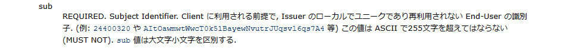
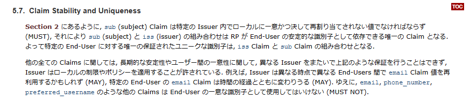
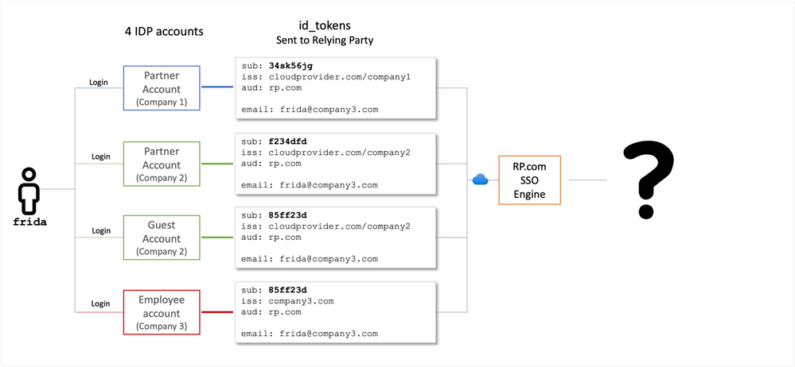
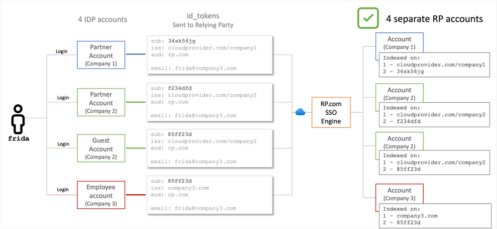
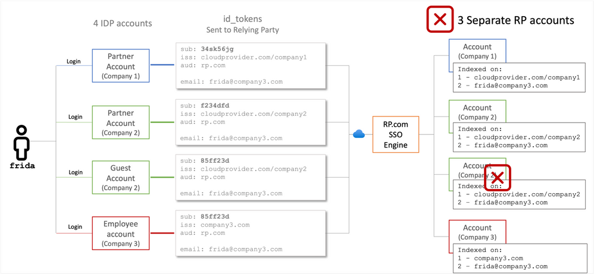
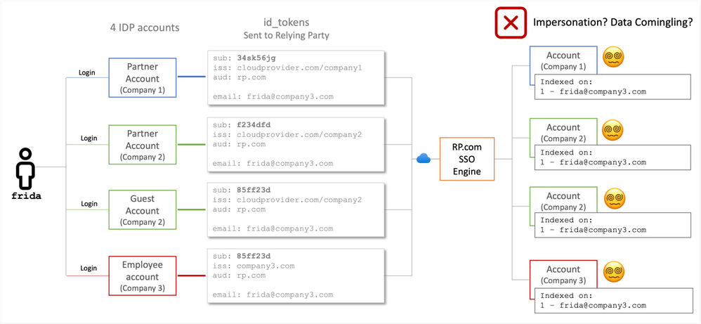

# 偽の ID (識別子) のアンチパターン

こんにちは、Azure Identity サポート チームの 高田 です。

本記事は、2023 年 6 月 20 日に米国の Azure Active Directory Identity Blog で公開された [The False Identifier Anti-pattern](https://techcommunity.microsoft.com/t5/microsoft-entra-azure-ad-blog/the-false-identifier-anti-pattern/ba-p/3846013) を意訳したものになります。ご不明点等ございましたらサポート チームまでお問い合わせください。

----

本日は、ID の世界における危険なアンチパターンである **誤った ID (識別子) のアンチパターン** を取り上げます。[アンチパターン](https://ja.wikipedia.org/wiki/%E3%82%A2%E3%83%B3%E3%83%81%E3%83%91%E3%82%BF%E3%83%BC%E3%83%B3) とは、繰り返し発生する問題に対する一般的な対応策のことで、こういった問題は多くが悪い結果をもたらし、想定と反対の結果をもたらすリスクとなるものです。[パスワードのアンチパターン](https://adactio.com/journal/1357/) も聞いたことがあるかもしれません。本日お話しする内容は、もしかしたらより危険なパターンかもしれません。

**誤った ID (識別子) のアンチパターン** は、シングル サインオン時に、アプリケーションまたはサービスが連携 ID プロバイダから受け取るアサーションにおいて、その subject 以外の属性が "一意で持続性があり、信頼できるアカウント識別子である" と想定した際に発生します。

[OpenID Connect の id_token](https://learn.microsoft.com/en-us/azure/active-directory/develop/id-token-claims-reference) や [SAML 2.0 のアサーション](https://learn.microsoft.com/en-us/azure/active-directory/develop/reference-saml-tokens) などの構造化されたセキュリティ ドキュメントには、電話番号やソーシャル メディアのハンドル名、電子メール アドレスなどのユーザー データが含まれることがあります。これらユーザー情報の詳細は、(電子メールの送信や電話の発信など) 一部のシナリオで一意の識別子として使用され、場合によってはログインの識別子としても使用されます。しかし、"連絡やコラボレーションを目的とした情報属性としてこれら識別子を使用すること" と、"フェデレーションの一連の流れの中でトークンの一部から一意性の保証がない値をピックアップし、その値を一意性のある識別子として使用して認可やデータ アクセスに使用すること" には、決定的な違いがあります。

## OpenID Connect でエンド ユーザーの識別に subject 以外のクレームを使用することは標準に非準拠である

OpenID Connect 1.0 の著者らは、仕様が設計された 10 年前にこのアンチパターンを認識していました。仕様には、すべての Relying Party (SSO のトランザクションから ID 情報を取得するアプリケーションやサービス) が、アカウント キーとして常に sub 属性を使用するべきであるという記載があります。[OpenID Connect core specification セクション 2](https://openid.net/specs/openid-connect-core-1_0.html#IDToken) ([日本語](http://openid-foundation-japan.github.io/openid-connect-core-1_0.ja.html#IDToken)) では、sub を次のように定義しています:

加えて、[OpenID Connect の仕様 セクション 5.7](https://openid.net/specs/openid-connect-core-1_0.html#ClaimStability) ([日本語](http://openid-foundation-japan.github.io/openid-connect-core-1_0.ja.html#ClaimStability)) では明示的に以下のように述べています。

OpenID Connect の Relying Party が、トークンに含まれる sub (subject) クレームと発行者 (isser) クレームの組み合わせ以外を OpenID Connect のアカウント識別子として使用すると、連携 ID プロバイダと Relying Party の間で **標準への非準拠** が生じ、仕様に準拠しない動作となるため、潜在的にユーザーにリスクを負わせることになります。もしあなたが Relying Party 側で標準への準拠を担当しているのであれば、やるべきことは一つです。

OpenID Connect の仕様における明確な要件を確認しておくことは非常に重要です。トークンのペイロードに含まれる一般的なクレームを一意なアカウント識別子として使用してしまうとが、なぜこれほど問題になるのでしょうか？セクション 5.7 の文章に、必要なヒントがすべて示されています。

## ローカルでの一意な識別子

識別子がローカルで一意である場合、ID プロバイダーはドメイン内のユーザー間で値が重複しないように検出し、重複を防止します。ローカルでの一意性が強制されていれば、シングル サインオン (SSO) 時に 2 つの異なる ID プロバイダーのアカウントが同じ文字列で表されることはありません。しかし、現在の ID 基盤では、ユーザーが複数の組織や企業、学校などのコミュニティに属している場合があり、それらのコミュニティが重複または反復する通信チャネルを保持している可能性は十分にあります。

テスト用アカウントと本番用アカウントを持っている社員は、両方のアカウントで同じ電話番号を設定するかもしれません。また、非従業員が企業間コラボレーションのために招待されたゲスト アカウントと顧客アカウントを持ち (ID プロバイダの小売サービスを使用するため)、両方とも同じ電子メール アドレスを使用する場合もあります。これらの例では、電子メールと電話番号はローカルで一意ではなく、アカウントを区別するには不十分です。しかし、トークンに含めるペイロードとしては許容されます。これは、これら属性がトークン内で一意性の要件を持たないペイロードの一部であり、トークンの Subject (一意性の要件がある) に関する追加情報を提供するためのものだからです。

## 単一の発行者内で再割り当てを行わない

セクション 5.7 の 2 つ目の節は、属性のライフサイクルに言及しています。電子メール アドレスおよび電話番号とユーザーとの紐づけが解かれるタイミングとしては様々なものがあり得ます。問題はその次に何が起こるかです。識別子が 2 つの異なるタイミングで 2 つの異なるユーザに割り当てられると、後に割り当てられたユーザーが、その前に割り当てられていたユーザーの権限とデータを得てしまうリスクがあります。

例えば、ある組織が Fred Smith という人を雇い、fsmith@company.com という電子メール アドレスを割り当てたとします。Fred がやがて退職し、Frida Smith が採用され、同じ電子メール アドレスが割り当てられました。この時、例え電子メール アドレスが同じでも、トークンの Subject は Fred と Frida で異なる値である必要があります。これにより、Frida が Fred のデータにアクセスする可能性を防ぐことができます。

## 時間が経過した際の安定性

企業の合併や買収のような事が生じた際に、社外のゲストやパートナーで連絡先情報の変更が生じる可能性についても考慮が必要です。例えば A 社が B 社を買収した場合には、社員の連絡先情報 (電子メール アドレスなど) を変更する必要が生じますが、同時にユーザーが引き続き SSO 可能とすることが重要です。トークンの Subject は、社名の変更、企業の移行、新しい市外局番へのオフィスの移転、その他のイベントが生じても影響を受けないだけの安定性が必要となります。

## 現実世界での例

実例を見ていきましょう。Frida という会計士がいるとします。この人は Company3 という企業で働き、Company1 と Company2 という企業にサービスを提供しています (Company2 では 2 つの部門で働いている)。Frida の専門は RP.com という SaaS の会計アプリケーションで、彼女は一日中そのアプリケーションで様々な顧客のために業務を行っています。Frida が持っている電子メール アドレスは 1 つだけで、これは雇用主である Company3 から得たものです。彼女が 4 つの ID プロバイダーのアカウントにサインインし、RP.com に SSO しようとするとどうなるでしょうか？

### 可能性 1: RP.com で偽の識別子のアンチパターンを回避した場合

RP.com が OpenID Connect の仕様に準拠していれば、Frida は問題なく各アカウントにサインインし、関連するデータを参照したり、適切なユーザーとやりとりしたり出来るでしょう。RP.com は適切なユーザーを適切なセキュリティ コンテキストで処理することになります。

### 可能性 2: RP.com が偽の識別子のアンチパターンに陥った場合

RP.com が電子メール アドレスを安定的な識別子として利用するというアンチパターンにハマってしまった場合、以下のようなことが起こりえます。

まず 1 つ目は、単一のテナント内でのアカウントの混同です。この場合、ID プロバイダーは RP.com に対し、同じ電子メール アドレスをもつトークンを 2 つの異なるアカウント用のものとして送信することになります。RP.com が Subject を使用していない場合、Frida に (そして彼女の雇用主にも) 面倒な事態が生じます。RP.com は 2 つの異なるアカウントを表すトークンを 1 つのアカウントを表すものと見なしてしまうため、認証プロセスが不安定になり、Frida の業務遂行が困難となる可能性があります。その結果、ユーザーのセッションにおいて Frida の 2 つのアカウントのうち、1 つにしかアクセスできなくなったり、2 つの RP.com アカウント間でバックエンドのデータが不安定に上書きされたりする可能性もあります。仮に Frida が 1 つ目は通常業務用、2 つ目は重要な調査用という目的で Company2 に 2 つのアカウントを持っていた場合、2 つのアカウントが混同されることで、重要なデータが通常のデータと混同され、不適切に処理されてしまう可能性もあります。

### 可能性 3: RP.com が偽の識別子のアンチパターンの最悪のシナリオに陥った場合

RP.com が偽の識別子の最悪なアンチパターンにハマってしまった場合、RP.com が識別子を作成する際に、複数の Relying Party テナント間で電子メール アドレスのみを参照するという最悪なシナリオに陥る可能性もあります。この場合、4 つの異なるユーザー アカウントを表す 4 つの異なるトークンが、同じ文字列として RP.com で 1 つのものとして識別されることになります。

4 つのアカウントのどれがどのような状況でアクセスされるかは、Relying Party 側がサービスをどのように設計しているかによってきます。Frida がどの IdP のアカウントでサインインしても、常に RP 側の 1 つのアカウントつにしかアクセスできなくなるという可能性もあります。Cookie を発行するテナント固有のスタート ページがある場合もありますし、各テナントに独自のサブドメインがある可能性もありますので、その場合はそれら入り口から各サービスに適切にサインインできるかもしれません。

最悪のシナリオがより一層悪化するのは、どのテナントのセッションがロードされるかを決定するメカニズムが外部から操作できる場合です。Frida 自身は、あるアカウントと別のアカウントが混同され "なりすまし状態" になることは考えもしないと思いますが、攻撃者はそういったことを考えるでしょう。攻撃者が自分のテナントを登録し、SSO で接続し、Frida の電子メール アドレスを指定することができれば、Frida が RP.com でやり取りする 3 つの会社すべてを危険にさらす事も可能です。

## SAML における偽の識別子

OpenID Connect の話題ばかりなので、SAML (Security Assertion Markup Language) の場合はどうだろうかとお考えの方もいると思います。アンチパターンはどちらのプロトコルでも同じですが、SAML の仕様にも、業界がクロス ドメイン識別子に関して学んだ数々の教訓が込められています。SAML の実装がまだ問題になる場合もあるものの、実装の詳細によってニュアンスが異なってきます:

- SAML 仕様は複雑であるため、Relying Party が独自の実装を展開するのは困難です。Relying Party が ID 属性を誤ってマッピングする可能性はありますが、SAML アサーションを検証するライブラリやツールが十分に成熟していることが多く、可能な限りリスクは軽減されています。
- SAML 仕様では、電子メール アドレスが有効かつ一般的に使用されるトークンの Subject です。しかし、SAML の一般的な利用シナリオは、組織が電子メールを「所有」し一意性を強制するという、制限の強い業務用のケースです。一方で、この制限の強いパラダイムは、BYOI (Bring Your Own Identity) および B2B の連携のユースケースによって崩れつつあるため、Relying Party だけでなく ID プロバイダーにとってもリスクが増しているという現状があります。
- SAML 仕様には、OAuth ベースの OpenID Connect が使用するエンドユーザーの同意フローに相当するようなものが実装されていません。これは、管理者が許可すれば、エンドユーザがアプリにアクセスする際に、その利用に同意できるというものです (Azure AD では [ユーザーと管理者の同意](https://learn.microsoft.com/ja-jp/azure/active-directory/manage-apps/user-admin-consent-overview) 機能によって管理される)。

このアンチパターンの認識と対策については、先進的な組織や企業が既に取り組んでいます。[SAML V2.0 Subject Identifier Attributes Profile Version 1.0](https://docs.oasis-open.org/security/saml-subject-id-attr/v1.0/cs01/saml-subject-id-attr-v1.0-cs01.html#_Toc536097222) のセクション 2.1 では、2019 年に次のように述べています: "セキュリティ プロトコルとアプリケーションにおける認証対象 (subject) の識別においては、様々な問題が生じた歴史があります。それは表現の不備や、不具合の混入、電子メール アドレスの誤用や特定の市場のみを考慮したアプローチ、意図した意味や制約が正確に伝わらないといったものです。

SAML と OpenID Connect のどちらの ID プロバイダーも、偽の識別子のアンチパターンのリスクにさらされる可能性がありますが、OpenID Connect の仕様策定者の功績により、仕様に準拠した認定済みの ID プロバイダーは十分に保護されているといえます。

トークンの対象者を表す識別子 (Subject) は、ライブラリまたはクラウド基盤のレベルで生成されることが多く、通常は管理者がデータストアから接続ごとに個別にマッピングするような情報ではありません。もし SAML ID プロバイダーの管理者が、SAML アサーションにおいて電子メール アドレスを対象ユーザーの識別子として使用し、さらには対象の Relying Party に対して認可されたユーザーが、ローカルで一意であることが保証されず、再割り当てされないことも保証されず、長期間にわたって不変であることも保証されない電子メール アドレスを持っていたとすると、その組織は偽の識別子のアンチパターンの餌食となり、危険なリスクを負うことになります。

## まとめ

世の中にある Relying Party に対するメッセージはシンプルで、**連携アカウントを識別する際には、常にトークンの Subject と発行者 (Issuer) を一緒に使用してプライマリ キーを形成する** ということです。

ID プロバイダーに対するメッセージも同様で: **SSO のために生成されるトークンの Subject は、常にローカルで一意であり、決して再割り当てされず、長期にわたって安定していることを保証する** ことです。

これら 2 つのルールに従うことで、アンチパターンを回避し、すべてのユーザーを適切かつ安全にマッピングください。
