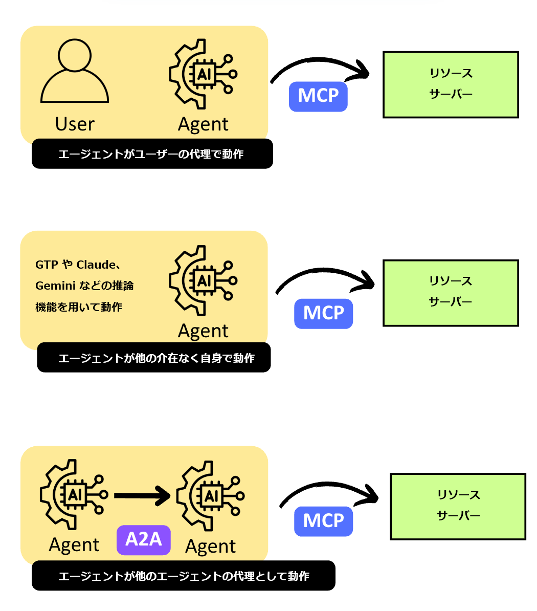
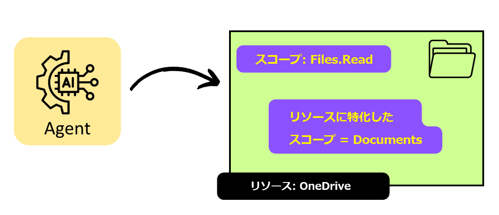

# AI エージェントの未来 - OAuth にも進化が必要な理由

こんにちは、Azure Identity サポート チームの 高田 です。

本記事は、2025 年 5 月 27 日に米国の Microsoft Entra Blog で公開された [The future of AI agents—and why OAuth must evolve](https://techcommunity.microsoft.com/blog/microsoft-entra-blog/the-future-of-ai-agents%E2%80%94and-why-oauth-must-evolve/3827391) を意訳したものになります。ご不明点等ございましたらサポート チームまでお問い合わせください。

----

我々は今、とてつもなく大きな変化の最初の段階にいるのかもしれません。

今日の AI エージェントは、ソフトウェア エンジニアのコード作成を支援したり、IT の運用チームによるシステムのトラブルシューティングを支援したり、さまざまな分析タスクを処理したりと、すでに目を見張る物となっています。これら特化したエージェントはより多くのことを実現できるようになりつつありますが、我々はその可能性の片鱗をまだ見始めたばかりなのです。次の変化の波は急速に近づいており、さまざまな分野で私たちの働き方を変革する可能性をもたらしています。 

Microsoft では、今後 12 か月から 24 か月の間に AI エージェントの分野で根本的な変化が生じると考えています。エージェント システムは、単に要求に応答するのではなく、独立して動作し始め、問題を特定し、解決策を提案し、会話全体での文脈をも適切に認識し始めるでしょう。最初は小さな変化に見えるかもしれませんが、エージェントが指示に従うだけでなく、自ら積極的に問題を解決するのを支援するようになると、その違いに気付くでしょう。

この未来を実現するには、API、コード リポジトリ、データウェアハウスから、生産性向上ツール、エンタープライズ システム、機密性の高いビジネス プロセスに至るまで、エージェントが接続されたシステム間でいかにエージェントがデータにアクセスし、行動するかの基礎となる ID 標準を進化させる必要があります。この進化は OAuth 2 に関わるものです。

## 何が変わるのか？

Microsoft では、堅牢で洗練されたエージェントを構築しています。直近では、新しい条件付きアクセスの最適化エージェントのパブリック プレビューを開始しました。これは次の機能を備えた多機能な AI エージェントです。 

- 組織の条件付きアクセス ポリシーを分析する
- ID に関するセキュリティの抜け漏れを特定する
- ポリシーの改善と簡素化を提案する
- パイロット モードで新しいポリシーを展開する
- 新しいユーザーとアプリが確実に保護されるようにする

また、SWE エージェントや SRE エージェントなど、開発者や運用ワークフローのエージェントに幅広く投資し、チームがアプリケーションを作成および保守する際の生産性を向上させられるよう支援しています。新しい AI 主導のシナリオが導入されるにつれ、より豊かで賢く、多機能で自律的なエージェントが大量に出現すると予想しています。

AI エージェントは、組織の能力を強化ならびに増幅していくでしょう。マーケティング エージェントは、完全なデジタル マーケティング キャンペーンの計画を提案し、フィードバックに基づいてそれらを改良および更新し、さらには計画が承認されたら、最初から最後まで一貫してその計画を実行するということも可能となるでしょう。エンジニアリング エージェントは、新機能の仕様を自律的に作成できるだけでなく、最小限の人間による操作で新機能の構築とテストを開始でするということも可能となります。今年の Microsoft Build カンファレンスで、[これらの体験の一部](https://www.youtube.com/watch?v=eVPHMMrORbA) をすでにご覧になった方もいるかもしれません。あらゆる種類のエージェントが、コンプライアンスの管理、新入社員のオンボーディング、さらには IT 運用の一部をより効率的に実行できるように支援している様がこれから当たり前になるでしょう。

しかし、ここで問題なのは、今日の OAuth 2 標準は AI エージェントの世界のために作られたものではないということです。現在すでに [RFC 9396 – OAuth 2.0 Rich Authorization Requests](https://datatracker.ietf.org/doc/rfc9396/) などではこういった新しいアイデアの実現に動いていますが、弊社では AI ファーストのシナリオにおいては、よりスケーラブルなソリューションが必要だと考えています。 

## OAuth 2 に改善が必要な理由

OAuth 2 は、ユーザーから委任を受けて動作する今日のタスク重視のエージェントには十分適しています。しかし、エージェントがより自律的に動作し、その機能が向上するにつれ、認可に関して満たすべき新しい要件が次々と浮かび上がって来ています。エージェントには、よりきめ細かい権限が必要であり、それらの権限もより動的である必要がある一方、簡単に取り消すことができ、かつ監査可能である必要があります。エージェントは、組織の境界を越えて他のエージェントと安全に対話できるだけでなく、エージェントの所有権が都度変更されるようなシナリオに対しても適切に動作する必要があります。これらの機能を実現にするには、既存の標準に複数の変更を加える必要があるのです。こういったことが実現して初めて、各企業は自らの持つデータの安全性に対してコンプライアンスと信頼性を維持しつつ、こういった新しい機能を取り入れていけるようになります。 

## 変更が必要と考えている点

1. **エージェント ID を他と同等のアクターとして扱う**: エージェントは、OAuth におけるクライアントとは区別する必要があります。エージェント独自の ID を OAuth のモデルに定義する必要があります。エージェントを IDP に登録するときは、クライアントではなくエージェントとして登録できるようにする必要があります。エージェントがリソースにアクセスするときは、それがエージェントであることを示せる必要があるのです。コンピューターを使用するエージェントがクライアントを介してリソースにアクセスする場合、このやり取りを表現するに際し、標準に基づいたアプローチが必要です。

    

2. **エージェントに独自の権限を付与するための標準的なモデルを定義する**: エージェントは、ユーザー権限の代理としてではなく、独自の権限を使用して処理を実行できる必要があります。
3. **エージェントの行動を透明性があるものかつ追跡可能にする**: エージェントがいつどういった状態 (以下) で動作しているかを区別するわかりやすい方法が必要です。 

    - ユーザーの代理として動作
    - 他の介在なく自身で動作
    - 別のエージェントまたは連携して動作している他の一連のエージェントの代理として動作

   これは、フォレンジックやポリシーの適用、およびシステム全体の信頼にとって重要です。

    

4. **アクセス許可の検出と委任が実現できる**: エージェントは、タスクの実行に必要なアクセス許可を検出し、ユーザーから直接か、処理の上流にいるエージェントからか、または最終的にユーザーに紐づいた上流のエージェントを通じてかのいずれかから、アクセス許可を要求できる必要があります。

    

5. **きめ細やかなリソース固有の最小特権アクセスのサポート**: [OAuth のスコープ モデル](https://oauth.net/2/scope/) を改善し、ユーザーがアクセスを委任する対象リソースをさらに絞り込んで識別できるようにする手法をサポートする必要があります。例えば以下のような絞り込みが挙げられます。

    - リソースの集合やリソースをひとまとめにしたもの (先週撮られた写真すべてなど)
    - リソースの階層内の特定のノード (/taxinfo ディレクトリ内のすべてのファイルなど)
    - リソースの特定の種類やカテゴリ (重要度高のラベルや機密ラベルがついたものなど)  
    - クエリ (SELECT * FROM my_emails WHERE sender LIKE '%@microsoft.com' など)
    - 特定のリソース ({customer_ID, 12345} など)

    

これら一連の改善を施すことで、AI エージェントによる変革を実現するために必要な制御や監視機能、アクセス許可の粒度を得ることができると考えています。

## 皆様とともに作り上げる

弊社は、AI エージェントの未来に期待を寄せています。しかし、そこにたどり着くためには、AI エージェントへの安全な委任を可能にする ID 標準を進化させる必要があると考えています。

弊社は、今後進むべき正しい道のりを切り開いていくべく、より広範な OAuth コミュニティ、Model Context Protocol (MCP)、Agent-to-Agent (A2A) プロトコル運営委員会、およびマシン ID エコシステムのパートナーと協力してまいります。Microsoft が最近行った MCP の [認可の仕様](https://modelcontextprotocol.io/specification/draft/basic/authorization) をより堅牢にする取り組みは、より広範なセキュリティ コミュニティや Anthropic と共に進められたものであり、こういった活動はまだ始まったばかりです。

来週ラスベガスで開催される Identiverse に参加する場合は、水曜日の午前 7 時 15 分に朝食付きで開催される [AI Agents と Future of Identity のラウンドテーブルをぜひ予約](https://forms.office.com/Pages/ResponsePage.aspx?id=v4j5cvGGr0GRqy180BHbR6ZbczyCoVNBgUfmUGS5Sn1UNjhVRVVQVzg3S0dFT1YxM0RJRk5EVzhUWC4u) いただければ幸いです。また、ブースに立ち寄ったり、[Identiverse で Microsoft Security とミーティング](https://aka.ms/identiversecustomermeetings) をご要望いただくことも可能です。

次世代の AI エージェントを、安全で信頼性が高く、標準に基づいたものにするよう皆で取り組んでまいりましょう。

\- Alex
