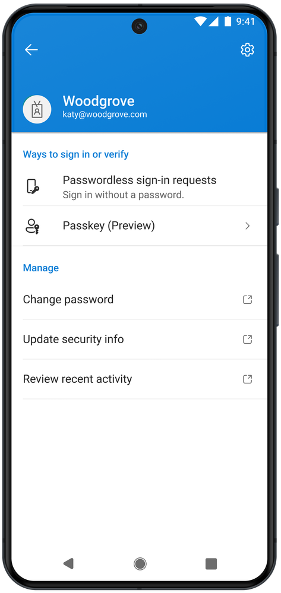
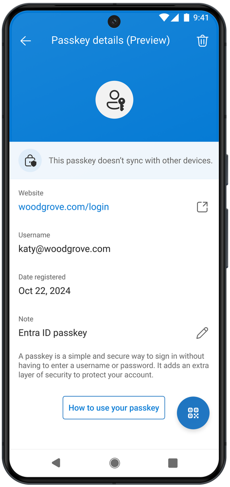
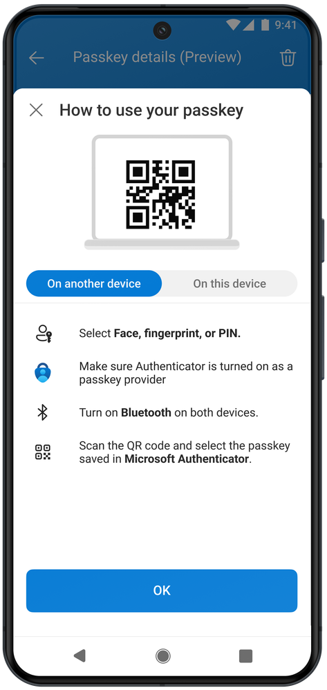

# Microsoft Authenticator の最新の機能強化

こんにちは、Azure Identity サポート チームの 五十嵐 です。

本記事は、2024 年 10 月 23 日に米国の Microsoft Entra (Azure AD) Blog で公開された [The latest enhancements in Microsoft Authenticator](https://techcommunity.microsoft.com/blog/identity/the-latest-enhancements-in-microsoft-authenticator/4078807) の抄訳です。ご不明点等ございましたらサポート チームまでお問い合わせください。

----

皆さん、こんにちは。

この度は、フィッシング耐性のある認証でユーザーをより保護できるよう、Microsoft Entra ID の 3 つの大きな機能強化を発表できることを嬉しく思います:

- **パブリック プレビューの更新:** Microsoft Authenticator におけるデバイスに紐づくパスキーのサポート
- **パブリック プレビュー:** Android 14 のネイティブ ブローカー アプリケーション (Outlook や Teams など) での FIDO2 セキュリティ キーのサポート
- **一般提供 (GA):** Android における Microsoft Authenticator の FIPS 準拠

これらの機能強化は、[国家のサイバーセキュリティ向上に関する米国大統領令 14028](https://www.whitehouse.gov/briefing-room/presidential-actions/2021/05/12/executive-order-on-improving-the-nations-cybersecurity/) を遵守するためだけでなく、安全なデジタル ID に依存するすべての組織とユーザーを保護するためにも極めて重要です。さらに詳細を見てみましょう！

## パブリック プレビューの更新: Microsoft Authenticator におけるデバイスバインド パスキーのサポート

5 月の [World Password Day](https://jpazureid.github.io/blog/azure-active-directory/public-preview-expanding-passkey-support-in-microsoft-entra-id/) において、より高いセキュリティ アシュアランスを必要とする組織を対象に、iOS および Android 用の Microsoft Authenticator においてデバイスに紐づくパスキーのサポートのパブリック プレビューを発表しました。そしてこの度、この機能にエキサイティングな新機能を追加しました！

パブリック プレビューの期間中、パスキーの登録が煩雑でエラーが発生しやすいというお客様からの貴重なフィードバックをいただきました。ノート PC から登録する際、19 ものステップを踏んだり、デバイスの Bluetooth を有効にするなどの重要な前提条件を見逃したり、サポートされていないプロバイダーでパスキーを設定したりしたユーザーもいました。このようなフィードバックに基づき、私たちは登録フローを改善し、ユーザーが確実にパスキーを登録できるよう、よりカスタマイズされたユーザー体験を提供するようにしました。また、最初に Authenticator アプリにサインインするようユーザーを誘導することで、登録プロセスを最適化しました。このアプローチにより、シームレスなユーザー体験が提供され、前提条件を満たした状況でユーザーを誘導し、デバイス間の切り替えも大幅に削減されました。

ユーザー体験の強化に加え、アプリとしての正当性確認を導入することでセキュリティ体制も強化しました。Android と iOS の API を活用し、パスキーの登録前にユーザーのデバイス上の Microsoft Authenticator アプリの正当性を検証します。

この 2 つの機能は現在プレビュー中です。近々予定されている一般提供に向けて、ぜひ組織内でこれらの機能の試験運用を開始し、フィードバックを共有ください。

パスキーを利用するには、当社の [ドキュメント](https://learn.microsoft.com/ja-jp/entra/identity/authentication/how-to-enable-authenticator-passkey) をご覧ください。Microsoft Entra ID のパスキー サポートの詳細については、当初の発表である [パブリック プレビュー: パスキーのサポートを Microsoft Entra ID に拡張](https://jpazureid.github.io/blog/azure-active-directory/public-preview-expanding-passkey-support-in-microsoft-entra-id/) をご覧ください。

## パブリック プレビュー: Android 上のブローカー アプリケーションでのパスキー (FIDO2) 認証

Microsoft Authenticator のパスキー サポートのパブリック プレビュー更新と並行して、Android 上でのブローカーを経由した Microsoft アプリケーション内でのパスキー (FIDO2) 認証のパブリック プレビューも開始しました。Android 14 以上のデバイスに Microsoft Authenticator アプリまたは Microsoft Intune Company Portal アプリが認証ブローカーとしてインストールされている場合、ユーザーは Microsoft Authenticator アプリで FIDO2 セキュリティ キーまたはパスキーを使用して、Teams や Outlook などの Microsoft アプリケーションにサインインできるようになりました。

Android 13 でのブローカーを経由した Microsoft アプリへの FIDO2 セキュリティ キーのサインイン機能は、今後数ヶ月以内に提供される予定です。

## 一般提供 (GA): Android における Microsoft Authenticator の FIPS 準拠

iOS と Android の Microsoft Authenticator が FIPS 140 に準拠しました。[iOS 版の Authenticator アプリは 2022 年 12 月から FIPS 140 に準拠していますが](https://jpazureid.github.io/blog/azure-active-directory/microsoft-brings-fips-140-compliance/)、Android の Authenticator アプリの FIPS 140 準拠バージョンは 2024 年 9 月にリリースされました。

Microsoft Authenticator の FIPS 140 準拠は、連邦政府機関が [大統領令 (EO) 14028 "国家のサイバー セキュリティの改善"](https://www.whitehouse.gov/briefing-room/presidential-actions/2021/05/12/executive-order-on-improving-the-nations-cybersecurity/) の要件を満たすこと、ならびに医療機関が [EPCS (Electronic Prescriptions for Controlled Substances)](https://learn.microsoft.com/en-us/azure/compliance/offerings/offering-epcs-us) の要件を満たすのに重要な役割を果たします。 

パスキー、パスワードレスの電話によるサインイン、多要素認証 (MFA)、ワンタイム パスワード コードを含む、Authenticator を使用した Microsoft Entra ID のすべての認証は FIPS 準拠と見なされます。この機能を有効にするために、Microsoft Authenticator または Microsoft Entra 管理センターで構成を変更する必要はありません。 Android の Microsoft Authenticator バージョン 6.2408.5807 以降のユーザーは、Microsoft Entra ID 認証が既定で FIPS 140 準拠となります。

Android 上の Microsoft Authenticator は、WolfSSL Inc. の wolfCrypt モジュールを使用して、FIPS 140-3 レベル 1 準拠を実現しています。使用されている認証の詳細については、[暗号モジュール検証プログラム](https://csrc.nist.gov/projects/cryptographic-module-validation-program/certificate/4718) の情報を参照してください。

これらのリリースにより、Microsoft Authenticator のユーザー体験とセキュリティ体制が大幅にレベルアップし、フィッシングへの対策を実施しやすくなりました。フィッシング対策をまだ検討されていない場合は、ぜひご検討ください。更新された [パスワードレス デプロイ ガイド](https://learn.microsoft.com/ja-jp/entra/identity/authentication/how-to-plan-prerequisites-phishing-resistant-passwordless-authentication) を使用して、この取り組みをぜひ開始ください。

これらの新機能をお試しいただき、ご意見をお聞かせいただけることを楽しみにしています。

ありがとうございます。
Nitika Gupta
