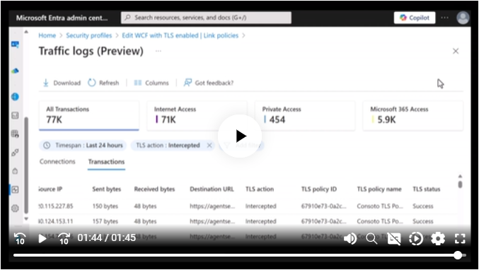
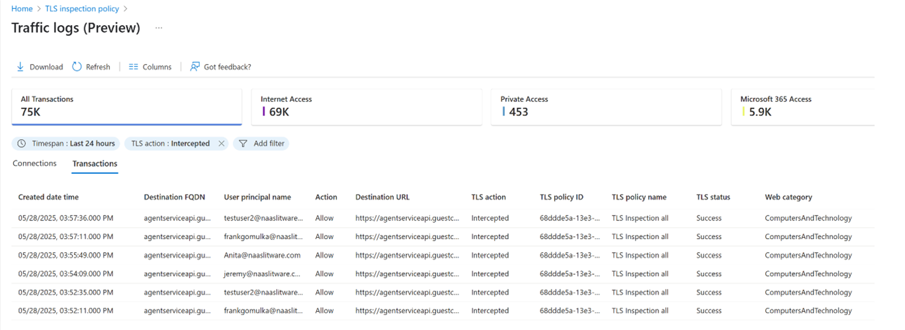
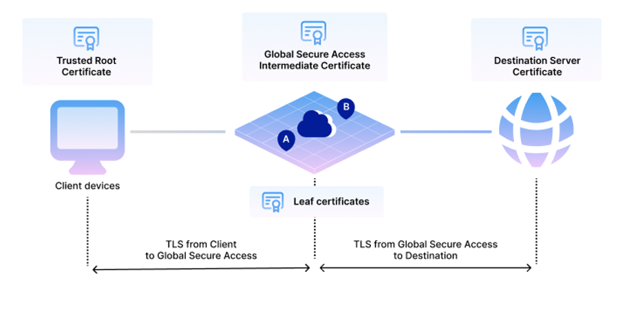

# Microsoft Entra Internet Access で TLS インスペクションが利用可能に

こんにちは、Azure Identity サポート チームの 名取 です。

本記事は、2025 年 5 月 31 日に米国の Microsoft Entra Blog で公開された [TLS Inspection now in Microsoft Entra Internet Access](https://techcommunity.microsoft.com/blog/microsoft-entra-blog/tls-inspection-now-in-microsoft-entra-internet-access/4395972) を意訳したものになります。ご不明点等ございましたらサポート チームまでお問い合わせください。

----

HTTPS は、プライバシーと安全な Web 通信に関する技術標準ですが、同時に攻撃を隠す手段にもなりえます。実際、現在では **87% 以上のサイバー脅威が暗号化された通信経路**を利用しており、これによって可視化ができない抜け漏れの個所が生まれてしまい、Zero Trust (ゼロ トラスト) セキュリティの強制が困難になっています。

そこで今回、Microsoft Entra はこの課題に対応するための新機能を発表いたします。このたび、**Microsoft Entra Internet Access における Transport Layer Security (TLS) インスペクション機能がパブリック プレビュー**として利用可能になりました。この強力な新機能により、追加のハードウェアや複雑な導入作業なしで、HTTPS トラフィックをリアルタイムに復号および検査できるようになります。これにより、ユーザーの ID に基づいたきめ細かなポリシーを適用し、Microsoft の Security Service Edge (SSE) ソリューション内のすべての暗号化セッションに Zero Trust の原則を拡張することが可能になります。

## TLS インスペクションが画期的な理由

暗号化通信の普及はセキュリティにとって重要ですが、その一方で、従来のセキュリティ対策では通信の中身が見えず、高度なマルウェアやこっそり行われるデータの持ち出し (情報漏えい) といった脅威を見逃しやすくなっています。この可視性におけるギャップが脆弱なポイントとなり、攻撃者に悪用されているのです。

Microsoft Entra Internet Access の TLS インスペクションは、こうした暗号化された脅威に対応します。仕組みとしては通信を Microsoft の Security Service Edge を経由するようにし、HTTPS 通信を安全に復号して中身をチェック (インライン インスペクション) します。これにより、単なるドメインの情報だけでなく、通信内容の文脈まで把握し、それに基づいてセキュリティ ポリシーを適用できます。その後、ユーザーの ID 情報や条件付きアクセスの情報を利用し、この通信が安全かどうかを判断します。安全と判断された通信は、すぐに再び暗号化されて送信されるため、高いセキュリティを保ちつつ、ユーザーには違和感のないスムーズな体験を提供できます。

## 現在利用可能なパブリックプレビュー機能

Microsoft Entra Internet Access における TLS インスペクションの最初のパブリック プレビューでは、以下のような主要な機能が提供されます: 

  • **リアルタイムかつ高パフォーマンスなインスペクション**: 暗号化された HTTPS 通信を復号および検査しても、ユーザー体験やネットワーク性能への影響をほとんど与えません。
  • **ID ベースのポリシー適用**: ユーザーの ID、デバイスの準拠状況、リスクレベルなどの [条件付きアクセスのシグナル](https://learn.microsoft.com/en-us/entra/identity/conditional-access/overview) を活用し、「誰に」「いつ」通信内容のインスペクションを行うかを判断します。
  • **強化されたウェブ カテゴリの分類**: 精度の向上により、ウェブ　サイトのカテゴリ分けがより正確かつきめ細かくなります。
  • **改善されたユーザー体験**: アクセスがブロックされたときに、ユーザーに分かりやすく明確なメッセージを表示することで混乱を減らし、ヘルプデスクへの問い合わせを最小限に抑えられます。

## TLSインスペクションの実際の動作

以下のデモ動画をご覧いただくと、証明書の作成方法、TLS インスペクション ポリシーの設定、セキュリティ プロファイルへの適用、そしてトラフィック ログの確認方法がわかります。

[元記事にジャンプして動画を閲覧する](https://techcommunity.microsoft.com/blog/microsoft-entra-blog/tls-inspection-now-in-microsoft-entra-internet-access/4395972)  

## 可視化がすべてを変える

トラフィックの内容を評価することで、TLS インスペクションはより強力かつ効果的なセキュリティを実現するその基礎を提供します。この可視化機能により、これまでにない精度で、なおかつ文脈も考慮してポリシーを強制できるようになり、以下のような主要なセキュリティ シナリオにも対応できるようになります。

• **詳細なウェブ フィルタリング**: ドメインのカテゴリーという広い分類にとどまらず、特定の URL に基づいてアクセスの許可およびブロックを細かく制御できるようになり、より高度なウェブ アクセスの管理が可能になります。
• **暗号化された脅威へのプロアクティブな防御**：マルウェア、ランサムウェア、フィッシング攻撃などの脅威を、ユーザーの端末に被害が及ぶ前に検出および無効化します。
• **包括的なデータ損失防止 (DLP)**: すべての通信にわたって一貫した DLP ポリシーを適用し、管理外のデバイスや公共 Wi-Fi 経由でのアクセス時でも企業の機密データを保護します。
• **許可されていない AI 利用の抑制**: 生成 AI ツールの使用状況を可視化および制御し、機密データの不正な持ち出しを防ぎます。
• **コンプライアンスと監査の効率化**：クラウド上で一元管理されるログを活用することで、PCI や HIPAA などの規制、地域ごとのデータ保存要件への準拠を簡単かつ明確に証明できます。

まとめると、「暗号化されている = 見えない」ではなくなるのです。TLS インスペクションを使えば、HTTPS 通信にもゼロトラストの制御を適用できるようになり、プライバシーを損なうことなく、ユーザーやデータをしっかり守ることができます。詳細は[ドキュメント](https://learn.microsoft.com/en-us/entra/global-secure-access/concept-transport-layer-security)でご確認ください。

さらに深く知りたい方は、John Savill による Microsoft Entra Internet Access の TLS インスペクション解説動画もぜひご覧ください！

[TLS Inspection in Microsoft Entra Internet Access Deep Dive](https://youtu.be/WxxHH_4vKh4)

## 今後について

TLS インスペクションは基盤となる重要な機能であり、これはまだ始まりに過ぎません。この発表は、[Microsoft Entra Internet Access](https://www.microsoft.com/en-us/security/business/identity-access/microsoft-entra-internet-access) と [Microsoft Entra Private Access](https://www.microsoft.com/en-us/security/business/identity-access/microsoft-entra-private-access) をさらに強化するための今後のアップデートの土台を築くものです。弊社は ID を中心とした SSE ソリューションを継続して構築してまいります。

TLS インスペクションをパブリックプレビューとして提供できることを非常に嬉しく思います！まずは [TLSインスペクションの前提条件やセットアップに関するドキュメント](https://learn.microsoft.com/en-us/entra/global-secure-access/concept-transport-layer-security) を確認し、皆様の働く場所がどこであろうと安全な接続を実現できるようぜひフィードバックをお寄せください。

Ashish Jain, Principal Group Product Manager, Identity & Network Access
