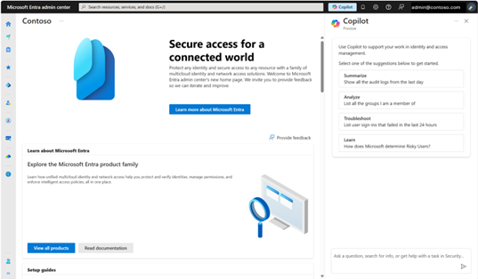
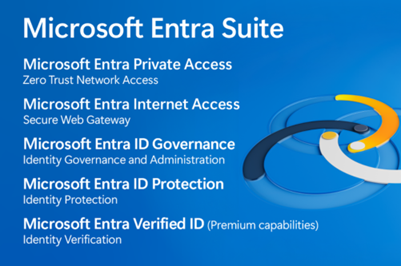
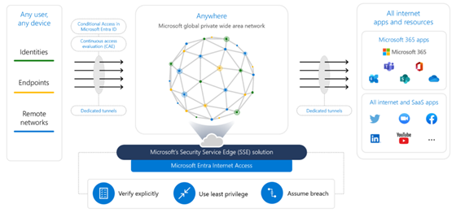
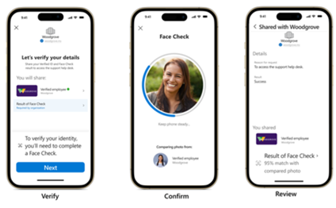
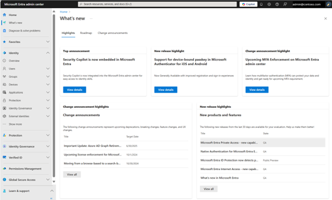
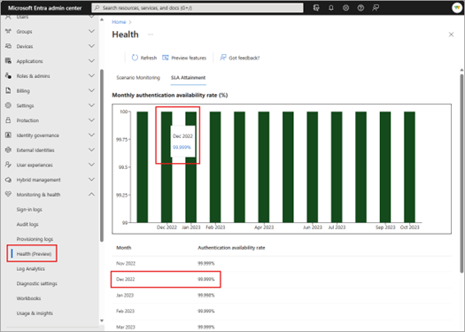

# Microsoft Entra : 2024 年の注目機能トップ 50

こんにちは、Azure Identity サポート チームの 夏木 です。
 
本記事は、2025 年 1 月 7 日に米国の Microsoft Entra (Azure AD) Blog で公開された [Microsoft Entra: Top 50 features of 2024 | Microsoft Community Hub](https://techcommunity.microsoft.com/blog/identity/microsoft-entra-top-50-features-of-2024/4352584) の抄訳です。ご不明点等ございましたらサポート チームまでお問い合わせください。

----

## 2024 年の Microsoft Entra におけるセキュリティ強化と製品イノベーションを振り返る

2024 年の Microsoft Entra の製品イノベーションやセキュリティ強化について、全部ついていくのは大変と感じてはいらっしゃいませんか？ご安心ください。いつも Microsoft Entra の最新情報をお届けしているチームより、注目すべき 50 のソリューションや新機能をまとめた振り返りレポートを作成しました。

以下では、増大するサイバー脅威、お客様からのフィードバック、市場のニーズをもとに進化した 50 の注目機能をご紹介します。より詳しい情報は、[Entra 管理センターの「最新情報」エクスペリエンス](https://aka.ms/entra/whatsnew) をご覧ください。最新の ID のイノベーションを導入することで、デジタル資産をより強固に保護し、セキュリティ投資の価値を最大化できます。

新年あけましておめでとうございます！

Shobhit

----

## 新しいソリューション トップ 5

**1. AI 主導の ID セキュリティ**  
Microsoft Ignite 2024 で、Microsoft Entra 管理センター内での Microsoft Security Copilot のプレビュー提供を発表しました。これにより、ID 管理者は AI による ID にまつわる情報の要約や知見を活用して、セキュリティ インシデントへの対応力を高め、侵害リスクからより確実に組織を守ることができます。管理センター内に統合されたユーザー体験により、ID のリスクやサインインの問題解決といった作業もより迅速に行えます。

**2. Microsoft Entra Suite の一般提供開始**  
[Microsoft Entra Suite](https://techcommunity.microsoft.com/blog/identity/microsoft-entra-suite-now-generally-available/2520427) は、従業員のアクセス管理を包括的にサポートするクラウドベースのソリューションです。クラウドやオンプレミスを問わず、あらゆるアプリケーションやリソースへのアクセスを一元的に保護します。最小特権のアクセスを一貫して適用し、従業員の利便性も向上させます。

**3. Microsoft の Security Service Edge (SSE) ソリューション**  
Microsoft の Security Service Edge (SSE) ソリューションは、[Microsoft Entra Private Access](https://www.microsoft.com/en-us/security/business/identity-access/microsoft-entra-private-access)、Microsoft Entra Internet Access、SaaS セキュリティに特化した [Microsoft Defender for Cloud Apps](https://www.microsoft.com/en-us/security/business/siem-and-xdr/microsoft-defender-cloud-apps)（CASB）を組み合わせた SSE ソリューションを提供します。このクラウドベースかつ ID 中心のネットワーク モデルは革新的なものです。条件付きアクセスと継続的アクセス評価 (CAE) をすべてのアプリやリソースに拡張し、オンプレミスやクラウド環境におけるセキュリティの隙間を解消します。

**4. Microsoft Entra External ID による外部 ID アクセスの管理**  
[Microsoft Entra External ID](https://www.microsoft.com/en-au/security/business/identity-access/microsoft-entra-external-id?msockid=31a0906fdeb0658912808276df9c6461) は、開発者に優しい次世代のカスタマー ID アクセス管理 (CIAM) ソリューションです。パートナー、法人顧客、消費者向けアプリケーションの構築において、安全かつカスタマイズ可能な CIAM をシンプルに実現します。

**5. [Face Check](https://techcommunity.microsoft.com/blog/identity/face-check-is-now-generally-available/4175880): 高精度な ID 検証機能**  
Microsoft Entra Verified ID の初のプレミアム機能として、プライバシーを重視した顔認証機能 Face Check の一般提供が開始されました。ユーザーのリアルタイムの自撮り画像と Verified ID に登録された写真を照合することで、信頼性の高い本人確認を実現します。

## ゼロ トラスト アクセス制御の確立と ID の保護

**6. Microsoft Entra ID Protection によるパスワードスプレー攻撃のリアルタイム検出と防御**  
[Microsoft Entra ID Protection](https://learn.microsoft.com/en-us/entra/id-protection/overview-identity-protection) により、パスワードスプレー攻撃のリアルタイム検出と防御が可能となり、修復作業を数時間から数秒に短縮できます。

**7. Entra ID Protection の[新しい検出機能](https://learn.microsoft.com/en-us/entra/id-protection/concept-identity-protection-risks)**  
異常な Microsoft Graph の使用、トークン窃取、攻撃者中間 (AitM) 攻撃に対する保護を強化するための新しい検出機能が追加されました。

**8. オンプレミスのパスワード変更によるリスクのリセット**  
オンプレミス側でパスワード変更を行うことで、ユーザー リスクをリセットできるようになりました。これによりハイブリッド環境のお客様は[パスワードの修復](https://learn.microsoft.com/en-us/entra/id-protection/howto-identity-protection-remediate-unblock#allow-on-premises-password-reset-to-remediate-user-risks-preview)を必要とするリスクベースの条件付きアクセス ポリシーを適用できるようになりました。

**9. インサイダー脅威の検出と自動緩和の強化**  
条件付きアクセスで[インサイダー リスク条件](https://learn.microsoft.com/en-us/entra/identity/conditional-access/policy-risk-based-insider-block)を活用することで、インサイダー脅威の検出と自動緩和が強化されました。

**10. [Entra ID Protection のダッシュボード](https://learn.microsoft.com/en-us/entra/id-protection/id-protection-dashboard)**  
ダッシュボードでは、重要なメトリクス、視覚的な表示、セキュリティ体制を強化するための推奨事項が提供されます。

**11. 管理者ポータルへのアクセスに多要素認証 (MFA) を要求**  
Entra 管理センターなどの[管理者ポータルにアクセス](https://techcommunity.microsoft.com/blog/identity/mfa-enforcement-for-microsoft-entra-admin-center-sign-in-coming-soon/4230849)する際に MFA を要求することで、アカウント侵害の試みを 99.2% 以上防ぐことができます。

**12. [Microsoft マネージド 条件付きアクセス ポリシー](https://techcommunity.microsoft.com/blog/identity/act-now-turn-on-or-customize-microsoft-managed-conditional-access-policies/4078809)の強化**  
Microsoft マネージド条件付きアクセス ポリシーは、お客様の使用パターンやリスク、既存のポリシーに基づいてリソースとデータをより強固に保護し、管理者の負担を軽減します。

**13. MFA 登録を 14 日間スキップする猶予期間の[終了](https://techcommunity.microsoft.com/blog/identity/update-to-security-defaults/4044868)**  
セキュリティ既定値群による MFA 登録のスキップ (14 日間の猶予期間) が廃止されます。MFA を直ちに有効にすることで ID に関するの攻撃の 99.2% 以上を防ぐことが可能なためです。

**14. Microsoft Entra ID での[外部認証方法](https://learn.microsoft.com/en-us/entra/identity/authentication/concept-authentication-external-method-provider)**  
Microsoft Entra ID の外部認証方法では、お好みの MFA ソリューションを使用しながら、条件付きアクセスや ID Protection などの機能を活用できます。

**15. Microsoft Entra Permissions Management と Microsoft Defender for Cloud の[統合](https://learn.microsoft.com/en-us/entra/permissions-management/permissions-management-for-defender-for-cloud)**  
Microsoft Entra Permissions Management と Microsoft Defender for Cloud（MDC）の統合により、他のクラウド リソースへのアクセスと権限に関する情報が統一されたインターフェースで提供されます。

**16. 新しい [Entra 推奨事項の追加](https://techcommunity.microsoft.com/blog/identity/introducing-new-and-upcoming-entra-recommendations-to-enhance-security-and-produ/3796390)**  
「未使用のアプリケーションを削除」や「期限切れのアプリケーション資格情報を更新」など、アプリケーションの健全性とセキュリティを向上させるための新しい推奨事項が追加されました。

**17. 重要なアプリケーションへのアクセス前に[対話的な再認証を要求](https://techcommunity.microsoft.com/blog/identity/prompt-users-for-reauthentication-on-sensitive-apps-and-high-risk-actions-with-c/4062703)**  
条件付きアクセスにより、重要なアプリケーションにアクセスしたり、機密性の高い操作を行ったりする前に、対話的な再認証を要求します。

**18. [Microsoft Entra Verified ID をあっという間に設定](https://learn.microsoft.com/en-us/entra/verified-id/verifiable-credentials-configure-tenant-quick)**  
管理者が「開始する」ボタンを一度選択するだけで、設定ステップがいくつか省略され、Microsoft Entra Verified ID を速やかにセットアップ可能になりました。

## パスワードレス認証でフィッシング攻撃を無効化

**19. Microsoft Authenticator のデバイスにバインドされたパスキーサポートによるフィッシング攻撃の無効化**  
iOS および Android 用の Microsoft Authenticator で、[デバイスにバインドされたパスキー](https://learn.microsoft.com/en-us/entra/identity/authentication/how-to-plan-prerequisites-phishing-resistant-passwordless-authentication)を使用してフィッシング攻撃を無効化できます。

**20. Microsoft Account (MSA) でのパスワード削除と[パスキー](https://www.microsoft.com/en-us/security/blog/2024/05/02/microsoft-introduces-passkeys-for-consumer-accounts/)使用**  
Microsoft Account (MSA) においてパスワードを削除し、パスキーを使用する機能が追加されました。

**21. [Android でブローカーアプリを用いた Microsoft アプリでのパスキー (FIDO2) 認証](https://techcommunity.microsoft.com/blog/identity/the-latest-enhancements-in-microsoft-authenticator/4078807)のサポート**  
FIDO2 セキュリティキーまたはパスキーを使用して、Teams や Outlook などのアプリにサインインできるようになりました。

**22. ユーザーの代わりに FIDO2 セキュリティキー (パスキー) を[管理者が構成](https://techcommunity.microsoft.com/blog/identity/public-preview-microsoft-entra-id-fido2-provisioning-apis/4062699)**  
管理者がユーザーの代わりに FIDO2 セキュリティ キー (パスキー) を構成することで、初日から安全でシームレスな認証が実現します。

## ID 環境の刷新

**23. [Microsoft Entra ID のマルチテナント組織](https://learn.microsoft.com/en-us/entra/identity/multi-tenant-organizations/multi-tenant-organization-overview)を使用した安全なユーザーのコラボレーション**  
複数のテナントにまたがるユーザーとの安全なやり取りが可能となり、ユーザーのプロビジョニングと管理が自動化されます。

**24. [AD FS 移行ツール](https://techcommunity.microsoft.com/blog/identity/move-to-cloud-authentication-with-the-ad-fs-migration-tool/4174841)を使用したクラウド認証への移行**  
AD FS 移行ツールを使用して、移行可能なアプリケーションを特定し、その互換性を評価することができます。

**25. 外部 ID 用の[ネイティブ認証](https://learn.microsoft.com/en-us/entra/external-id/customers/concept-native-authentication)を使用した魅力的な認証画面の構築**  
アプリケーションにシームレスに統合された、ユーザーの資格に訴えかける魅力的な認証画面を簡単に構築できます。

**26. [Bicep テンプレート](https://learn.microsoft.com/en-us/graph/templates/overview-bicep-templates-for-graph)による Microsoft Graph リソースの宣言的な IaaC 機能**  
Microsoft Entra ID グループやアプリケーションなど、テナントのインフラ情報を定義し、展開するために Bicep テンプレートを使用できます。

**27. ユーザーが自らアクセス要求を行うフロー**  
[従業員の代理で、管理者がリソースへのアクセスを要求する機能](https://learn.microsoft.com/en-us/entra/id-governance/entitlement-management-request-behalf)が追加され、従業員がリソースへタイムリーにアクセスできるようになり、生産性向上を実現します。

**28. 人事データを活用したライフサイクル ワークフローの自動化**  
[カスタム セキュリティ属性](https://learn.microsoft.com/en-us/entra/id-governance/manage-workflow-custom-security-attribute)に保存された機密人事データと他の属性を活用し、入社から異動、退職までの一連のシナリオを自動化するためのワークフローを定義します。

**29. Microsoft Entra でのアカウントの有効化、無効化、削除の簡素化**  
[ライフサイクル ワークフロー](https://learn.microsoft.com/en-us/entra/id-governance/manage-workflow-on-premises)により、一定期間経過後のシームレスなオフボーディングを実現できます。

**30. ライフサイクル ワークフローの[動作状態の監視](https://learn.microsoft.com/en-us/entra/id-governance/lifecycle-workflow-insights)**  
ワークフロー、タスク、カテゴリーごとの処理データを表示して、ワークフローの動作状態を確認できるようになりました。

**31. サインイン ワークブックに対する重要な更新**  
Azure AD 認証ライブラリ (ADAL) から Microsoft 認証ライブラリ (MSAL) への移行を進めるための重要なツールとして[サインイン ワークブックが強化](https://techcommunity.microsoft.com/blog/identity/migrate-adal-apps-to-msal-with-enhanced-insights/4194361)されました。

**32. [Microsoft Entra PowerShell モジュール](https://techcommunity.microsoft.com/blog/identity/introducing-the-microsoft-entra-powershell-module/4173546)の更新**  
Microsoft Entra 製品の管理と自動化をより簡単に行うため、高品質でシナリオ重視のツールとして Micorosft Entra PowerShell モジュールが提供されました。

**33. [Microsoft Graph アクティビティ ログ](https://techcommunity.microsoft.com/blog/identity/microsoft-graph-activity-logs-is-now-generally-available/4094535)を活用したセキュリティ分析**  
テナント内のアクティビティを監視し、セキュリティ分析や脅威ハンティングが可能になりました。

**34. Mac デバイスの使い勝手と管理性をよりセキュアに**  
[プラットフォーム SSO](https://techcommunity.microsoft.com/blog/identity/platform-sso-for-macos-now-in-public-preview/4051574) により、Mac デバイスの使用と管理がよりシームレスかつ安全に行えるようになりました。

**35. [Microsoft Entra ID ガバナンス](https://learn.microsoft.com/en-us/entra/identity/hybrid/cloud-sync/how-to-configure-entra-to-active-directory)によるオンプレミス アプリケーションの管理**  
セキュリティグループを Active Directory にプロビジョニングし、Microsoft Entra ID ガバナンスを使用してオンプレミス アプリケーション (Kerberos アプリケーション) の管理がより簡単になります。

**36. 動的ルールを使用した管理者ユーザーとグループの[効果的な管理](https://learn.microsoft.com/en-us/entra/identity/role-based-access-control/admin-units-members-dynamic)**  
動的ルールを使用して、管理者ユーザーやグループの管理を効率化します。

**37. [Microsoft Entra Permissions Management](https://learn.microsoft.com/en-us/entra/permissions-management/) における PIM 対応グループの強化**  
Microsoft Entra Permissions Management において、PIM 対応グループのサポートが強化されました。

**38. [カスタム認証拡張機能](https://learn.microsoft.com/en-us/entra/identity-platform/custom-extension-overview)による認証体験のカスタマイズ**  
外部システムとの統合を通じて、認証体験をカスタマイズできるようになりました。

**39. ワークロード ID 認証の[耐障害性](https://techcommunity.microsoft.com/blog/identity/microsoft-entra-resilience-update-workload-identity-authentication/4094704)向上**  
ワークロード ID 認証の耐障害性が向上し、99.99% のサービスレベル保証が提供されます。

# 製品の更新やテナントの健全性などに対する可視性の向上

**40. "[What's new](https://aka.ms/entra/whatsnew)" 機能によるプロダクト更新の集中管理**  
Microsoft Entra 管理センターの "What's new" 機能により、製品の更新情報、パブリックプレビュー、一般提供開始、廃止予定、変更通知などを集中管理できます。

**41.  サインインの種類ごとに視覚的にトレンドと合計値を提供する正常状態の監視機能**  
さまざまなサインインの種類について、それらのトレンドと合計値を視覚的に表示し、認証処理の正常状態を簡単に調査できるようになりました。

**42.  ライセンス利用状況に関する情報提供**  
[Microsoft Entra のライセンス](https://techcommunity.microsoft.com/blog/identity/introducing-microsoft-entra-license-utilization-insights/3796393)を最大限活用いただけるよう、現在の使用状況に関する情報を得ることができ、さらにライセンス違反がないようにできます。

## 連邦政府および規制業界の要件への準拠

以下は Microsoft Entra 証明書ベース認証 (CBA) に対して行われた[機能強化](https://techcommunity.microsoft.com/blog/identity/microsoft-entra-cba-enhancements/4286759)です。

**43. 証明書失効リスト (CRL) の検証に対するフェイルセーフ**  
証明書発行機関 (CA) に証明書失効リスト (CRL) がない場合、CBA を失敗させるようにすることで管理者がセキュリティを強化できます。

**44. 強化された PKI ベースの証明書機関 (CA) ストア**  
以前まであったサイズ制限が撤廃され、各 CA のレベルで発行者ヒントもサポートされます。

**45. 条件付きアクセス ポリシーにおける細かい CBA の構成**  
ユーザー名、アフィニティ バインディング、ポリシー ルール、そして高度な CBA の構成が条件付きアクセスで[サポートされました](https://techcommunity.microsoft.com/blog/identity/microsoft-entra-certificate-based-authentication-enhancements/1751778)。

**46. 証明書発行者と OID によるきめ細かいアクセス制御**  
 証明書の発行者またはポリシー オブジェクト識別子 (OID) のプロパティに基づいて特定のリソースへのアクセスを[許可](https://techcommunity.microsoft.com/blog/identity/introducing-more-granular-certificate-based-authentication-configuration-in-cond/2365668)できます。

**47. [Microsoft Authenticator の FIPS 140 準拠](https://techcommunity.microsoft.com/blog/identity/the-latest-enhancements-in-microsoft-authenticator/4078807)**  
連邦機関が大統領令 (EO) 14028 の要件を満たし、医療機関が電子処方箋 (EPCS) に対応できるよう支援します。

**48. 政府向け ID ガバナンスの機能追加**  
Microsoft Entra ID Governance が米国政府のコミュニティ クラウド (GCC)、GCC-High、および国防総省クラウド環境で連邦機関、州・地方政府、政府契約者向けに[提供されています](https://techcommunity.microsoft.com/blog/identity/microsoft-entra-id-governance-for-government/3575578)。

## 統合されたセキュア アクセス サービス エッジ (SASE) と ID 管理 (IDM)

**49. [SD-WAN およびインターネット プロバイダーとの連携](https://techcommunity.microsoft.com/blog/identity/microsoft-partners-for-new-sase-ecosystem/4287444)**  
Microsoft は、主要な SD-WAN およびインターネット プロバイダーと提携し、セキュアなブランチ接続を実現しています。これにより、セキュリティ サービス エッジ (SSE) ソリューションを最先端のネットワーク接続で利用できるようなり、統一された SASE アーキテクチャへ移行しやすくしています。

**50. [SAP と Microsoft の連携](https://techcommunity.microsoft.com/blog/identity/microsoft-and-sap-work-together-to-transform-identity-for-sap-customers/2520430)**  
SAP は Microsoft と提携し、SAP Identity Management (IDM) の顧客に Microsoft Entra への移行を促しています。SAP IDM のサポート終了に伴い、包括的な ID およびアクセス ガバナンス フレームワークの統合強化が実現します。

毎年様々なフィードバックとコラボレーションを賜りありがとうございます。継続的に皆様からの声に耳を傾け、改善していく企業文化を育むことにより、セキュリティが単なる機能ではなく、すべての基盤となる未来を築いてまいります。今後のアップデートにもご期待ください！
