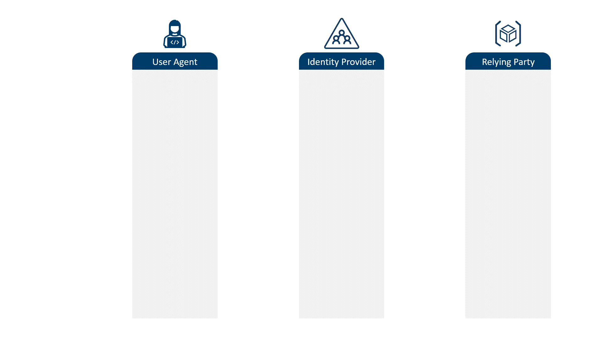
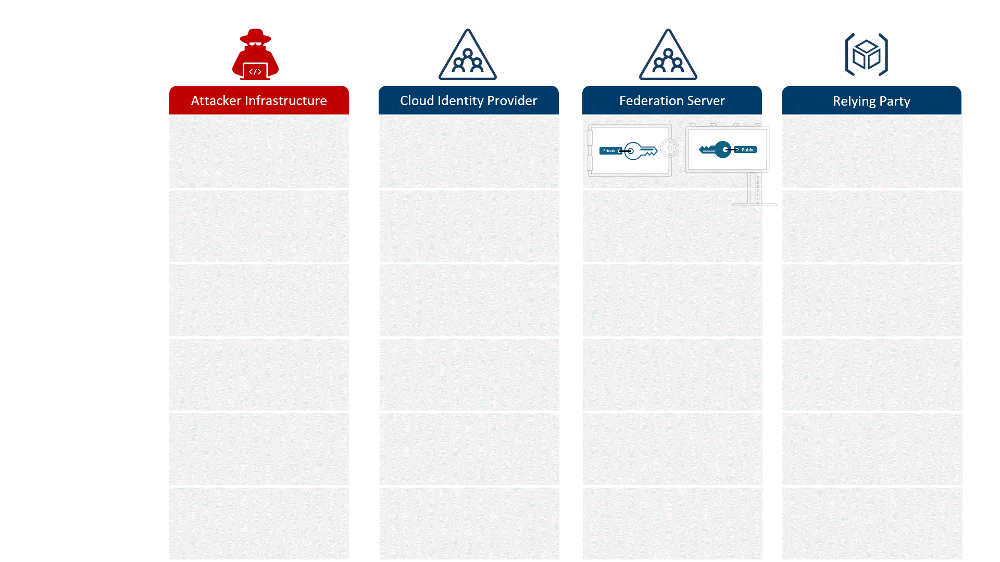

# ゴールデン SAML 攻撃の理解と対策

こんにちは、Azure Identity サポート チームの 五十嵐 です。

本記事は、2025 年 6 月 6 日に米国の Microsoft Entra (Azure AD) Blog で公開された [Understanding and Mitigating Golden SAML Attacks](https://techcommunity.microsoft.com/blog/microsoft-entra-blog/understanding-and-mitigating-golden-saml-attacks/4418864) の抄訳です。ご不明点等ございましたらサポート チームまでお問い合わせください。

---

## ゴールデン SAML 攻撃の仕組みを学び ID 基盤を保護するための戦略を立てよう

本日は ID に関連した高度な攻撃への対処についての連載記事である第 3 回目をお届けします。今回は、ゴールデン SAML (Security Assertion Markup Language) 攻撃について解説します。

毎月何百万ものアカウントがパスワード攻撃 (パスワード スプレー、リプレイ攻撃、フィッシングなど) により侵害されています。Microsoft では、毎秒 7,000 件以上のパスワード攻撃を検出およびブロックしています。これに対し、ゴールデン SAML 攻撃は非常に稀です。この記事の執筆時点で、Microsoft の顧客対応にあたるサイバーセキュリティ チームが報告したゴールデン SAML 攻撃は、過去 24 か月間で 20 件で、対象は 10 件未満のお客様にとどまっています。Microsoft で ID セキュリティに関わるデータ サイエンスのチームでも攻撃を検出しており、そちらでは世界中で毎月約 50 人のユーザーが影響を受けているとされています。

ゴールデン SAML 攻撃は他の攻撃に比べて発生頻度は低いものの、その影響は甚大です。たとえば、[Adversary-in-the-Middle (AiTM) 型のフィッシング攻撃](https://jpazureid.github.io/blog/azure-active-directory/defeating-adversary-in-the-middle-phishing-attacks/) は、フィッシングされたアカウントのみに影響しますが、ゴールデン SAML 攻撃が成功すると、組織内のすべてのアカウントが侵害される可能性があります。

本ブログでは、ゴールデン SAML 攻撃の仕組みと、ゴールデン SAML 攻撃からユーザーを守るために何ができるのかについて、特に Microsoft Entra 環境における影響に焦点を当てて説明していきます。

## SAML を用いた認証

まずは、[SAML 2.0](https://www.oasis-open.org/standard/saml/) の仕組みを復習しましょう。SAML (Security Assertion Markup Language) は、2005 年に公開されたインターネット標準であり、あるシステムから別のシステムへ認証処理の委任を実現するものです。

SAML の最も一般的な用途は、アプリケーションのシングル サインオン (SSO) です。これは、SAML に対応したアプリケーションが、Microsoft Entra ID のような SAML に対応する ID サービスに認証処理を委任するという仕組みです。SAML の用語では、アプリケーションは「リライング パーティー (RP ※)」、Entra ID は「ID プロバイダー (IdP)」と呼ばれます。複数の RP が 1 つの IdP を信頼できるため、ユーザーは IdP に一度サインインするだけで、複数のアプリケーション (RP) にアクセスできます。このため、たとえばユーザーが Windows にサインインすると、SharePoint、Teams、Exchange などにも再度サインインすることなくアクセスできるようなことを実現できます。

※ SAML の厳密な定義では、これは本来「SAML サービス プロバイダー (SP)」と呼ぶべきですが、本記事では過去の記事との一貫性を保つために、より分かりやすい用語である「RP (Relying Party)」を使用しています。

以下の図は、このシリーズの最初のブログに掲載された図を拡張したもので、SAML 認証の流れを示しています。ユーザー エージェント (ブラウザー) がコンテンツを要求すると、RP はユーザー エージェントを IdP にリダイレクトします。IdP はユーザーに対してその ID の正規の所有者であることを示す証明を要求します。ユーザー エージェントが資格情報を提供すると、IdP はトークンを返します。このトークンをユーザー エージェントが RP に提示することで、アクセスが許可されます。

このシリーズの [以前のブログ](https://jpazureid.github.io/blog/azure-active-directory/how-to-break-the-token-theft-cyber-attack-chain/) でも使った遊園地の例えを再び使うと、ユーザー エージェントは、遊園地で乗り物に乗るためのチケットを購入する来場者に当たります。IdP は乗り物のチケットを販売するチケット売り場に相当します。 RP は、来場者から渡されたチケットを受け取って確認し、乗り物に乗れるようにする係員のようなものです。

## 公開鍵暗号方式とホログラム

前回までの説明のとおり、これら一連の仕組みが機能するのは、乗り物の係員 (RP) から見て、チケット (SAML トークン) が本物であり、なおかつそれがチケット売り場 (IdP) から発行されたものだと十分に信頼できるからです。

遊園地の例えでは、チケット売り場がチケットに対してホログラムを刻印しておくことで、乗り物の係員はそのチケットが本物であると判断できるとしましょう。チケット売り場はホログラムの特徴を事前に通知しており、係員はその情報をもとに本物のホログラムかどうか、つまり本物のチケットかどうかを見分けることができます。

このホログラムの情報は広く周知されている必要があります。そうすることで、係員は有効なチケットを識別できるようになるのです。一方で、チケット売り場はホログラムを刻印する機械を厳重に管理し、チケットが偽造されることを防がなければなりません。

ID 管理をはじめとする多くのデジタル システムでは、このような真正性の確認を [公開鍵暗号方式 (PKC: Public Key Cryptography)](https://learn.microsoft.com/ja-jp/windows/win32/seccertenroll/public-key-infrastructure) を用いて実現しています。チケット売り場のような存在がチケット (トークン) に署名する行為は、秘密鍵を用いて行われます。これは、ホログラムを刻印する行為に相当します。これを「署名」と呼びます。公開鍵は、署名された情報を受け取る側が、それが本当に秘密鍵の所有者から発行されたものかどうかを検証するために使われます。

この例えと同様に、署名が検証できるよう公開鍵は広く公開されている必要があり、署名が偽造されないよう秘密鍵は厳重に保管されなければなりません。秘密鍵が安全に管理されている限り、公開鍵暗号方式は非常に有効な仕組みです。

しかし、悪意のある攻撃者がホログラムを刻印する機械 (秘密鍵) を手に入れてしまった場合、あたかもチケット売り場が発行したかのように見える偽造チケットを自由に作成できてしまうことになります。これは、他の来場者からチケットを盗むこと ([トークン窃取](https://learn.microsoft.com/ja-jp/entra/identity/devices/protecting-tokens-microsoft-entra-id)) や、来場者を騙してチケットを買わせること ([AiTM フィッシング](https://jpazureid.github.io/blog/azure-active-directory/defeating-adversary-in-the-middle-phishing-attacks/)) よりもはるかに深刻です。なぜなら、攻撃者はいつでも好きなだけ偽造チケットを作成でき、係員はそれが偽物だと見抜けないからです。

フェデレーション サーバーの秘密鍵を盗み、正しく署名されたトークンを偽造して RP にアクセスすること ―― これこそがゴールデン SAML 攻撃の本質です。

## ゴールデン SAML が SAML の一連の流れに与える影響

SAML は認証の委任の仕組みであり、この委任はチェーン (連鎖) させることができます。SAML のこの委任のチェーンを利用すると、クラウド アプリケーションをクラウド IdP (ID プロバイダー) に対する RP (リライング パーティー) として構成し、さらにそのクラウド IdP をオンプレミスのディレクトリ基盤に対する RP として構成できます。オンプレミスの基盤では Kerberos のような古いプロトコルが一般的に使われているため、このレガシーな基盤に対して SAML のインターフェースを提供する役割は Active Directory Federated Services (AD FS) のようなフェデレーション サーバーが担うことになります。

たとえば、あるアプリケーションが Microsoft Entra のようなクラウド IdP に認証を委任し、その IdP がさらに AD FS のようなオンプレミス IdP に認証を委任するという構成が可能です。このような構成では、チェーンの一番下にいる IdP (つまり AD FS) が侵害されると、たとえクラウド IdP からクラウド アプリケーションへの認証連携で使用される鍵が侵害されていなくても、信頼のチェーン全体が破られてしまうことになります。

このような SAML のチェーン構成は、Microsoft Entra を利用されているお客様にとって非常に一般的です。その理由は以下のとおりです:

SSO (シングル サインオン) システムは古くから存在しており、多くの組織はクラウド IdP が普及する以前から、オンプレミス環境で SSO を導入して利用しています。これらのシステムは、Active Directory や Kerberos プロトコルを基盤として構築されていることが多く、クラウドへの完全移行を目指している組織であっても、オンプレミスの基盤は依然として重要かつ複雑であるため、クラウド IdP への移行は数年がかりの慎重なプロセスとなることが一般的です。

そのため、多くの組織では、クラウド IdP をアプリケーションの SSO に利用しつつも、Kerberos や NTLM などのアプリケーション (あるいは規制への準拠やセキュリティ要件への対応) のために、オンプレミスの ID 基盤を維持しています。管理者はオンプレミスとクラウドの両方の ID リポジトリを管理し、ユーザーもオンプレミス認証とクラウド認証で別々にサインインする必要がありました。

SAML による認証の委任を利用すると、この複雑さが軽減されるのです。組織は Entra ID のようなクラウド IdP を構成し、Active Directory のようなオンプレミス ディレクトリに認証を委任することで、ユーザーが一度オンプレミスでサインインすれば、SMB ファイル共有のようなレガシー リソースと、Exchange Online のような SaaS アプリの両方にアクセスできるようになりました。

クラウド アプリケーションが認証のためにユーザー エージェントをクラウド IdP にリダイレクトすると、クラウド IdP は SAML を使って認証リクエストをフェデレーション サーバーにリダイレクトします。フェデレーション サーバーは、クラウド IdP (例: Entra ID) からのトークン要求をオンプレミス環境 (例: Active Directory) 用に「変換」し、その結果を SAML トークンとしてユーザー エージェント経由でクラウド IdP に返します (※)。この構成は Microsoft では推奨しておらず、多くの組織がこの方式からの移行を進めていますが、依然として一般的な構成パターンです。

※ Microsoft 以外にも、SAML 2.0 を実装しているクラウド ID プロバイダー、オンプレミス基盤、フェデレーション サーバーの代替手段は存在し、それらもゴールデン SAML 攻撃の対象となり得ますが、便宜上、本記事では Microsoft の実装に焦点を当てています。

## 遊園地の例における委任された認証権限

ここで、再び遊園地の例えに戻ります。遊園地が新しい乗り物を導入しようとしているとしましょう。これらの新しい乗り物には、高度な生体認証付きのリストバンドが必要となるため、紙のチケットからリストバンドへのアップグレードが進められています。こうした大規模なインフラの変更は、通常段階的に実施されます。

現時点では、来場者は従来どおりの紙のチケット売り場に行き料金を支払うことで、従来の乗り物に使える紙のチケットと、新しい乗り物に使えるリストバンド引換券を受け取ります。この引換券には、紙のチケットの情報が特定の形式で記載されており、リストバンドのブースでその内容を検証および確認できるようになっているとします。

最終的には、遊園地は紙のチケット システムを廃止してすべての乗り物をリストバンド対応に切り替え、POS システムも紙のチケット売り場からリストバンド ブースへと移行する予定です。しかし、その移行が完了するまでは、リストバンド ブースはクレジットカードなどを受け付けず、紙のチケット売り場からの引換券のみを受け付けてリストバンドと交換するとします。

さて、来場者が新しい乗り物に乗ろうとすると、係員は「この乗り物にはリストバンドが必要です」と伝え、リストバンド ブースを案内します。来場者がブースに行くと、「引換券はありますか？」と尋ねられます。来場者が「持っていません」と答えると、ブースは紙のチケット売り場を案内します。来場者は紙のチケットを購入し、引換券を受け取り、再びリストバンド ブースに戻ってリストバンドを受け取り、それを係員に見せて乗り物に乗ることができます。

この例えでは、それぞれ以下が登場します。

- 来場者: ユーザー エージェント (ブラウザーやアプリ) 
- 乗り物: アプリケーション
- 紙のチケット: オンプレミス IdP が発行する Kerberos チケット
- リストバンド引換券: フェデレーション サーバーが発行する SAML トークン
- リストバンド: クラウド IdP が発行するトークン

フェデレーション サーバーは、紙のチケットを引換券に変換する役割を担っており、チケット売り場の係員のような役割を果たします。この人の仕事は、紙のチケットを確認し、それに対応するリストバンド引換券を発行することだけです。

このプロセスは複雑に見えるかもしれませんが、SSO システムにおいては、アプリ (乗り物) からクラウド IdP (リストバンド ブース)、フェデレーション サーバー (チケット係)、さらにはオンプレミス ディレクトリ (紙のチケット売り場) へのリダイレクト、そして SAML トークン (引換券) からクラウド IdP のトークン (リストバンド) への変換までの一連の流れは、ユーザーからはほとんど見えません。まるで、来場者が紙のチケットを乗り物の係員に見せた瞬間に、リストバンドが魔法みたく手首に現れるかのような感じです。

以下の図は、このような SAML チェーンが関連する認証フローを図に表したものです。

## ハイブリッド ID 環境におけるゴールデン SAML を用いた攻撃の流れ

ゴールデン SAML 攻撃では、悪意のある攻撃者により秘密鍵が抜き取られます。この秘密鍵はフェデレーション サーバーが SAML トークンを署名するのに利用されるものです。これにはさまざまな手法がありますが、通常はフェデレーション サーバーの管理者権限の取得が必要です。

攻撃者は秘密鍵を盗み取ると、任意のユーザーやクレームを表すトークンを偽造し、それを RP (リライング パーティー) に提示します。署名は公開鍵によって正しく検証されるため、RP はそのトークンが偽造されたものであるかどうかを見分けることができません。このように攻撃が成功すると、攻撃者は IdP によって委任された範囲内であらゆる ID になりすますことが可能になります。加えてこの攻撃は、本物のユーザーを装い、正規のリクエストに見える要求を生成するため、RP 側での検出が非常に困難です。

ゴールデン SAML という用語は、[CyberArk 社が 2017 年 11 月に提唱したもの](https://www.cyberark.com/resources/threat-research-blog/golden-saml-newly-discovered-attack-technique-forges-authentication-to-cloud-apps) で、この攻撃手法を説明するために作られました。この名称は、Kerberos のゴールデン チケット攻撃に由来しています。ゴールデン チケット攻撃は、Mimikatz の開発者である Benjamin Delpy 氏が、[2014 年の Black Hat USA](https://www.slideshare.net/slideshow/abusing-microsoft-kerberos-sorry-you-guys-dont-get-it/37957800) で発表したものです。Kerberos のゴールデン チケット攻撃では、攻撃者が Kerberos の Ticket Granting Ticket (TGT) を通して Kerberos チケットを偽造できるようになり、Active Directory ドメイン内のリソースに対して広範かつ持続的にアクセスできるようになります。

CyberArk 社は、もし攻撃者が SAML サーバーの署名用秘密鍵を不正に入手できた場合、同様の手法で「SAML での認証連携をサポートするあらゆるアプリケーション (例: Azure、AWS、vSphere など) に、任意の権限でアクセスし、任意のユーザーになりすますことができる」と警告しました (※)。CyberArk 社はさらに、SAML 2.0 がクラウド時代において Kerberos に代わる主要な SSO プロトコルとなっていることから、この攻撃手法はドメイン コントローラーの侵害よりも広範なリソースへのアクセスを可能にしてしまうと指摘しました。

※ CyberArk, [Golden SAML: Newly Discovered Attack Technique Forges Authentication to Cloud Apps](https://www.cyberark.com/resources/threat-research-blog/golden-saml-newly-discovered-attack-technique-forges-authentication-to-cloud-apps) (2017 年 11 月 21 日).

また、CyberArk はゴールデン SAML が脆弱性の悪用によるものではないことを明確に述べています:

> この攻撃は、SAML 2.0 の脆弱性によるものではありません。AWS や AD FS、その他のサービスや IdP の脆弱性でもありません。ゴールデン チケットが脆弱性と見なされないのは、攻撃者がドメイン管理者権限を持っている必要があるからです... ゴールデン SAML も同様で、それ自体は脆弱性ではありませんが、攻撃者は SAML を使用しているフェデレーション環境内のあらゆるサービスに対して、任意の権限で不正アクセスし、その環境にステルス的に居座ることができます (※)。

※ 同様に詳細は上記 CyberArk の記事をご覧ください。

ゴールデン SAML は、秘密鍵をホストするシステムに対して管理者レベルの侵害を必要とする攻撃手法です。ゴールデン SAML 攻撃を実行できるレベルのアクセス権を持つ攻撃者は、すでにあらゆるリソースにアクセスできる可能性が高い状況にありますが、ゴールデン SAML の手法を使うことで、攻撃が検知される可能性を大幅に低減できるというところがポイントです。

この記事の残りの部分では、このような攻撃から身を守る方法と、攻撃を受けた際の対応策について解説します。これらの考え方は、すべてのオンプレミス SAML IdP の導入環境に適用可能ですが、以下の推奨事項は AD FS を前提としてまとめられています。

## クラウド ID に移行してゴールデン SAML 攻撃を軽減

※ 以下の対策は、オンプレミスで独自に SAML IdP を運用しているお客様向けです。Microsoft が自社のインフラに対してこの攻撃をどのように防いでいるかについては、[aka.ms/securefutureinitiative](https://www.microsoft.com/ja-jp/trust-center/security/secure-future-initiative) をご覧ください。

トークン窃取攻撃に対する最善の対策が [トークン バインディング](https://jpazureid.github.io/blog/azure-active-directory/how-to-break-the-token-theft-cyber-attack-chain/) であり、AiTM フィッシング攻撃に対する最善の対策が [パスキー](https://jpazureid.github.io/blog/azure-active-directory/defeating-adversary-in-the-middle-phishing-attacks/) であるのと同様に、オンプレミスのフェデレーション サーバーに対するゴールデン SAML 攻撃の最も効果的な対策は、そもそも SAML 署名証明書を自分で管理する必要のあるフェデレーション サーバーを運用しないことです (※)。

※ 2024 年、Semperis 社が「[Silver SAML](https://www.semperis.com/blog/meet-silver-saml/)」に関する調査結果を発表し、Entra でアプリの SSO 用に秘密鍵を自身で構成する場合は、その鍵の保護が極めて重要であることを強調しました。いずれの場合も、鍵を管理するのであれば、それを保護することがこの種の攻撃を防ぐための本質的な対策となります。

Microsoft は、[Identiverse 2018](https://www.youtube.com/watch?v=Nmkeg0wPRGE) 以降、統計的な根拠をもって「クラウドベースの ID システムはオンプレミスの ID システムよりも安全である」と主張してきました。ゴールデン SAML は、オンプレミスの ID 基盤に影響を与える可能性のあるよく知られた攻撃手法の一つに過ぎません。

オンプレミス ID 基盤に伴うセキュリティ リスク (特に鍵管理の課題) を踏まえ、Microsoft は長年にわたり AD FS のようなフェデレーション サーバーからの移行をお客様に推奨してきました。フェデレーション サーバーが存在しなければ、攻撃者が盗むことのできる署名鍵も存在しません。Microsoft Entra が提供する証明書ベース認証 (CBA) などのクラウド IdP 機能の拡充により、AD FS からの移行における最後の障壁も取り除かれつつあります。

Microsoft では、[AD FS から Microsoft Entra への移行ガイド](https://setup.cloud.microsoft/entra/migrate-ad-fs-to-microsoft-entra-id) や [AD FS 移行ツール](https://jpazureid.github.io/blog/azure-active-directory/move-to-cloud-authentication-with-the-ad-fs-migration-tool!/) など、移行を円滑に進めるためのツールを提供しています。AD FS から Entra ID への移行手順については、[弊社ドキュメント](https://learn.microsoft.com/ja-jp/entra/identity/hybrid/connect/migrate-from-federation-to-cloud-authentication) を確認ください。

## フェデレーション サーバーのセキュリティ強化

どうしてもフェデレーション サーバーを運用しなければならない場合は、署名鍵を厳密に保護し、AD FS の鍵が侵害された際の影響を最小限に抑えるとともに、ゴールデン SAML 攻撃や関連するアクティビティを検出できるよう備える必要があります。

AD FS のセキュリティ強化に関するベストプラクティスの詳細は、[弊社ドキュメント](https://learn.microsoft.com/ja-jp/windows-server/identity/ad-fs/deployment/best-practices-securing-ad-fs) を確認ください。

## AD FS の署名鍵と証明書を保護

インストール済みの証明書を窃取から守るための最善の方法は、AD FS と共にハードウェア セキュリティ モジュール (HSM) を使用することです。Microsoft は、Windows Server 2012 R2 以降で HSM のサポートを提供しています。署名および暗号化に使用する X509 証明書の作成方法のガイダンスについては HSM ベンダーにご確認ください。

何らかの理由で HSM が利用できない場合は、証明書をフェデレーション サーバー上にローカルで保存することを推奨します。ネットワーク共有に保存したり、ログに記録したり、安全な環境から持ち出したりしないようにご注意ください。AD FS がトークンに署名するために使用する鍵は、決してフェデレーション サーバーの外に出さないようにしてください。

HSM 用のカスタム証明書をインストールする手順については、[弊社ドキュメント](https://learn.microsoft.com/ja-jp/windows-server/identity/ad-fs/deployment/best-practices-securing-ad-fs#hardware-security-module-hsm) を確認ください。

## 最新の Windows Server ソフトウェアを使用していることを確認

オンプレミスの IdP を Windows Server 上に展開している場合は、最新のソフトウェア (この記事の執筆時点では [Windows Server 2025](https://www.microsoft.com/en-us/windows-server/blog/2024/11/04/windows-server-2025-now-generally-available-with-advanced-security-improved-performance-and-cloud-agility/)) と最新の更新プログラムを適用することが非常に重要です。これにより、既知の Windows の脆弱性を確実に修正でき、オンプレミスの ID 展開を安全に保つための [機能強化](https://techcommunity.microsoft.com/blog/windowsosplatform/active-directory-improvements-in-windows-server-2025/4202383) も利用できます。

たとえば、管理プレーンに対する攻撃への対策強化、NTLM の使用を最小限に抑えるための Kerberos の機能、機密属性や既定のマシン アカウント パスワードのセキュリティ向上などが挙げられます。

Active Directory Domain Services の最新の機能強化については、[弊社ドキュメント](https://learn.microsoft.com/ja-jp/windows-server/get-started/whats-new-windows-server-2025) を確認ください。

## 鍵管理を支えるインフラを保護および分離

多くの環境では、フェデレーション サーバーは他のすべてのリソースへのアクセスを許可する中心的場所に位置します。フェデレーション サーバーとその秘密鍵は「王国に入るための鍵」そのものであり、ゼロ トラストの原則に基づいて可能な限り厳格に管理する必要があります。これには、ネットワーク観点、運用観点、ロールベースの観点での分離、加えて最小特権、承認付きの Just-In-Time での権限昇格、さらには検出されたリスクに対して一切の妥協なく対応するということが含まれます。

たとえば、これらのサーバーは専用のごく小さなセグメントで管理し、アクセスについては、パスキーで保護された管理者アカウント、セキュアな専用のアクセス用ワークステーション、保護されたネットワークに限定して行われるべきです。サーバーにアクセスするアカウントには永続的な管理者権限を与えるのではなく、システムがポリシーに基づいて短時間だけ権限を付与し、その後自動的に権限を取り消す仕組みが推奨されます。

このようなアクセス制御を実現するには、[条件付きアクセス](https://learn.microsoft.com/ja-jp/entra/architecture/protect-m365-from-on-premises-attacks#conditional-access-policies) を Global Secure Access の [準拠ネットワークのチェック](https://learn.microsoft.com/ja-jp/entra/global-secure-access/how-to-compliant-network)、[Microsoft Entra Privileged Identity Management (PIM)](https://jpazureid.github.io/blog/azure-active-directory/pim-for-group-ga/) と組み合わせて利用することが有効です。

## クラウドの環境がオンプレミス環境から影響を受けないよう保護

ハイブリッド環境を運用している場合、オンプレミスのインフラが侵害された際に、フェデレーションの信頼関係やアカウント同期などがクラウド環境への侵入口となる可能性があるため、オンプレミス環境を保護し、分離することが重要です。
 
侵害されたオンプレミスのインフラから Microsoft 365 環境を保護するための詳細な手順は、[弊社ドキュメント](https://learn.microsoft.com/ja-jp/entra/architecture/protect-m365-from-on-premises-attacks) を確認ください。

## ゴールデン SAML 攻撃を検出および軽減するべく備える

フェデレーション サーバーのセキュリティ強化はゴールデン SAML 攻撃を防ぐのに有効ですが、攻撃が発生した場合に備えて、検出ならびに軽減する手段も必要です。Microsoft では、AD FS に対する攻撃を検出して封じ込めるための複数のツールを提供しています。

### ゴールデン SAML 攻撃の検出に備える

弊社では Microsoft Entra ID Protection および Microsoft Defender for Identity に新たな検出機能を追加し、管理者や SOC 担当者がゴールデン SAML 攻撃や関連するアクティビティを検出できるようにしました。Entra ID Protection の検出項目としては、「トークン発行者の異常」や「セッション トークンの異常」が挙げられます。

Entra ID Protection のリスク検出については、[弊社ドキュメント](https://learn.microsoft.com/ja-jp/entra/id-protection/concept-identity-protection-risks) を確認ください。

Defender for Identity では、AD FS に保存されたキーへの異常なアクセスを検出することで、**疑わしい AD FS DKM キーの読み取り** を検出します。ゴールデン SAML に関するより洗練された検出機能も現在開発中です。

Defender for Identity の資格情報アクセスに関するアラートについては、[弊社ドキュメント](https://learn.microsoft.com/ja-jp/defender-for-identity/credential-access-alerts) を確認ください。

### 侵害された AD FS キーの影響を最小限に抑えるためのポリシーの実装

ゼロ トラストの「侵害を前提とする」原則では、ユーザーだけでなくシステムにも最小権限が求められます。ゴールデン SAML 攻撃に対しては、フェデレーション サーバーのスコープを制限することで、攻撃が成功した場合の影響を軽減できます。

  1. [信頼の委任範囲を制限](https://learn.microsoft.com/en-us/answers/questions/1339525/adfs-authenticate-users-with-selective-trust) し、必要なユーザーのみに制限することで、AD FS キーが侵害されても、そのフェデレーションで許可されたユーザーにしか影響が及ばないようにします。
  2. 対象のフェデレーション サーバーから [発行されるクレームに制限をかける](https://learn.microsoft.com/ja-jp/windows-server/identity/ad-fs/operations/create-a-rule-to-permit-or-deny-users-based-on-an-incoming-claim) ことで、攻撃者が偽造クレームを使ってアクセス権を昇格させることを防ぎます。
  3. [Entra による多要素認証 (MFA) を常に必須とする](https://learn.microsoft.com/ja-jp/windows-server/identity/ad-fs/operations/configure-ad-fs-and-azure-mfa) し、トークンが偽造された場合でも、ユーザーは Entra の MFA チャレンジを完了するために当人の立ち合いが求められるようにします。

### Microsoft Defender for Identity を使ってのゴールデン SAML 攻撃の調査および封じ込め

ゴールデン SAML 攻撃の可能性を示すアラートが発生した場合、Microsoft Defender for Identity は関連しているユーザーやコンピューターを表示し、それらへのリンクを提供してくれますので、お客様は範囲と影響規模を把握いただけます。また、AD FS、Entra ID、その他の ID プロバイダーのログなど、他のセキュリティ ログやテレメトリと相互に照合することも可能です。

ゴールデン SAML 攻撃を封じ込めるには、侵害された SAML トークンを即座に取り消し、影響を受けたアカウントの資格情報をリセットならびに MFA を強制するとともに、AD FS のトークン署名証明書およびトークン復号証明書を新しいものに更新して、偽造されたトークンが利用できないようにします。

Defender for Identity のアラートへの対応方法については、[弊社ドキュメント](https://learn.microsoft.com/ja-jp/defender-for-identity/persistence-privilege-escalation-alerts) を確認ください。

| クラウド ID を採用する | フェデレーション サーバーの展開を保護する | ゴールデン SAML 攻撃を検出して軽減する準備をする |
| ------------- | ------------- | ------------- |
| [AD FS から Entra ID に移行する](https://learn.microsoft.com/ja-jp/entra/identity/hybrid/connect/migrate-from-federation-to-cloud-authentication)。 | [ハードウェア セキュリティ モジュールを使用して証明書を格納](https://learn.microsoft.com/ja-jp/windows-server/identity/ad-fs/deployment/best-practices-securing-ad-fs#hardware-security-module-hsm) する。  [最新の Windows Server ソフトウェアを使用していることを確認する](https://www.microsoft.com/en-us/windows-server/blog/2024/11/04/windows-server-2025-now-generally-available-with-advanced-security-improved-performance-and-cloud-agility/)。  [キー管理をサポートするインフラを保護および分離する](https://www.microsoft.com/en-us/windows-server/blog/2024/11/04/windows-server-2025-now-generally-available-with-advanced-security-improved-performance-and-cloud-agility/)。  [オンプレミスのインフラからクラウド環境を保護する](https://aka.ms/protectm365)。 | [Entra ID Protection を使用して、ゴールデン SAML 攻撃を示す可能性のある異常を検出する](https://learn.microsoft.com/ja-jp/entra/id-protection/concept-identity-protection-risks)。  [Defender for Identity を使用して、ゴールデン SAML 攻撃を検出、調査、封じ込める](https://learn.microsoft.com/ja-jp/entra/id-protection/concept-identity-protection-risks)。 |

ここまで読んでくださった方であれば、すでに MFA やゼロ トラストの原則を導入しようと取り組まれていることと思います。素晴らしい！ MFA を突破するような高度な攻撃、特にゴールデン SAML を含む攻撃に備えることは、攻撃者の一歩先を行くために非常に重要となります。フェデレーション環境の堅牢性を高めること、あるいは可能であればフェデレーション サーバーからクラウド認証への移行は、まれではあるものの壊滅的な影響を及ぼす可能性のあるゴールデン SAML 攻撃への有効な対策となります。この記事で紹介した知見が、皆さまの ID セキュリティの取り組みに役立つことを願っております。

Nitika Gupta – Partner Group Product Manager  
Yaron Paryanty – Principal Group Product Manager
