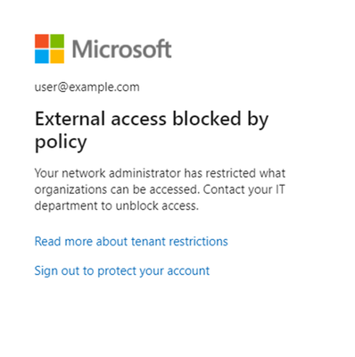
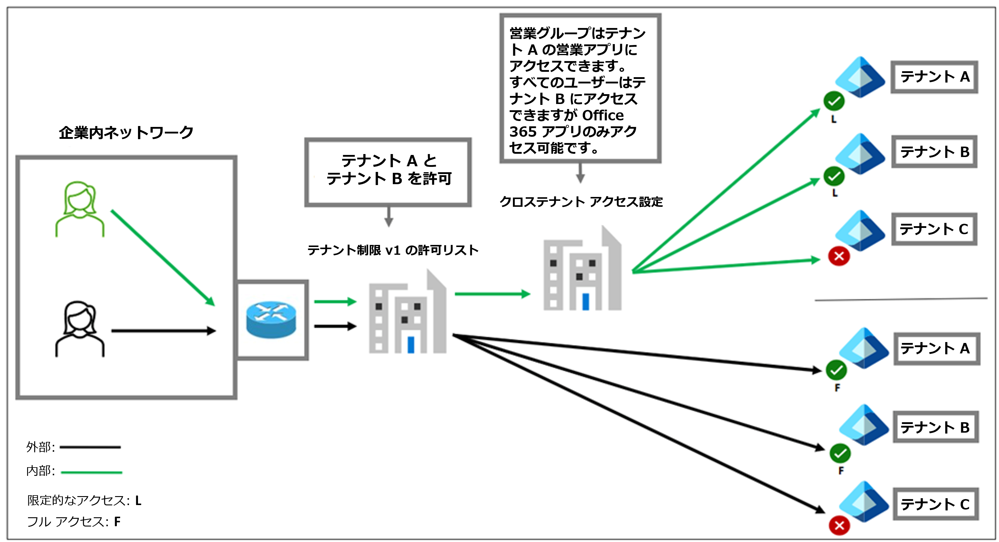

# テナント制限を v2 にアップグレードください

こんにちは、Azure Identity サポート チームの 五十嵐 です。

本記事は、2024 年 3 月 21 日に米国の Microsoft Entra (Azure AD) Blog で公開された [Upgrade your tenant restrictions to v2](https://techcommunity.microsoft.com/t5/microsoft-entra-blog/upgrade-your-tenant-restrictions-to-v2/ba-p/4081855) の抄訳です。ご不明点等ございましたらサポート チームまでお問い合わせください。

----

データ流出について綴った [前回のブログ](https://jpazureid.github.io/blog/azure-active-directory/how-tenant-restrictions-v2-can-be-used-to-prevent-data/) では、様々な種類のテナント制限ポリシーについて説明しました。このブログでは、テナント制限 v1 から認証プレーンのテナント制限 v2 への移行について説明します。今後のブログでは、Universal テナント制限 v2 への移行についても説明します。

テナント制限は、外部の Microsoft Entra ID テナントおよびコンシューマー Microsoft アカウントへの不正なアクセスによるデータ流出を防止するための重要なツールです。テナント制限 v1 では、テナント ID と Microsoft サインイン エンドポイントの許可リストを作成することで、組織が許可する外部テナントにユーザーがアクセスできるようになります。テナント制限 v1 は、長年にわたって十分に機能しましたが、テナント制限 v2 は、追加のライセンス要件なしで、より詳細かつ簡単にポリシーを管理できるようになります。

テナント制限 v2 には、テナント制限 v1 と比較して以下のような利点があります:

- 各ネットワーク プロキシからではなく、Microsoft Entra ポータルからポリシーを更新します。このため、ヘッダーを更新する必要がありません。
- プロキシ ヘッダーの最大長のサイズ制限が撤廃されます。これによりテナント制限 v2 で追加できるパートナーの数に制限がなくなりました。
- すべての ID に対してテナント全体を許可するのではなく、どのユーザー グループが外部テナントのどのアプリにアクセスするかを選択的に指定できるようになります。

このブログでは、2 つのテナント制限の種類が、クロステナント アクセス設定 (送信アクセス) とは独立したパターンと、連動したパターンのそれぞれでどのように機能するかの違いを説明し、テナント制限 v2 にアップグレードするメリットをお伝えしたいと思います。

## テナント制限の概要

テナント制限を利用する場合、すべてのユーザー認証トラフィックをプロキシ経由でルーティングする必要があります。通常、プロキシはオンプレミス ネットワークの出口にありますが、クラウドベースのプロキシでもかまいません。プロキシでは、発信元のデバイスやネットワークの場所に関係なくヘッダーが挿入され、これによりトラフィックに対して宛先の許可リストが強制されるようになります。テナント制限 v1 では、宛先の許可リストがそのままヘッダーに一覧で指定されました。テナント制限 v2 では、ヘッダーにはテナント ID とポリシー ID が指定されます。トラフィックが Microsoft Entra ID に到着すると、Entra ID がヘッダーを読み取り、ポリシーの内容を適用します。トラフィックの宛先が許可リストにない場合は、ユーザーにエラー メッセージが表示されます。

## テナント制限 v1 のしくみ

ID には、内部 ID と外部 ID の 2 種類があります。組織は ID プロバイダー (IdP) を使用して内部 ID を作成および管理しますが、個人アカウントや外部組織によって作成された ID などの外部 ID は管理しません。テナント制限 v1 は、両方の種類の ID に適用されます。

以下の図では、2 種類の ID (緑が内部 ID、黒が外部 ID) が企業ネットワーク上にあるか、仮想プライベート ネットワーク (VPN) で接続されています。どちらの ID も、Microsoft 365 サービスにアクセスしようとすると、企業ネットワークの外向きのプロキシを経由します。通常、どちらも同じように許可された宛先情報を含むヘッダーが挿入されます。この動作にはいくつかの制限があります。ネットワーク プロキシで許可リストを維持している場合、管理者はテナントを追加または削除するときに各プロキシでヘッダーを更新する必要があります。また、ヘッダーにはサイズ制限があることにも注意が必要です。

## 送信アクセス方向のクロステナント アクセス設定によるテナント制限 v1

Microsoft Entra ID では、クロステナント アクセス設定機能を構成することで、ユーザーごとやグループごと、アプリケーションごとに送信アクセスを制御できます。このクロステナント アクセス ポリシーは、デバイスやネットワークの場所に関係なく、内部 ID に適用されます。

以下の図では、ユーザーは外向けのプロキシを経由しています。そこにクロステナント アクセス設定とテナント制限が適用されました。しかし、外部 ID に適用されるポリシーはテナント制限 v1 の許可リストのみです。クロステナント アクセス設定は内部ユーザー管理を改善しますが、このアーキテクチャには制限があります。

テナント制限 v1 とクロステナント アクセス設定の両方が評価され、最も制限の厳しいポリシーが適用されます。しかし、前述のとおりクロステナント アクセス設定は内部 ID にのみ適用されます。ユーザーに対してテナント制限 v1 により外部テナントへのアクセスを許可すると、たとえクロステナント アクセス設定によるグループまたはアプリケーションの制限があっても、すべての外部 ID がそれらのテナント内の任意のリソースにアクセスできるようになります。

## クロステナント アクセス設定によるテナント制限 v2

テナント制限 v2 は、クロステナント アクセス設定と綿密に連動します。テナント制限 v2 は、外部 ID に適用されるクラウドベースのポリシーです。内部 ID のユーザーのアクセスは、クロステナント アクセス設定によって制御されます。このように分離することで、内部および外部の ID シナリオに対して、ユーザーおよびアプリケーションごとのきめ細かな設定が可能になります。

次の例では、組織は内部 ID に対してグループとアプリケーションの制限を設けています。同時に、一部の例外を除いて、外部 ID が外部テナントにアクセスすることをブロックすることも可能です。この場合、テナント C の Bob に対して例外が設定されています。Bob は Microsoft Exchange のみへのアクセスを許可され、企業ネットワークにいるときに電子メールをチェックできるようになっています。

前の図は、テナント制限 v2 がいかに柔軟に動作するかを示しています。テナント制限 v1 と v2 は同じライセンス要件であるため、ポリシーの再作成とネットワーク プロキシでヘッダーの挿入処理を更新するという 1 回限りの作業で移行が完了します。

テナント制限 v2 への移行計画の詳細については、[テナント制限 v1 からテナント制限 v2 への移行を計画する](https://learn.microsoft.com/ja-jp/entra/external-id/tenant-restrictions-migration) のドキュメントをご覧ください。

テナント制限をさらに強化するには、[ユニバーサル テナント制限](https://learn.microsoft.com/ja-jp/entra/global-secure-access/how-to-universal-tenant-restrictions) についてもご覧ください。ユニバーサル テナント制限では、データ レイヤーを保護し、企業ネットワーク プロキシでのテナント制限のヘッダー挿入処理を回避するようなトークンの侵入を防止します。またこの機能は、トラフィックが企業ネットワーク プロキシを経由していなくても、ヘッダーを挿入でき、Microsoft 365 リソースに低遅延で接続が可能です。

Jeff Bley  
Senior Product Manager, Microsoft  
[LinkedIn](https://www.linkedin.com/in/jeffrey-bley/)
