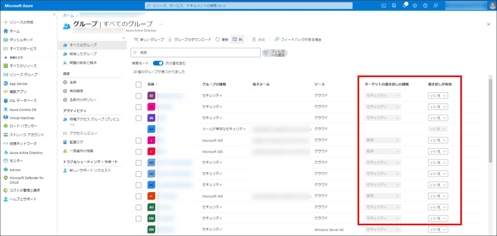
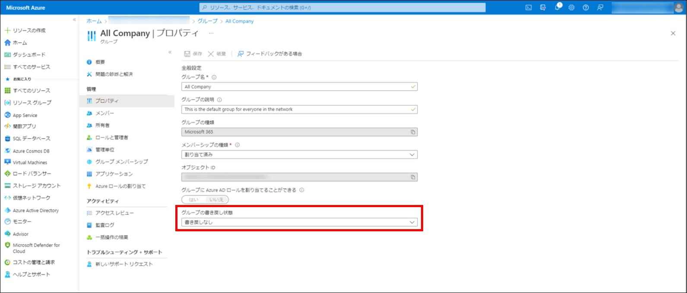

# オンプレミス AD でクラウド上のグループを使用するグループ ライトバック機能のご紹介

こんにちは、Azure Identity サポート チームの 村上 です。

本記事は、2022 年 7 月 6 日に米国の Azure Active Directory Identity Blog で公開された [Use cloud groups in on-premises Active Directory with group writeback](https://techcommunity.microsoft.com/t5/microsoft-entra-azure-ad-blog/use-cloud-groups-in-on-premises-active-directory-with-group/ba-p/3118023) を意訳したものになります。ご不明点等ございましたらサポート チームまでお問い合わせください。

---

グループ ライトバックの大幅な機能強化がパブリック プレビューで発表でき、とても嬉しく思っています。Azure AD Connect を使用して、セキュリティ グループを含むクラウド グループをオンプレミスの Active Directory に書き戻すことができます。このプレビューにより、クラウドで管理されているグループを使用して、オンプレミスのリソースへのアクセスを管理することができます。

現在、M365 のグループをユニバーサル配布グループとして、オンプレミスの Active Directory に書き戻すことが可能です。今回のパブリック プレビューでは、ライトバックできるグループを拡大するとともに、MS Graph と Azure 管理ポータルでライトバック対象のグループを管理する機能を追加し、Azure AD Connect でオンプレミスのグループを見つけやすくする機能を追加しています。

## M365 グループの機能強化

- PowerShell、MS Graph、または Azure 管理ポータルを使用して、M365 グループをユニバーサル配布グループ、セキュリティ グループ、メールが有効なセキュリティ グループのいずれかとして、オンプレミスの Active Directory に書き戻すことができるようになりました。
- MS Graph を使用して、新しく作成された M365 グループを自動的に書き戻す設定をテナント全体で行うことができます。

## グループ ライトバックの新機能 

- PowerShell、MS Graph、Microsoft Entra の管理センターを使って、Azure AD のセキュリティ グループをユニバーサル セキュリティ グループとしてオンプレミスの Active Directory に書き戻す設定もできるようになりました。
- Azure AD Connect でグループのライトバックを設定する際、オンプレミスの識別名のコモン ネームをクラウド グループの表示名に置き換えるオプションがあり、Azure AD からライトバックされるグループの識別が容易になりました。
- Active Directory に書き戻すグループは、MS Graph Explorer や Microsoft Entra の管理センターを使って管理することができます。

