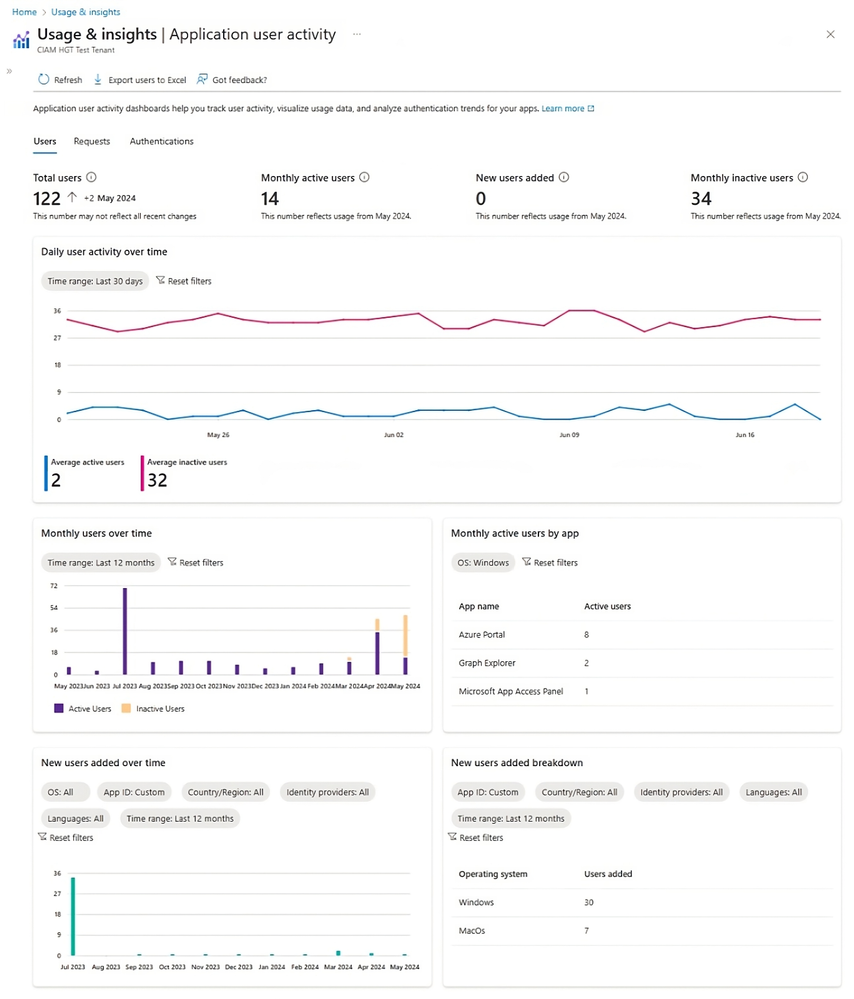

# 使用状況と分析情報: 顧客 ID データの分析

こんにちは、Azure Identity サポートチームの 張替 です。
本記事は、2024 年 3 月 18 日に米国の Azure Active Directory Identity Blog で公開された [Cross-tenant access settings - Notes from the field](https://techcommunity.microsoft.com/t5/microsoft-entra-blog/cross-tenant-access-settings-notes-from-the-field/ba-p/4081841) を意訳したものになります。ご不明点等ございましたらサポート チームまでお問い合わせください。

---

本日、Microsoft Entra External ID における [使用状況と分析情報] の **一般提供** を発表できることを嬉しく思います。

2023 年 10 月にパブリック プレビューが開始された [使用状況と分析情報] は、管理者や開発者が顧客の行動、好み、課題について、より深い洞察を得ることができる強力なツールです。このツールは、月間アクティブユーザー数 (MAU) や日次のアクティブ ユーザー数 (DAU)、新規追加ユーザー数、リクエスト数、認証数、多要素認証 (MFA) の種類別利用状況、MFA の成功率対失敗率などの主要な指標を提供します。また、時間の範囲、オペレーティング システム、国、およびアプリケーション ID によってデータをフィルタリングおよびセグメント化することもできます。[使用状況と分析情報] では、以下のことが可能です:
 
- 顧客のアプリケーションへのログインと登録操作の傾向およびパターンを分析し、事業の成長と改善のための新たな機会を提供します。
- 顧客のユーザー体験と ID の管理戦略を最適化し、ビジネス ゴールとユーザー ニーズに沿ったデータ主導の意思決定を支援します。
- Microsoft Graph API から [使用状況と分析情報] を使って Power BI などのツールでカスタマイズされたダッシュボードを構築し、顧客の ID データをより柔軟に管理できるようにします。
 
[使用状況と分析情報] にアクセスするには、[Microsoft Entra External ID](https://aka.ms/External_ID) の外部テナントが必要です。テナントの準備ができたら、[Microsoft 管理センター](https://aka.ms/ExternalIDUserInsights) でダッシュボードにアクセスするか、[Microsoft Graph API](https://aka.ms/userInsightsGraphAPIs) を介して生のデータにアクセスできます。本日発表する機能は、プレビュー版のお客様からの直接のフィードバックに基づいており、大きな価値を提供するものです。無料トライアルはこちら (here) からお申し込みください。
 
## Excel へデータをエクスポートしてオフラインで分析する

Microsoft Excel へのエクスポート機能を利用することで、ダッシュボードから生データに容易にアクセス可能となります。データをカンマ区切り値 (CSV) 形式でエクスポートできますので、Excel やその他の CSV エディターでデータをシームレスにインポートおよび操作できるようになりました。これにより、お客様はデータをオフラインで使用し、独自の分析や操作を行うことができます。

 
## さまざまなユーザー セグメントに対応するよう ID 管理ソリューションを最適化

言語および ID プロバイダー別にデータをフィルタリングして、ユーザーの嗜好や行動に関する詳細な洞察を得ることもできます。例えば、ユーザーの間でどの言語が最も人気ｄえ、アプリケーションや地域によってどのように異なるかを確認できます。また、どの ID プロバイダーが認証に最も使用されているか、それらがユーザー体験やサービスの継続利用にどのような影響を与えるかも確認できます。これらのフィルターは、さまざまなユーザー セグメントに合わせて ID 管理ソリューションを調整し、最適化するのに有効です。

## MFA の失敗に関する分析情報からユーザー体験とセキュリティを向上
 
MFA 失敗のグラフを用いて、MFA が原因で失敗したサインイン試行の数と、失敗した理由を確認できます。3 つのカテゴリ別に内訳を確認できます:
 
- Bad requestサインイン リクエストが不正または無効であった。
- MFA denied: ユーザーが間違った認証コードを入力したか、MFA の要求を拒否した。
- MFA incomplete: ユーザーが制限時間内に MFA の要求を完了しなかった。    
 
この内訳を用いることで、MFA 失敗の一般的な原因を理解し、リソースを絞り込んで、アプリケーションのユーザー体験とセキュリティを向上させることができます。

## ユーザーの維持、エンゲージメント、満足度に関する潜在的な問題の特定

非アクティブ ユーザーとは、一定期間サインインしていないユーザーのことです。アプリケーションの日次および月次の非アクティブ ユーザー数、および経時的な傾向を確認できます。この指標は、ユーザー エンゲージメントを監視し、ユーザー体験を改善できるエリアを特定したり、ユーザーの再エンゲージメントのために何らかのインセンティブを提供したりするのに有効です。

 
## ぜひ今日からこの機能を活用ください

[使用状況と分析情報] のデータを確認するには、[Microsoft Entra External ID 外部テナント](https://aka.ms/External_ID) と、実際の顧客のサインインまたはサインアップ データを持つアプリケーションが必要です。[クイック スタート ガイド](https://aka.ms/CiamStartFreeTrialLearnMore) を使用して、試用版テナントを作成し、[Microsoft 管理センター](https://aka.ms/ExternalIDUserInsights) で [使用状況と分析情報] にアクセスするか、[Microsoft Graph API](https://aka.ms/userInsightsGraphAPIs) を介して生データにアクセスください。この新機能へのアクセス方法や、ユーザーアクティビティの表示、クエリ、分析方法については、[ドキュメント](https://learn.microsoft.com/en-us/entra/external-id/customers/how-to-user-insights) をご覧ください。
 
Microsoft Entra ポートフォリオの他の機能の詳細やテストについては、[開発者センター](https://developer.microsoft.com/en-us/identity/customers) をご覧ください。また、[Identity ブログ](https://devblogs.microsoft.com/identity/tag/external-id/) の E メール通知に登録すれば、Identity の最新情報を入手可能です。加えて、[YouTube](https://www.youtube.com/@MicrosoftSecurity/playlists) をフォローして、概要、チュートリアル、ディープ ダイブのビデオもご覧ください。
