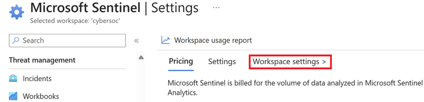
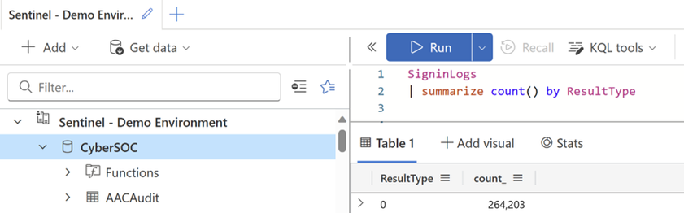
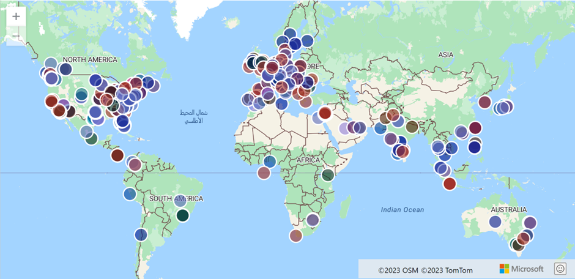
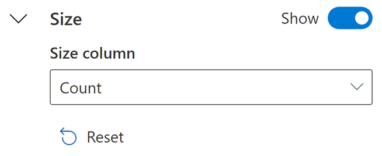
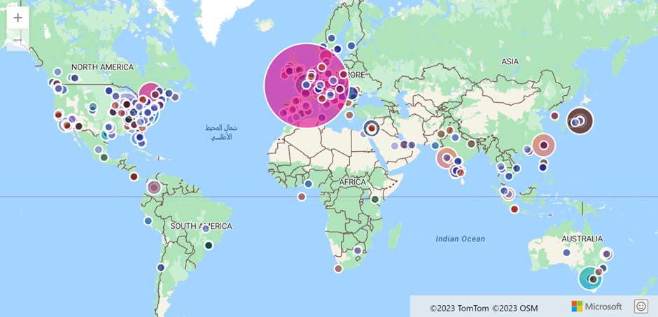

# インタラクティブマップを使用した Entra Sign-in ログの可視化手法


こんにちは！ Azure ID チームの小出です。

本記事は、2024 年 1 月 16 日に米国の Microsoft Entra (Azure AD) Blog で公開された [ Visualize Entra Sign-in Logs using an Interactive Map - Microsoft Community Hub](https://techcommunity.microsoft.com/t5/microsoft-entra-blog/visualize-entra-sign-in-logs-using-an-interactive-map/ba-p/4013853) を意訳したものになります。ご不明点等ございましたらサポート チームまでお問い合わせください。


---


Microsoft Sentinel には、Microsoft および Azure サービス、サードパーティのソースやカスタムログまで、豊富なデータコネクタが存在します。このデータは、分析してこそ価値をもたらすものです。プロアクティブおよびリアクティブな調査をしていく中で、さまざまなフォーマットでデータを可視化することで、何らかの異常やパターン、貴重な洞察などを得ることができます。

Microsoft Entra のサインインログのような地理的な関連情報を含むデータを扱う場合、データを最大限に活用するためには、適切なツールを通してデータを視覚化することが重要です。そこで、Sentinel と Log Analytics ワークスペースのインタラクティブ マップが活躍します。このブログ記事の執筆時点では、Sentinel や Log Analytics ワークスペースの Logs セクションで直接インタラクティブマップを使用することはできません。代わりに、Azure Data Explorer ウェブ アプリまたは [Kusto Explorerデスクトップ アプリ](https://learn.microsoft.com/en-us/azure/data-explorer/kusto/tools/kusto-explorer)を使用する必要があります。この記事では、すべての例で Azure Data Explorer を使用した方法をご紹介します。必要なセットアップは、数分しかかからず、簡単なものとなっております。


## セットアップと構成

最初のステップでは、[Azure Data Explorer](https://dataexplorer.azure.com/)ウェブアプリにアクセスし、画面左上の Add をクリックし、Connection を選択します。


ここで、接続を求めるウィンドウが表示されます。Sentinel のインスタンス (実際は Log Analytics ワークスペース) に接続するためには、以下の情報が必要になります:
 
- サブスクリプション ID
- リソース グループ名 - Log Analytics ワークスペースがあるリソース グループ
- Log Analytics ワークスペース名

これらの情報は、Sentinel のメニューの［設定］をクリックし、［ワークスペース設定］をクリックすると表示されます。



[ワークスペースの設定] をクリックすると、以下のように必要な情報が画面に表示されます。これは、Sentinel を使用せずに Log Analytics ワークスペースに接続している場合も同様です。Log Analytics ワークスペースのページに移動すると、以下のページが開きます。


接続 URI は以下のような形式である必要があります。
 ```
https://ade.loganalytics.io/subscriptions/<subscription-id>/resourcegroups/<resource-group-name>/providers/microsoft.operationalinsights/workspaces/<workspace-name>
```

接続 URI を適切な値で書き変えたら、それを Azure Data Explorer に追加します。表示名も入力し、[追加] をクリックします。接続 URI に指定している Log Analytics ワークスペースが、ウィンドウの下部に表示されているテナントの値と会ていることを確認ください。Log Analytics ワークスペースが Azure Data Explorer にサインインしたテナントとは異なるテナントにある場合は、この画面でテナントを切り替えください。


接続が確立すると、左メニューの [接続] に表示されるようになります。


テーブルをクエリするには、ワークスペースを選択し、Sentinel の Logs の画面で通常行うようにクエリを入力ください。



## インタラクティブ マップの使用 

インタラクティブ マップを使用するには、経度と緯度のデータが必要が必要になります。国名、州名、都市名に基づくマッピングには対応していません。経度と緯度のフォーマットは 10 進数である必要があります。つまり、41.40338 と 2.17403 の組み合わせは機能しますが、41°24'12.2"N と 2°10'26.5 "E の形式では機能しません。Sentinel のほとんどのテーブルには、すでに正しいフォーマットの地理データが含まれています。

インタラクティブ マップを生成するには、"scatterchart with (kind=map) "の後に render operator を使用する必要があります。地理空間データの可視化に関連する引数についてのドキュメントは[こちら](https://learn.microsoft.com/en-us/azure/data-explorer/kusto/query/geospatial-visualizations)です。ルールの 1 つとして、クエリ出力の最初の 2 列は経度と緯度の値でなければなりません。経度と緯度の特定の列は、クエリを実行した後に手動で選択することもできますが、列の順序を適切に設定することで、余分な作業を省略することができます。

各ロケーションから Entra のサインイン数を取得し、インタラクティブ マップ上に可視化させたデータを表示するには以下のクエリを利用ください。


```
SigninLogs
|whereTimeGenerated >ago(7d)|whereisnotempty(LocationDetails.geoCoordinates)|extend Latitude =toreal(LocationDetails.geoCoordinates["latitude"])|extend Longitude =toreal(LocationDetails.geoCoordinates["longitude"])|summarize Count =count()byLongitude,Latitude
|project Longitude,Latitude,Count
|render scatterchart with(kind=map)
```



インタラクティブ マップは、拡大するなど自由に動かすことができます。オブジェクトをクリックすると、クエリの出力に基づいた値が表示されます。上記のクエリの例では、その場所からのサインイン数が計算されているため、オブジェクトをクリックするとサインイン数が表示されます。


Azure Data Explorer ページでクエリを実行すると、結果の右側にメニューが表示されます。ここでは、クエリの結果を可視化する際の設定を変更することができます。


円のサイズをサインイン数 (またはクエリ出力に存在する可能性のある他の数値) に比例させるように設定することも可能です。これを行うには、サイズのセクションで、まず非表示のトグルを切り替えてサイズの設定を有効にし、円のサイズを決める列名を選択します。

以下がサイズのセクションを設定した例になります。円の大きさが変化したことがお分かりいただけると思います。






## 結論

地理的なデータを可視化することで、他の方法では得られないような知見を得ることが可能です。Azure Data Explorer で接続をセットアップすれば、Entra ID やサインイン ログなど Sentinel のログを検索してインタラクティブな地図上に可視化が可能になるため、調査がより効果的になります。
 
ご自身のデータを実効力のある知見に変換する方法や、データの可視化の詳細については[こちら](https://learn.microsoft.com/en-us/azure/data-explorer/viz-overview)をご覧ください。

