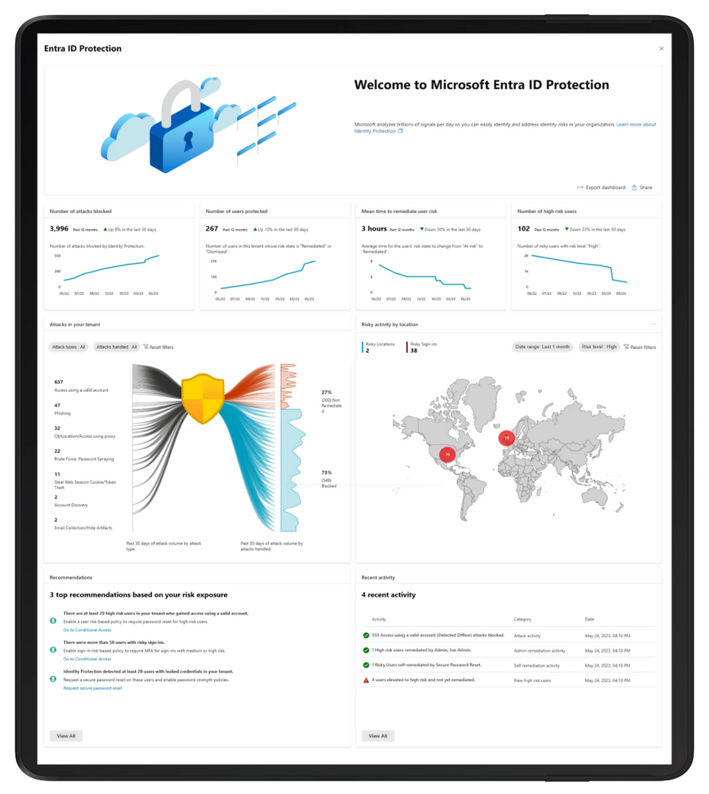
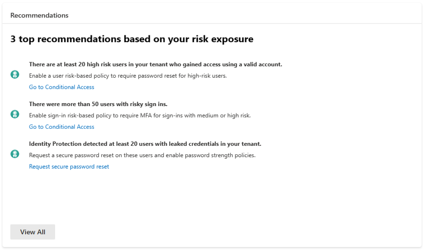
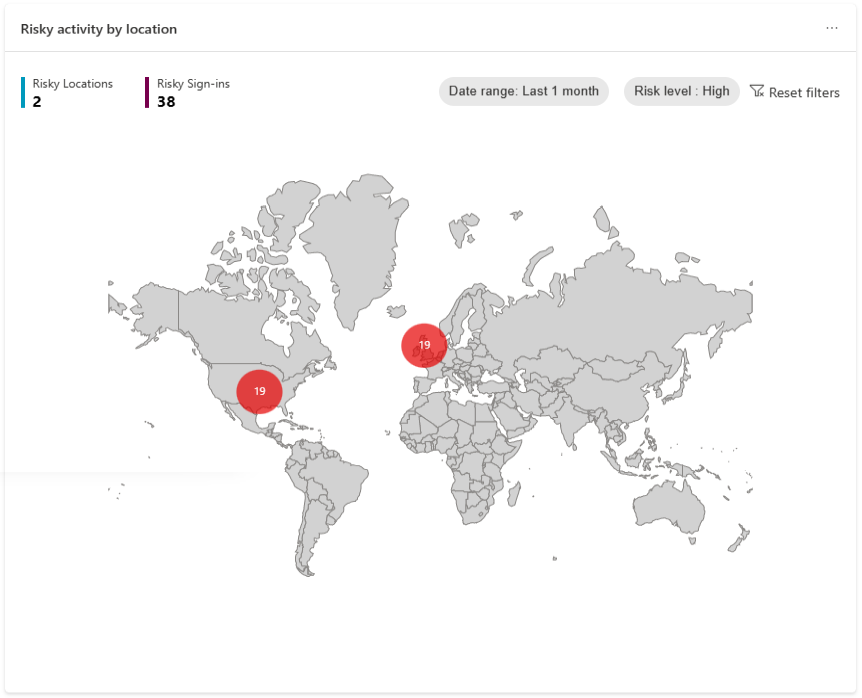
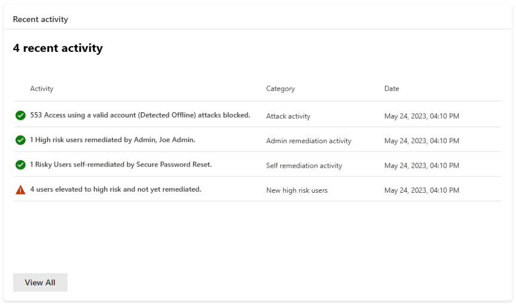
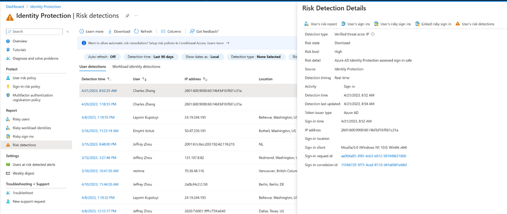
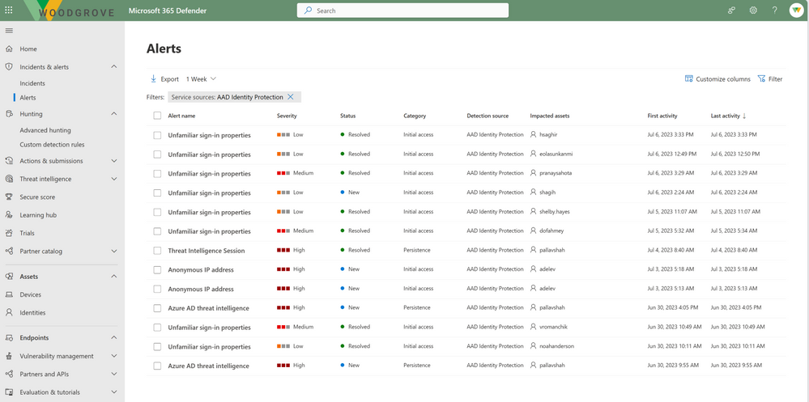
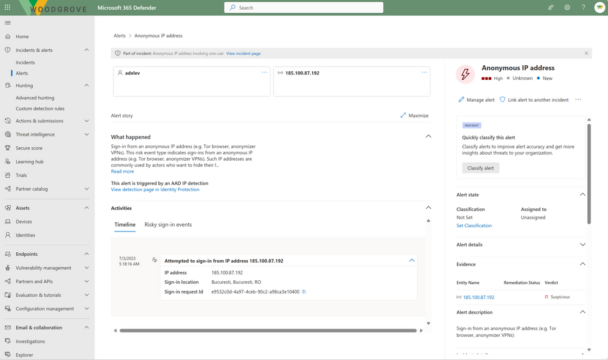

# Microsoft Entra ID Protection の新機能

こんにちは、Azure Identity サポート チームです。

本記事は、2023 年 7 月 31 日に米国の Microsoft Entra (Azure AD) Blog で公開された [What’s new with Microsoft Entra ID Protection](https://techcommunity.microsoft.com/t5/microsoft-entra-azure-ad-blog/what-s-new-with-microsoft-entra-id-protection/ba-p/3773132) を意訳したものになります。ご不明点等ございましたらサポート チームまでお問い合わせください。

---

拡大しつづけるデジタル世界において、ID は最も攻撃される領域であり、攻撃の巧みさと頻度も増し続けています。手動による調査や対応では到底このペースには追い付くことはできません。ID を侵害から守り、今後生じる脅威に迅速に対応していくためには、考え方を変える必要があります。

Microsoft Entra ID Protection (旧名: Azure AD Identity Protection) は攻撃が発生する前に、それを抑止するツールです。Microsoft Entra ID Protection は乗っ取りをリアルタイムに防ぎ、進化した機械学習による検知、リスクベースのアクセス ポリシー、そして総合的なリスク レポートと分析情報によって自動的に攻撃から防御します。最新技術でお客様を保護するために、この度、Microsoft Entra ID Protection の主要な強化機能を発表できることをうれしく思います。この機能強化では、鍵となる分析情報を提供する新しいダッシュボード、既知の攻撃をブロックする新しい検知の仕組み、生じうる脅威からユーザーを迅速に保護するための新しい仕組み、そして、Microsoft 365 Defender との統合が行われます。それぞれの新しい機能の詳細については以下をご参照ください。

## 新しいダッシュボード

Microsoft Entra ID Protection の刷新されたダッシュボードをこの度公開いたします。このダッシュボードにより、ID の管理者と IT 担当者はセキュリティの状態をよりよく把握でき、ID の侵害に対してより効率的に対応が取れるようになります。

最新のダッシュボードでは、詳細を把握可能なビジュアル化に加え、実際に行動に移せる形で推奨情報を提供します。これらの情報により、ID を担当するチームでは、"我々の組織はどのように保護されているのか？" や "我々の組織にどのような攻撃が仕掛けられているのか？"、"それらの攻撃にどのように対応すべきか？" というような問いに答えられるようになります。

[リスクベースの条件付きアクセス ポリシー](https://learn.microsoft.com/ja-jp/azure/active-directory/identity-protection/concept-identity-protection-policies) と強力な認証ポリシーを利用することにより、テナントの保護をさらに強化できます。お客様からは、これまで自らの組織がどれほどうまく保護されているのかという情報が欲しいという要望をいただいておりましたので、この度、お客様が構成済みの保護機能の有効性を示す **4 つのキー メトリクス** を提供することといたしました。**ブロックされた攻撃の数** と **保護されているユーザーの数** のメトリクスではセキュリティ対策の効果を示し、**ユーザー リスクを修復するための平均時間** では組織の攻撃への応答時間と侵害からの回復時間を確認できます。リスクベース ポリシーやセルフサービス パスワード リセットを採用することによって、回復速度を劇的に短縮し、セキュリティと運用効率を向上させることができます。最後に、**危険度の高いユーザーの数** では、アカウント侵害のリスクがどれだけ続いているかを確認できます。

また、晒されているリスクの状況と脆弱な箇所を示すために、**攻撃の状況を示すグラフ** を表示することとしました。過去 30 日に検知された一般的な ID ベースの攻撃パターンや、さらに重要なこととして、ブロックに成功した攻撃数と復旧を必要とする ID 数を視覚化しました。先進の機械学習の検知により、漏洩した資格情報や匿名トークン、パスワード スプレー攻撃などの情報を元に攻撃パターンが特定されます。

効果的な対策を講じれるよう、晒されたリスクに基づいてカスタマイズされた **推奨事項** を提供します。例えば、少なくとも 20 名の危険なユーザーがテナントへアクセスした場合 (アカウントが侵害された可能性がある場合) ユーザー リスク ポリシーを利用してこれらのユーザーアカウントを効果的かつ効率的に安全な状態に戻すという推奨案が提案されます。攻撃状態を示すグラフと推奨事項を組み合わせて、セキュリティ体制を強化するための的確な取り組み内容を提案します。  

また、地理的にリスク イベントの発生元を示すために **地図** の表示も取り入れました。この動的な地図を用いることで、組織に対する脅威をグローバル的な視点から示します。

最後に **最新のアクティビティ** 機能はテナントでの直近のリスク関連のアクティビティの要約を提供します。疑わしい振る舞いを特定するために管理者またはユーザーによりどのような推奨事項が対応されたかなどのアクティビティを確認できます。

新しいダッシュボードにより、組織のセキュリティを強化するためのアクセスしやすく、分かりやすい解析情報が導き出されるため、ID 担当チームにとって非常に貴重な助けになると思われます。管理者または SOC (Security Operation Center) チームは日々の業務ではもちろん、ビジネス インパクトを示すために経営層に情報を共有するためにもこれらの情報を利用いただけます。

ダッシュボード機能は現在プレビューではありますが、ぜひお試しいただきたいです！

## 新しい高度な検出機能

Microsoft Entra ID Protection の開発において、弊社では悪意のある攻撃者やアクティビティから環境を保護するため、新しい検知機能を提供できるよう努めています。Microsoft の持つ広範な脅威インテリジェンスの情報を活用して、この度 2 つの **高精度** の検知機能をリリースします。これらの検知機能をリスクベースの条件付きアクセスポリシーと組み合わせることにより、攻撃をより早い段階で阻止できるようにします。

1 つ目の検知は **検証済み脅威アクター IP** です。過去数年にわたり、多くの重大なセキュリティ インシデントが国家による攻撃者またはサイバー犯罪グループによって引き起こされたことがわかっています。Microsoft の様々なセキュリティ チームによる調査結果を活用することによって、これらの攻撃者についてのナレッジ データベースを作成し、これらの攻撃者によりサインインが行われた際には、リアルタイムのサインイン リスクを検出できるようになります。

2 つ目は **中間者攻撃** です。ユーザーのアクセス権を取得し、アカウントを侵害する一般的な手法はフィッシングであり、通常は偽のログイン ページにユーザーを誘導して資格情報を入力させ、入手した認証方法を Microsoft Entra ID に横流しして利用します。仮にユーザーに多要素認証 (MFA) が要求されても、いつもどおりの認証操作であるため、ユーザーはそのまま認証を完了する可能性が高いです。これによって攻撃者に認証済みのセッションと、以降に攻撃に利用できる資格情報を提供してしまいます。

Microsoft 365 Defender からのシグナルと Microsoft Entra ID からのデータを組み合わせることで、このような攻撃を正確に検知し、対象となるサインインとユーザーに **Azure AD 脅威インテリジェンス** のリスクを割り当てるようにします。これにより、パスワード リセットを強制することによってセッションを破棄させ、ユーザーの資格情報がその後悪用させるのを抑止します。

両検知機能はすでに Microsoft Entra ID のお客様にて利用可能です。

## リアルタイムな Azure AD 脅威インテリジェンス

新たに発生する ID ベースの攻撃からお客様を保護するために、Microsoft Entra ID Protection にてリアルタイムな Azure AD 脅威インテリジェンスを提供いたします。新しい攻撃パターンが判明したときに、迅速に新しいリアルタイム検知機能を Microsoft Entra ID Protection に追加し、これら新しい攻撃に対抗できるようになりました。これらの検知は Microsoft の脅威インテリジェンスをリアルタイムに活用するため、Microsoft Entra ID Protection がサインインの時点で侵害パターンを特定/検知して、リスク ベースの条件付きアクセスポリシーを利用することで ID を保護することができます。

ユーザーのサインインの処理において、サインイン情報がリアルタイム脅威インテリジェンス検知のパターンにマッチすると、Microsoft Entra ID Protection のリアルタイム リスク評価エンジンが検知を報告し、サインインとユーザーのリスク レベルを上げて、お客様が構成したリスク ベースの条件付きアクセスポリシーに従い、ブロックまたはユーザーへの認証要求を強制します。これにより、悪意ある攻撃から組織が保護されます。

リアルタイムな脅威インテリジェンスの検知について詳細を確認するには、検知内容の追加情報の欄をご覧ください。

## 一般提供: Microsoft Entra ID Protection と Microsoft 365 Defender との統合

**Microsoft Entra ID Protection と Microsoft 365 Defender との統合が一般提供となりました** ことを発表いたします。Microsoft Entra ID Protection のアラートは高度な検知アルゴリズムによって生成され、侵害された ID を特定するための重要な指標となります。これらのアラートは Microsoft 365 Defender にも表示され、他のセキュリティ機能から報告された **インシデント** とも関連付けられます。セキュリティを担当するチームは、効率的かつ効果的にインシデントを調査でき、攻撃の全体像を理解すると共に、ID の侵害に対して迅速に対処出来ます。

これらのアラートは Microsoft 365 Defender Incident API でも取得でき、Microsoft Sentinel または他のソリューションに格納されている Microsoft Entra ID Protection のアラートと組み合わせてインシデントを追跡可能です。

Microsoft 365 Defender のユーザーのページでは、ユーザーのリスク スコアを確認でき、侵害された可能性のあるユーザーに対してフィードバックを提供できます。調査が完了した場合、インシデントとアラートのステータスが更新され、Microsoft Entra ID Protection に自動的に結果が同期されます。

このシームレスな統合により、まだ ID が侵害される前の段階で、攻撃の芽をつぶしておくということが可能になります。[https://security.microsoft.com/](https://security.microsoft.com/) と [ドキュメント](https://learn.microsoft.com/ja-jp/azure/active-directory/identity-protection/howto-identity-protection-investigate-risk#investigate-risk-with-microsoft-365-defender) を参照し、ぜひ本日から利用を始めていただければ幸いです。この統合に関して改善のフィードバックがありましたらぜひお知らせください。

## まとめ

これらのアップデートにより、Microsoft Entra ID Protection を改善し続けることでさらなる機能強化を行い、お客様に最高の ID セキュリティを提供するという目標により一歩近づくことができました。

製品の機能を最大に活用するため、お客様におかれましては新しいダッシュボードで提供されるベスト プラクティスと推奨事項に従い、加えてリスクベースの条件付きアクセス ポリシーを展開して、新しく検出された脅威から自動的に保護および復旧することを強くお勧めします。

Alex Weinert ([@Alex_](https://techcommunity.microsoft.com/t5/user/viewprofilepage/user-id/15847)T_Weinert)  
VP Director of Identity Security, Microsoft