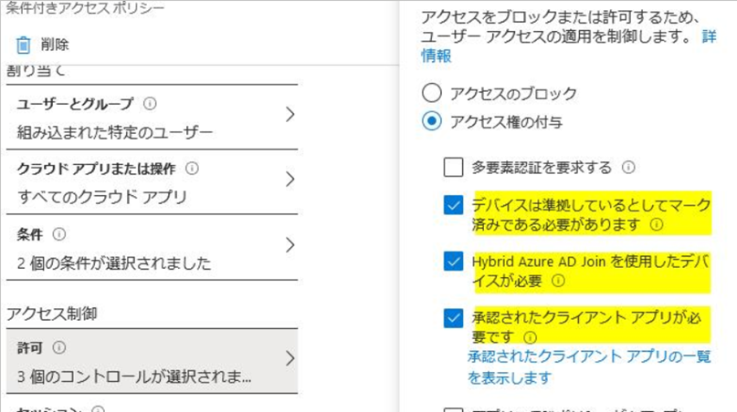
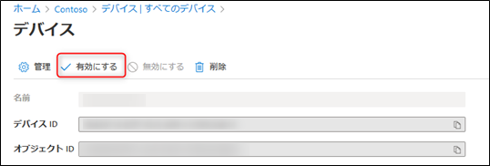

# エラーコード 135011 の対処方法

こんにちは、Azure & Identity サポート チームの谷口です。

今回は、最近多くご質問いただいております、135001 エラーが出力された際の対処方法をご紹介します。

## エラーコード 135011 について

Azure Active Directory (Azure AD) にデバイスを登録するとそのデバイスに紐づく形で PRT (Primary Refresh Token) というものを取得できるようになり、この PRT を用いて Office 365 など Azure AD と連携したアプリケーションのサインイン時にシングル サインオン (SSO) できるようになります。

このエラーは、Azure AD 上に登録された デバイス オブジェクトが無効の状態となっているために PRT が利用できなくなり、SSO に失敗することで表示されます。
エラーの影響範囲としては、無効にされたデバイスからのユーザーでの認証部分になります。

また、条件付きアクセスで [デバイスは準拠しているとしてマーク済みである必要があります] や [Hybrid Azure AD Join を使用したデバイスが必要]、[承認されたクライアント アプリが必要です] といった、デバイス情報が必要なポリシーが登録されていた場合、 該当のデバイスはデバイス情報が記載されている PRT を利用できないため、条件付きアクセスでブロックされるといった影響がでる場合もあります。

PRT に関しまして、以下の公開情報についても、ご参照いただけますと幸いです。
 

PRT はどのようにして無効になりますか ?

https://docs.microsoft.com/ja-jp/azure/active-directory/devices/concept-primary-refresh-token#how-is-a-prt-invalidated

## デバイスを再び有効にする方法
エラー 135011 への対処はデバイスを有効にすることです。

一般ユーザーは、自身のアカウントに紐づいたデバイスを無効にすることはできますが、無効状態となったデバイスを有効化することはできません。

デバイスを有効な状態に変更するには、テナントの [グローバル管理者] もしくは [クラウド デバイス管理者] のロールを持つユーザーとして Azure ポータルにサインインし、有効化をする必要があります。

今後もご利用になる予定のデバイスが意図せず無効になった際には、以下の手順を実行してデバイスを有効化することが可能です。

1. Azure ポータル (https://portal.azure.com/) にグローバル管理者権限を保持するアカウントでログオンします。
2. 左ペインから [Azure Active Directory] - [デバイス] と移動します。

3. [デバイス] の一覧から対象のデバイス名をクリックし、遷移した画面内の上部から [有効にする] を押します。

今回の記事は以上となります。
該当エラーでお困りの方は、ぜひお試しください。
