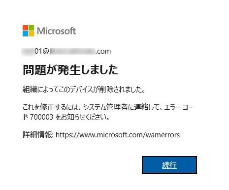
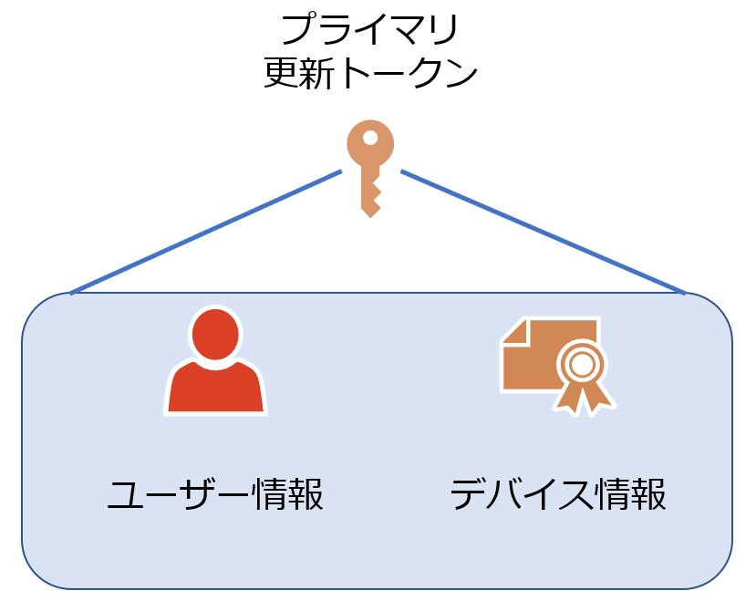
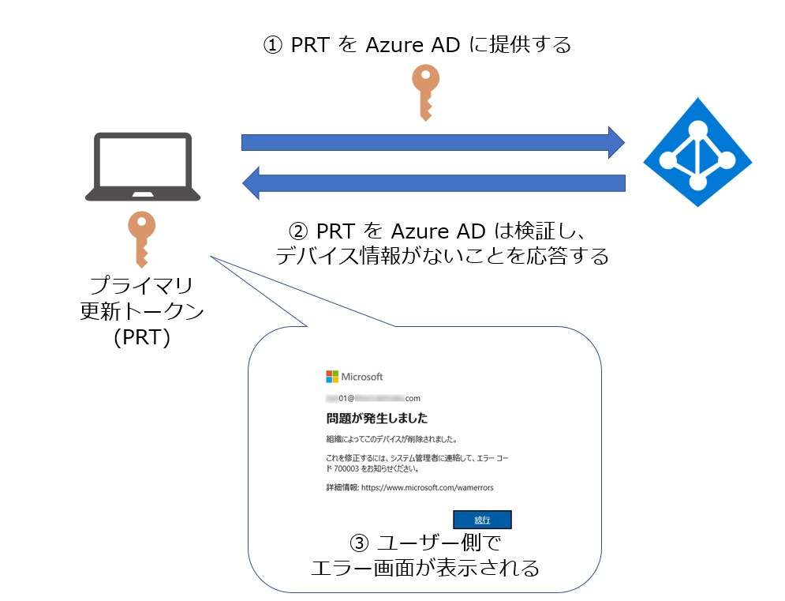
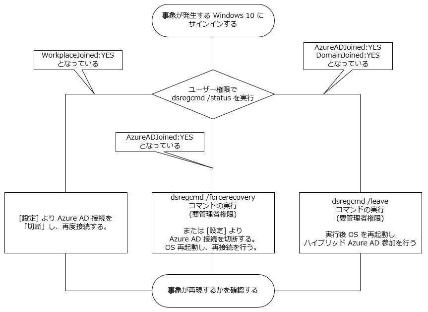
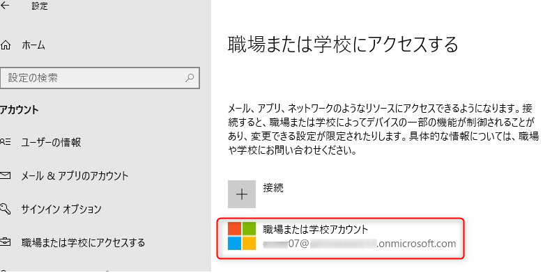
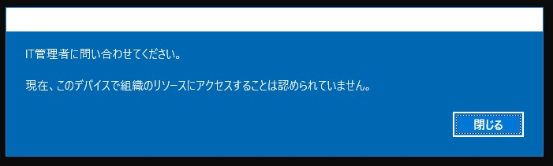
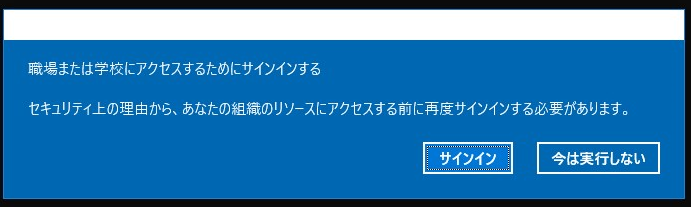

# エラーコード 700003 の対処策について

こんにちは、 Azure Identity の平形です。
今回は最近多くお問い合わせ頂いております 700003 エラーについてのご説明と一般的な対応手順をお伝えします。

## エラーコード 700003 とは何か

最近こんなエラーを見たことはありますか？

上記で表示されているエラー コード 700003 とは、「クライアントが提示したデバイス情報が Azure AD 上に存在しない」場合に発生するエラーです。
このエラーが多く起きるのは Windows 10 デバイスをご利用されており、かつ Edge や Internet Explorer をご利用されている、もしくは Office アプリケーションご利用のタイミングです。
本ブログでは、このエラーの対処策と、簡単に「デバイス情報」とは何かをご説明します。

## デバイス情報とは何か

Windows 10 を Azure AD に参加させた場合、あるいはデバイスを登録することで、Windows 10 側にはデバイスを AAD に登録したという情報、 Azure AD にはデバイス情報が、それぞれ格納されます。
この状態で Azure AD に所属するユーザーがログオン、あるいはデバイスを登録したユーザーがログオンするタイミングで Primary Refresh Token (プライマリ更新トークン = PRT) と呼ばれるトークンを取得するようになります。
この PRT は、ブラウザーや Office クライアントを利用した Azure AD (Office 365) へのアクセスで利用され、改めてユーザー名、パスワードを入力することなく、シングル サインオンを実現するために利用されます。

他に PRT が利用されるケースとしては、条件付きアクセスのアクセス制御にあります「デバイスは準拠しているとしてマーク済みである必要があります」「ハイブリッド Azure AD 参加済みのデバイスが必要」といったデバイスの状態に依存したコントロールを利用する場合が挙げられます。
この状態を Azure AD はどのように察知しているか、気になった人もいると思いますが、実は PRT にはデバイス情報が含まれるため、 PRT を Azure AD に提示することでこれらの制御ができるようになっています。

なお、 Office のバージョンにも依存しますが、最新のバージョンでは Windows 10 に対する Office のインストール、セットアップ時に自動的に Azure AD へのデバイス登録をおこなうため、明示的に Azure AD への登録、参加を実施していなくともデバイスが Azure AD に登録され、 PRT 取得、シングル サインオンが行われます。

改めて PRT に含まれる情報を図にまとめますと次のようになります。

プライマリ更新トークンについては以下の公開情報がございますので、気になった方は参照ください。

- [プライマリ更新トークンとは](https://docs.microsoft.com/ja-jp/azure/active-directory/devices/concept-primary-refresh-token)

さて、今回の問題ですが、クライアントが PRT の取得を試みた場合、あるいは既に取得していた PRT を Azure AD に提示した際に Azure AD が提供されたデバイス情報に紐づく情報を Azure AD 上に確認できなかった場合に、このエラーコード 700003 が発生します。
(クライアントが PRT の取得を試みる際にもクライアントが保持するデバイス情報を Azure AD に提示する動作が行われ、その時に該当のものが見つからない場合にもエラーになります)

以下の図は、既に取得済みの PRT を Azure AD に提供した場合のケースで問題が発生したパターンを示しています。

## エラーコードが 700003 が発生した時の対処策
端的に言えば現在クライアント上に存在するデバイス情報を削除し、必要に応じて再度 Azure AD に登録します。
Azure AD へのデバイス登録には 3 種類 (*1, 注釈は最下部に記載) ありますので、その状態に合わせて登録処理を行う必要があります。
現在の状態は dsregcmd /status コマンドで確認することが可能です。
この実行結果を基に、現在デバイスがどの状態かを確認することが可能です。

大まかなフローは以下の通りです。

以下にそれぞれのシナリオごとの対処手順を記載します。

### WorkplaceJoined が YES の場合

Azure AD 登録済み状態 (Azure AD Registered) と認識されています。
これを解除するには、 Windows 10 の [設定] - [アカウント] - [職場または学校アカウント] より、 Azure AD のバッジを選択し、「切断」を選択する必要があります。

切断後、再度「+ 接続」より Azure AD への再登録を実行してください。 (*2, 注釈は最下部に記載)

### AzureADJoined のみ YES の場合

Azure AD 参加済み状態 (Azure AD Joined) と認識されています。
これを解除・再登録を行う場合は dsregcmd /forcerecovery コマンドを実行します。 (*2, 注釈は最下部に記載)
このコマンドは管理者権限で実行する必要があります。
管理者権限でないユーザーで実行した場合には以下のエラーが表示されます。

管理者権限で実行すると以下の画面が表示されるので、「サインイン」を選択します。

再度サインインを行い、 Azure AD 参加を行い直すと以下の画面が表示されますのでサインアウト・サインインをして作業完了です。

### DomainJoined および AzureADJoined の両方が YES の場合

ハイブリッド Azure AD 参加済み状態 (Hybrid Azure AD Joined) と認識されています。
この場合、管理者権限でコマンド プロンプトを起動し、 dsregcmd /leave コマンドを実行します。
実行後、 OS を再起動してサインインし直すことでデバイスが自動的に再登録されます。 (*2 *3, 注釈は最下部に記載)

### 上記を実行しても解消しない場合

上記手順を実行しても解消しない場合には、一度 Azure AD 参加・登録を一度解除し、「AzureADJoined/WorkplaceJoined」両方が No の状態であることを確認した上で以下のレジストリを確認します。

 HKEY_CURRENT_USER\Software\Microsoft\Windows\CurrentVersion\AAD\Storage

上記レジストリ配下に「`https://login.microsoftonline.com`」というレジストリが残っているかを確認します。
残留している場合には削除し、 Azure AD への再登録を実行ください。
その後事象が解消したかを確認します。
上記はハイブリッド Azure AD 参加環境下で事前に Azure AD デバイス登録を行っていたデバイスで残留する場合があります。
なお、レジストリ削除は今回のエラーが発生した時のみ実行し、それ以外の時には実行しないようお願い致します。

基本的な対処策は上記の通りですが、これらを行っても事象が解消しない場合はお気軽に弊社までお問い合わせください。

*1 3 種類の登録状態は以下の公開情報を参照ください。
[デバイス ID とは](https://docs.microsoft.com/ja-jp/azure/active-directory/devices/overview#getting-devices-in-azure-ad)
Azure AD 登録済み・ Azure AD 参加済み・ハイブリッド Azure AD 参加済みの 3 種類があります。

*2 Intune 等の MDM 登録も行っている場合は切断・再登録ができない場合もあります。この場合は MDM 側のリタイアもお試しください。
*3 これは既定値です。環境によっては自動的に再登録しないように制御している場合があります。
