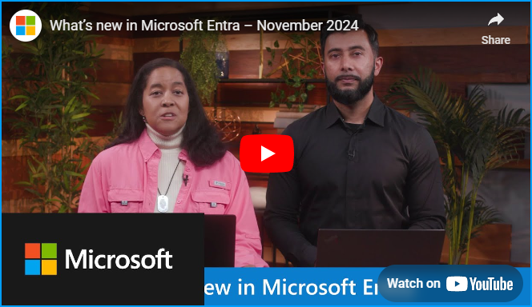

# Microsoft Entra の新機能 - 2024 年 11 月

こんにちは、Azure Identity サポート チームの 高田 です。

本記事は、2024 年 12 月 6 日に米国の Microsoft Entra Blog で公開された [What's new in Microsoft Entra - November 2024](https://techcommunity.microsoft.com/blog/identity/whats-new-in-microsoft-entra---november-2024/4253152) を意訳したものになります。ご不明点等ございましたらサポート チームまでお問い合わせください。

----

## Microsoft Entra の最新機能と変更のお知らせ

ID セキュリティの状況は、かつてないほどのスピードで変化しています。世界的な出来事や急速に進化する AI によりサイバーセキュリティ環境が変化する中、セキュリティの維持はこれまで以上に重要になっています。サイバー攻撃の規模と影響の増大に対処するために、Microsoft は [Secure Future Initiative (SFI)](https://www.microsoft.com/ja-jp/trust-center/security/secure-future-initiative?msockid=31a0906fdeb0658912808276df9c6461) というイニシアティブを開始し、Microsoft のもつ力を最大限に活用して組織と製品全体のサイバーセキュリティを強化する取り組みを進めています。この取り組みは、社内の知見と、お客様、政府、パートナーからの貴重なフィードバックの両方を反映したものであり、セキュリティの未来を形作るために最も価値のある部分に焦点を当てて取り組んでいます。

先月の [Microsoft Ignite](https://ignite.microsoft.com/ja-jp/home) では、進化する脅威の状況を先取りし、AI 時代における安全なアクセスを確保するため、次のようないくつかの重要な更新情報を発表しました。

- **Microsoft Entra における Security Copilot**: パブリック プレビューを拡張し Security Copilot を Microsoft Entra 管理センターに直接埋め込むことで、管理者向けの従来のユーザー体験の中で ID に関する分析情報に簡単にアクセスできるようになりました。
- **Microsoft Entra Private Access の機能強化**: クイック アクセス ポリシー、アプリ検出、プライベート ドメイン ネーム システム (DNS)、ネットワーク コネクターなどの新機能を発表しました。
- **Microsoft Entra Internet Access の進歩**: CAE (Continuous Access Evaluation) および TLS (Transport Layer Security) インスペクションのサポートが追加されました。
- **Microsoft Entra ID Protection** でのリアルタイムのパスワード スプレー攻撃の検出。
- Microsoft Authenticator for iOS および Android での **デバイスに紐づくパスキー** のサポート。
- Microsoft Entra External ID での **ネイティブ認証**。
- Microsoft Entra における **What's new の機能** と **正常性監視** の新機能。

これらの更新の詳細については、Microsoft コミュニティ ハブのブログ「[Ignite: Microsoft Entra の AI と SASE のイノベーション](https://jpazureid.github.io/blog/azure-active-directory/ignite-ai-and-sase-innovations-in-microsoft-entra/)」を参照ください。

そして本日は、2024 年 10 月から 11 月にかけての Microsoft Entra 全体でのセキュリティ改善とイノベーションについて、製品ごとに整理してお伝えいたします。

詳細については、[Microsoft Entra の新機能](https://youtu.be/NESTW0B1nAQ) の動画で製品更新プログラムの概要をご覧いただくとともに、Microsoft Entra 管理センターの [新機能](https://aka.ms/entra/whatsnew) ブレードでも詳細な情報をご覧いただけます。

## Microsoft Entra ID

新機能

- [動的管理単位](https://learn.microsoft.com/en-us/entra/identity/role-based-access-control/admin-units-members-dynamic)
- [Microsoft Entra の正常性監視と正常性メトリクスの機能](https://learn.microsoft.com/ja-jp/entra/identity/monitoring-health/concept-microsoft-entra-health)
- [Log Analytics サインイン ログ スキーマが MSGraph スキーマと同一形式に対応](https://learn.microsoft.com/en-us/azure/azure-monitor/reference/tables/signinlogs)

変更のお知らせ

### セキュリティの改善

#### セキュリティ既定値群に対する変更

[お客様によっては対応が必要]

Microsoft の [Secure Future Initiative](https://www.microsoft.com/ja-jp/trust-center/security/secure-future-initiative) に則り、[セキュリティ既定値群が有効になっている場合に多要素認証 (MFA) の登録を 14 日間スキップできる選択肢を削除する](https://jpazureid.github.io/blog/azure-active-directory/update-to-security-default/) 予定です。すべてのユーザーは、セキュリティ既定値群が有効になった後、最初のログイン時に MFA を登録する必要があります。この変更は、2024 年 12 月 2 日以降に新しく作成されたテナントに影響し、2025 年 1 月からは既存のテナントにロールアウトされます。

#### FIDO2 を利用しておりキーの制限を使用していない組織において Authenticator でのパスキーを有効化

[お客様によっては対応が必要]

2025 年 1 月中旬以降、Microsoft Authenticator でのパスキーの GA (一般提供開始) 後、**パスキー (FIDO2) の認証方法ポリシーがキー制限なしで有効になっているお客様は、FIDO2 セキュリティ キーに加えて Microsoft Authenticator のパスキーも自動的に有効になります**。セキュリティ情報のページでは、ユーザーは認証方法として Microsoft Authenticator にパスキーを追加するという選択肢が表示されるようになります。さらに、条件付きアクセスの認証強度ポリシーでパスキーの認証が適用される場合、パスキーを持たないユーザーは、Microsoft Authenticator にパスキーを登録するように求められます。この変更を有効にしたくないお客様は、パスキー (FIDO2) の認証方法ポリシーでキー制限を有効に変更ください。詳細については、[こちら](https://learn.microsoft.com/ja-jp/entra/identity/authentication/how-to-enable-authenticator-passkey) をクリックしてください。

#### Microsoft が提供する API 用のアクセス トークンが暗号化される

[お客様によっては対応が必要]

2024 年 10 月より、Microsoft はより多くの API で段階的にアクセス トークンを暗号化しています。この変更により、Microsoft が所有する API のアクセス トークンの形式が変更されます。

**必要なアクション**: クライアント アプリケーションは、アクセス トークンを解読不可能な文字列として扱う必要があり、読み取り、検証、または解析を試みないでください。アクセス トークンを解析して検証する必要があるのは、アクセス トークンの意図された受信者である Web API のみであり、お客様のクライアント アプリケーションではありません。

**その理由**: アプリケーションが特定のトークン形式を前提としている場合 (GUID ではなく 'aud' クレームに URI を期待するなど)、トークン形式が変更されると、その前提が崩れ機能上の問題が発生する可能性があります。

お客様のクライアント アプリケーションが現在アクセス トークンを解析している場合は、Microsoft ID プラットフォームの [ドキュメント](https://learn.microsoft.com/ja-jp/entra/identity-platform/identity-platform-integration-checklist) で説明されているベスト プラクティスに沿ってコードを確認および更新ください。

#### Microsoft Graph のアクセス トークンでの aud 要求の形式の変更

[お客様によっては対応が必要]

セキュリティに対する継続的な取り組みとして、2025 年 1 月 15 日以降に Microsoft Graph 用に発行されるトークンに若干の変更を加えます。クライアント アプリケーションが不必要にアクセス トークンを解析し、特定の形式の [aud クレーム](https://learn.microsoft.com/ja-jp/entra/identity-platform/access-token-claims-reference#payload-claims) を期待している場合、アプリケーションに影響が生じる可能性があります。

[ドキュメント](https://learn.microsoft.com/ja-jp/entra/identity-platform/access-tokens) で説明されているように、アクセス トークンを解析および検証する必要があるのはリソース API のみです。クライアント アプリケーションは、この変更または将来の変更によって影響受けないよう、アクセス トークンを解読不可能な文字列として扱うよう対応ください。

#### 適切なユーザーが引き続き Azure Service Health のセキュリティ アドバイザリにアクセスできるよう確認

[お客様によっては対応が必要]

適切な権限を持つユーザーのみが機密性の高いセキュリティ アドバイザリを受け取れるように、2025 年 2 月 28 日以降、Azure Service Health の [ロールベースのアクセス制御 (RBAC) に変更](https://learn.microsoft.com/ja-jp/azure/service-health/security-advisories-elevated-access?branch=pr-en-us-255499) を加える予定です。この変更を行うにあたり、弊社では以下の対応を行います。

- 2025 年 2 月 28 日に Resource Health API の新しいバージョンを導入し、セキュリティ アドバイザリ イベントにアクセスできるのは特権ユーザーのみになります。
- 2025 年 8 月 31 日に Azure ポータルでセキュリティ アドバイザリ イベントの RBAC を有効にします。
- 2025 年 9 月 15 日に Azure Resource Graph のセキュリティ アドバイザリ イベントの RBAC を有効にします。

以下に示すいずれかの方法でセキュリティ アドバイザリを受け取っている場合に本変更の影響を受ける可能性があります。

**Azure ポータルを使用している場合:**

- 2025 年 8 月 31 日より前に [RBAC の割り当て](https://learn.microsoft.com/ja-jp/azure/service-health/security-advisories-elevated-access?branch=pr-en-us-255499) を確認し、必要に応じて変更または追加を実施ください。

**Resource Health API を使用してイベントにアクセスしている場合:**

- 2025 年 9 月 15 日に古いバージョンが非推奨になる前に、新しい Resource Health API に移行ください。
- [FetchEventDetails](https://learn.microsoft.com/ja-jp/rest/api/resourcehealth/event/fetch-details-by-subscription-id-and-tracking-id?view=rest-resourcehealth-2024-02-01&tabs=HTTP) を使用して、機密性の高いセキュリティ情報を今後はご確認ください。

**Azure Resource Graph を使用している場合:**

- 昇格されたアクセスを必要とする [ServiceHealthResources プロパティ](https://learn.microsoft.com/ja-jp/azure/service-health/resource-graph-samples?tabs=azure-cli) を確認し、2025 年 9 月 15 日より前に変更または追加を行います。

[Microsoft Learn](https://learn.microsoft.com/ja-jp/azure/service-health/stay-informed-security) にアクセスして、これらの変更の詳細を確認し、Azure のセキュリティ問題に関する最新情報を入手ください。

#### パブリック プレビューの更新 - ハードウェア OATH トークン

[お客様によっては対応が必要]

11 月 14 日に、ハードウェア OATH トークンのパブリック プレビューに関し、新しいバージョンをリリースしました。この更新では、エンド ユーザーによる自己割り当て、アクティブ化、および委任された管理者のアクセスがサポートされています。詳細については、[公開ドキュメント](https://learn.microsoft.com/ja-jp/entra/identity/authentication/concept-authentication-oath-tokens#hardware-oath-tokens-preview) を参照ください。

この更新を利用するには、[MS Graph API](https://learn.microsoft.com/ja-jp/entra/identity/authentication/how-to-mfa-manage-oath-tokens) を使用してトークンを作成します。新しいユーザー体験は、廃止されるまで旧バージョンと並行して実行され、廃止は [Microsoft Entra の新機能](https://aka.ms/entra/whatsnew) と M365 メッセージ センターの投稿を通じて発表されます。

今すぐ移行するには、古いトークンを削除し、MS Graph を使用して新しいプレビューでトークンを再作成します。一般提供された際には、MS Graph API を使用して、ユーザーに影響を与えずユーザーごとにトークンを移行できるようになります。

#### MFA ワンタイム パスコードの配信手段としての WhatsApp の利用拡大

[お客様によっては対応が必要]

2024 年 12 月から、インドおよびその他の国のユーザーは、WhatsApp を介して MFA テキスト メッセージを受信できるようになります。認証方法として MFA のテキスト メッセージの受信が有効になっており、すでに電話に WhatsApp がインストールされているユーザーのみがこのユーザー体験を利用できます。WhatsApp を使用しているユーザーに到達できない場合、またはインターネットに接続していない場合は、すぐに通常の SMS の通信経路にフォールバックします。さらに、WhatsApp 経由で初めて OTP を受信するユーザーには、SMS テキスト メッセージで動作の変更が通知されます。

Microsoft Entra の従業員向け (Workforce) テナントにて、現在テキスト メッセージの認証方法を利用している場合は、この今後の変更についてヘルプデスクに事前に通知することをお勧めします。さらに、ユーザーが WhatsApp 経由で MFA テキスト メッセージを受信しないようにしたい場合は、組織の認証方法としてテキスト メッセージを無効にすることが可能です。なお、Microsoft Authenticator やパスキーなど、より最新で安全な方法の使用に移行し、電話回線やメッセージング アプリの方法は極力控えることを強くお勧めします。この更新は、お客様側での変更なく既定で有効になります。詳細については、[電話認証のドキュメント](https://learn.microsoft.com/ja-jp/entra/identity/authentication/concept-authentication-phone-options) をご覧ください。

この変更の展開は自動的に行われ、管理者の操作は必要ありません。この変更についてユーザーに通知し、必要に応じて関連ドキュメントを更新することをおすすめします。

### ID の刷新

#### 重要な更新情報: Azure AD Graph の廃止

[お客様によっては対応が必要]

[Azure AD Graph API サービスの廃止](https://jpazureid.github.io/blog/azure-active-directory/azure-ad-graph-api-retirement/) は 2024 年 9 月に開始され、最終的には新しいアプリケーションと既存のアプリケーションの両方に影響します。現在、Azure AD Graph の提供終了の第 1 フェーズの展開が完了しており、新しいアプリケーションは利用延長の構成を行っていない限り、Azure AD Graph API を使用できません。Microsoft Graph は Azure AD Graph API に代わるものであり、今すぐに Azure AD Graph API から Microsoft Graph に移行し、Azure AD Graph API を使用した開発は止めることを強くお勧めします。

**Azure AD Graph API サービスの段階的な廃止のタイムライン**

<table border="1" width="0px">
    <tbody>
        <tr>
            <td width="20%">
                
<strong>フェーズの開始日</strong><strong>&nbsp;</strong><strong>&nbsp;</strong>

            </td>
            <td width="40%">
                
<strong>既存のアプリへの影響 </strong><strong>&nbsp;</strong><strong>&nbsp;</strong>

            </td>
            <td width="40%">
                
<strong>新しいアプリへの影響  </strong><strong>&nbsp;</strong><strong>&nbsp;</strong>

            </td>
        </tr>
        <tr>
            <td width="20%">
                
2024 年 9 月 1 日

            </td>
            <td width="40%">
                
なし &nbsp;

            </td>
            <td width="40%" rowspan="3">
                
<a href=https://learn.microsoft.com/en-us/graph/applications-authenticationbehaviors">blockAzureAdGraphAccess</a> を false に設定し、Azure AD Graph へのアクセスを延長するようにアプリが構成されていない限り、新しいアプリは Azure AD Graph API の使用をブロックされます。新しいアプリでは Microsoft Graph を使用する必要があります。

            </td>
        </tr>
        <tr>
            <td width="20%">
                
2025 年 2 月 1 日

            </td>
            <td width="40%">
                
<a href=https://learn.microsoft.com/en-us/graph/applications-authenticationbehaviors">blockAzureAdGraphAccess</a> を false に設定し、Azure AD Graph へのアクセスを延長するようにアプリが構成されていない限り、アプリは Azure AD Graph API を使用できません。

            </td>
        </tr>
        <tr>
            <td width="20%">
                
2025 年 7 月 1 日

            </td>
            <td width="40%">
                
Azure AD Graph は完全に廃止されます。Azure AD Graph API への要求は機能しません。

            </td>
        </tr>
    </tbody>
</table>

サービスの中断を避けるため、[弊社のガイダンス](https://aka.ms/AzureADGraphMigration) に従いアプリケーションを Microsoft Graph API に移行ください。

**アプリの Azure AD Graph アクセスを 2025 年 7 月まで延長する必要がある場合**

Microsoft Graph へのアプリの移行が完全に完了していない場合は、この廃止を延長できます。アプリケーションの [authenticationBehaviors](https://learn.microsoft.com/ja-jp/graph/applications-authenticationbehaviors?tabs=http) の構成で blockAzureADGraphAccess 属性を false に設定すると、アプリケーションは 2025 年 6 月 30 日まで Azure AD Graph API を使用できるようになります。その他のドキュメントについては、[こちら](https://learn.microsoft.com/ja-jp/graph/applications-authenticationbehaviors?tabs=http#allow-extended-azure-ad-graph-access-until-june-30-2025) を参照ください。

この設定が false に設定されていない限り、新しいアプリケーションが Azure AD Graph API にアクセスしようとすると **403 エラー** が発生します。2024 年に Microsoft Graph への移行が完了しないすべての既存のアプリケーションについては、今すぐこの構成を設定することを計画ください。

**Azure AD Graph API を使用しているテナント内のアプリケーションが不明な場合**

テナントで Azure AD Graph API を現在も使用しているアプリケーションとサービス プリンシパルに関する情報を示す [2 つの Entra 推奨事項の機能](https://learn.microsoft.com/en-us/entra/identity/monitoring-health/recommendation-migrate-to-microsoft-graph-api) を提供しています。これらの新しい推奨事項を利用することで、影響を受けるアプリケーションとサービス プリンシパルを特定し、Microsoft Graph への移行をお進めください。

参照: 

- [Azure Active Directory (Azure AD) Graph から Microsoft Graph への移行](https://learn.microsoft.com/en-us/graph/migrate-azure-ad-graph-overview)
- [Azure AD Graph アプリの移行計画チェックリスト](https://learn.microsoft.com/en-us/graph/migrate-azure-ad-graph-planning-checklist)
- [Azure AD Graph から Microsoft Graph への移行に関する FAQ ](https://learn.microsoft.com/en-us/graph/migrate-azure-ad-graph-faq)

#### 重要な更新: AzureAD および MSOnline PowerShell の廃止

[お客様によっては対応が必要]

2024 年 3 月 30 日の時点で、従来の Azure AD PowerShell、Azure AD PowerShell Preview、MS Online モジュールは [非推奨](https://jpazureid.github.io/blog/azure-active-directory/important-update-deprecation-of-azure-ad-powershell-and-msonline/) になりました。これらのモジュールは 2025 年 3 月 30 日まで引き続き機能しますが、その後は廃止され、機能を停止します。[Microsoft Graph PowerShell SDK](https://learn.microsoft.com/ja-jp/powershell/microsoftgraph/overview?view=graph-powershell-1.0) はこれらのモジュールの移行先であり、できるだけ早くスクリプトを Microsoft Graph PowerShell SDK に移行する必要があります。

テナントでの Azure AD PowerShell の使用状況を特定するには、[Entra の推奨事項](https://learn.microsoft.com/ja-jp/entra/identity/monitoring-health/overview-recommendations) である「**廃止中の Azure AD Graph API から Microsoft Graph にサービス プリンシパルを移行する**」を使用いただけます。この推奨事項では、AzureAD PowerShell など、テナントで Azure AD Graph API を使用しているベンダー アプリケーションが表示されます。Microsoft Entra [サインイン ログ](https://learn.microsoft.com/ja-jp/entra/identity/monitoring-health/concept-sign-ins) も、テナント内の MS Online と Azure AD PowerShell から行われたログインを特定するために使用できます。**Azure Active Directory PowerShell** というアプリケーション名を持つサインイン イベント (対話型および非対話型) があれば、それは MS Online クライアントや Azure AD PowerShell クライアントによって行われたものだと判断できます。

弊社では、Microsoft Entra を管理するための PowerShell に新規および将来の大幅な投資を行っており、その具体的な例として [Microsoft Entra PowerShell](https://aka.ms/EntraPSPreview) モジュールのパブリック プレビューが挙げられます。この新しいモジュールは、Microsoft Graph PowerShell SDK をベースに構築されており、実際の利用シナリオに重点を置いたコマンドレットを提供します。Microsoft Graph PowerShell SDK のすべてのコマンドレットと完全に相互運用できるため、よりシンプルでドキュメントも整備されたコマンドを用いて複雑な操作を実行できます。このモジュールには、非推奨の AzureAD モジュールからの移行を簡略化するための下位互換性オプションも用意されています。

#### 新しい無料サブスクリプションのロールアウト: Microsoft Entra ID Free 

[お客様による対応は必要なし]

2024 年 12 月 11 日以降、M365 製品へのサインアップによって作成されたテナントには、"Microsoft Entra ID Free" というラベルの付いた新しいサブスクリプションが含まれます。このロールアウトは、2025 年 2 月 7 日までにすべての製品のサインアップ フローをカバーするように拡大されます。

新しく作成されたテナントの場合、このサブスクリプションは Entra ポータルおよび Azure ポータルの [All Billing Subscriptions] の配下、または M365 管理センターの [Subscriptions] ページにある課金サブスクリプションの一覧に表示されます。これはテナント レベルのサブスクリプションであり、関連する課金はなく、お客様の対応も必要ありません。

将来的には、このサブスクリプションは、同じ請求先アカウントで作成されたすべての新しいテナントを追跡するために使用され、お客様はすべての新しいテナントの棚卸が可能となるとともに、お客様がテナントの管理アクセス権を失った場合でもテナントの所有権を実証できるようになります。お客様がどのようなテナントを保持しているかすべて特定したい場合、詳細については https://aka.ms/TenantDiscoveryFAQ をご覧ください。

### ユーザー体験の向上

#### My Access にて推奨されるアクセス パッケージが表示

[お客様による対応は必要なし]

[以前にお知らせ](https://jpazureid.github.io/blog/azure-active-directory/whats-new-in-microsoft-entra-in-202409/) したように、[My Access](https://myaccess.microsoft.com/) に新しい Microsoft Entra ID ガバナンスの機能が追加され、推奨されるアクセス パッケージのリスト機能が導入されました。これにより、ユーザーは長いリストをスクロールすることなく、最も関連性の高いアクセス パッケージ (類似したユーザーが使用しているアクセス パッケージと以前の要求を参考に算出) をすばやく表示できます。これは、オプトインのプレビューとして 12 月末までにすべての Microsoft Entra ID Governance のお客様に展開され、変更を強調するための製品内メッセージも併せて表示されます。必要に応じて、関連するドキュメントに更新された画面デザインを反映することをご検討ください。

## Microsoft Entra ID ガバナンス

新機能

- [Microsoft Entra Connect Sync Version 2.4.27.0 がリリース](https://learn.microsoft.com/en-us/entra/identity/hybrid/connect/reference-connect-version-history#24270)

変更のお知らせ

#### Microsoft Entra 監査ログへの Microsoft Identity Manager (MIM) ハイブリッド レポート機能の廃止

[お客様によっては対応が必要]

Microsoft Identity Manager (MIM) 2016 で導入された [MIM ハイブリッド レポート機能](https://learn.microsoft.com/ja-jp/microsoft-identity-manager/working-with-identity-manager-hybrid-reporting) は非推奨とされています。この機能は、MIM ハイブリッド レポート エージェントが MIM サービスから Microsoft Entra にイベント ログを送信することで、セルフサービス パスワード リセット (SSPR) を利用したパスワードリセットとセルフサービス グループ管理 (SSGM) のレポートが Microsoft Entra 監査ログで確認可能となるものでした。この機能は、Azure Arc エージェントを使用してこれらのイベント ログを [Azure Monitor](https://learn.microsoft.com/ja-jp/microsoft-identity-manager/mim-azure-monitor-reporting) に送信する方法に置き換えられ、結果としてより柔軟なレポートが可能になります。2025 年 11 月になると、MIM ハイブリッド レポート エージェントによって使用されるクラウド エンドポイントは使用できなくなるため、お客様は Azure Monitor または同様のものに移行ください。その他の MIM および Entra ID Connect Health 機能は、この非推奨の影響を受けません。

## Microsoft Entra External ID

新機能

- [Microsoft Entra External ID の MFA 方法としての SMS](https://learn.microsoft.com/en-us/entra/external-id/customers/concept-multifactor-authentication-customers)

変更のお知らせ

#### Microsoft Entra External ID の属性収集の機能強化

[お客様による対応は必要なし]

2025 年 1 月より、Entra External ID の属性収集のページに対する重要な更新が生じます。ユーザーがサインアップすると、既定の属性とカスタム属性の両方の各入力フィールドの横にラベルが常時表示されるようになります。この機能強化には、次の 2 つの目的があります。

- **アクセシビリティの向上**: 常時表示されるラベルは、アクセシビリティ基準への準拠に重要であり、サインアップ プロセスがすべての人にとってよりわかりやすいものとなります。
- **文脈をより分かりやすく**: ユーザーの属性名に対応する各入力フィールドに明確にラベルを付けることで、特に値が事前に入力済みの場合に、ユーザーがその意図や目的をより理解しやすくなります。

## Microsoft Entra Private Access

新機能

- [クイック アクセス ポリシー](https://learn.microsoft.com/en-us/entra/global-secure-access/how-to-configure-quick-access)
 
どうぞよろしくお願いいたします

Shobhit Sahay