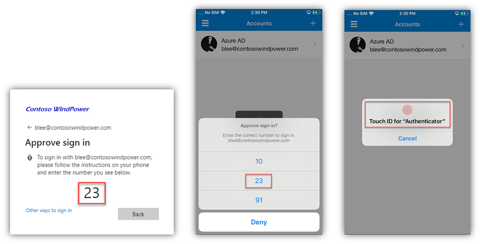
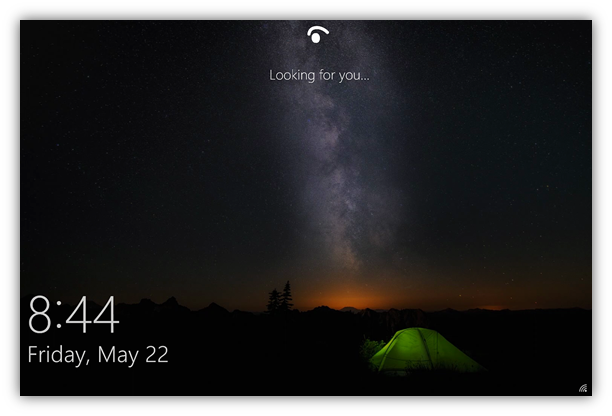
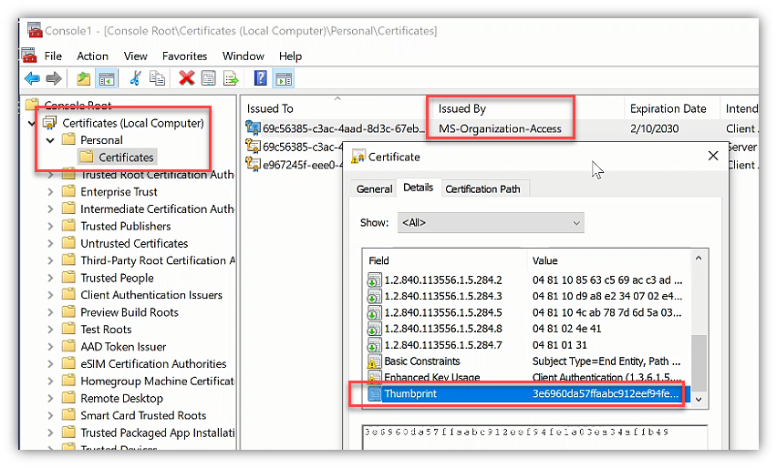

> 本記事は、 2020 年 6 月 18 日に Core Infrastructure and Security Blog に公開された記事 (“Why are my users not prompted for MFA as expected?”) を翻訳したものです。原文は [こちら](https://techcommunity.microsoft.com/t5/core-infrastructure-and-security/why-are-my-users-not-prompted-for-mfa-as-expected/ba-p/1449032) より参照ください。

# ユーザーに期待どりに MFA が求められない！

"MFA" もしくは "多要素認証 (Multi-Factor Authentication)" とは、リソースへのアクセスを許可する前に、ユーザー名とパスワード以上のものが必要とされる認証プロセスのことです。

これらには、SMS のテキスト メッセージを介してユーザーの携帯電話に送信されるワンタイム コードや、ユーザーのオフィスやデスクの電話機への電話、携帯電話のモバイル アプリに "プッシュ" されるワンタイム コード、もしくは物理的なトークンのコード (OATH トークンやハードウェア トークンなど) などが考えられます。 最近では、MFA でも生体技術が利用されています - 電話やテキストの代わりに (またはそれに加えて)、親指や指紋、網膜や顔の読み取りを使用されている方もいらっしゃると思います。

いずれにしろ、システムやリソースにアクセスする際に、ID とパスワードだけでは不十分という意味です。

恐らく既に銀行口座やクレジット カード、その他の金融関係の取引のために (恐らく職場でも) MFA を設定済みである場合も多いと思います。MFA により、これらのサービスの利用や取引がより安全に行えるようになっているはずです。仮に今、誰かがあなたのパスワードとメールアドレスを知っていたり、推測したり、お金を払って手に入れたりしたとしても、それだけではあなたのアカウントに侵入するには「不十分」です。

私たちは MFA を超えて、パスワードすらもはや必要ない世界に進もうとしています。つまりサインインをより簡単でなおかつ安全にするもっと別のテクノロジーを使うことを考えています。例えば以下の例では、「パスワードなし (パスワードレス) のサインイン」機能を利用することで、PC の画面上に番号が表示され、直後にモバイル デバイス上の Microsoft Authneticator アプリ上で同じ番号を選択するように入力が促されます。PC 上の番号と同じ番号が選択され番号が合致すると、その後に生体認証が要求され、ユーザーが認証されます。

[ジェリコ・フォーラム](https://en.wikipedia.org/wiki/Jericho_Forum) 以降、企業 IT の世界は「[ゼロ トラスト](https://www.microsoft.com/security/blog/2018/12/17/zero-trust-part-1-identity-and-access-management/)」モデルへと移行してきました。ゼロ トラストのモデルでは、従来のネットワーク境界やファイアーウォールではなく、ID こそが最初の管理ポイントとなります。これは、組織内の従業員 (とその資格情報) だけでなく、組織内のデバイスも「ID」を持ち、アクセス制御システムの一部となることで、多くの場合は PKI (公開鍵暗号基盤) に基づいて、ユーザーとデバイスで相互の認証を行うことを意味します。こういった方法はユーザーがシステムやサービスにアクセスするのにデバイスが必要であることを考えると、確かに理にかなったものですが、一方で当たり前にできて当然と思われていることも多く、明示的に説明されることは多くないかもしれません。映画のマトリックスのように、人間をコンピューターに直接に接続することはまだできませんから。

ハードウェア技術の進歩により、Trusted Platform Module (TPM) もしくは同様の技術がほとんどの PC およびモバイル デバイスで利用できるようになりました。これにより、資格情報を特定のデバイス上でのみ安全に保存および利用することが可能となります。TPM によって保護された情報は、技術的にエクスポートできないように保護されています。TPM を使用してデバイス上の資格情報やキーが保護されている場合、その資格情報はそのデバイス上でのみ機能します。

このような状況の中でも、Microsoft では Windows 10、Windows Hello for Business、Azure AD、オンプレミスの Active Directory などの技術やソリューションの設計、開発、改善を続けています。さらに、この活動には、これらの **チーム間の** 継続的な共同での技術的連携も含まれています。その結果、お客様の気づかないところで Microsoft のサービスおよび製品間の相互運用性は非常に優れたものとなっています。

例えば、ユーザーが Windows Hello for Business (WHfB) を介して Windows 10 PC にサインイン (またはロック解除) したときに、このような複数の機能の連携が製品内部で発生しています。このパッと見て一見何事もないように見えるサインインの処理が動作すると、ユーザーおよび Windows 10 デバイスは、"プライマリー リフレッシュ トークン (PRT)" と呼ばれる、新しいタイプのクラウド対応の資格情報を Azure AD から取得します。これは、KDC が動作している AD ドメイン コントローラーからオンプレミス環境で Kerberos チケットを取得するのに似ています。Kerberos のさらに前だと、NTLM と Windows NT の PDC/BDC のお話になりますね。クラウドの時代では、Web 認証、トークン、Azure AD という概念が認証の仕組みに加わります。

> おまけ: [Stuart Kwan による認証の基礎の YouTube 動画](https://www.youtube.com/watch?v=fbSVgC8nGz4&list=PLLasX02E8BPD5vC2XHS_oHaMVmaeHHPLy&index=1) - P.S. Stuart が使ってる反転した透明のホワイトボードがどういう仕組みで動いてるのか未だに謎です。

**ポイント #1** - Windows Hello for Business にサインインするという行為は一瞬で行われるので、ほとんどの人からは「強力な認証」はおろか、何もなかったように見えてしまいます。なのでこう思われがちです。

"え？それだけ？パスワードよりも安全性が低いように思えるけど？顔ちょっと見ただけ？短い PIN だけ？[長くて複雑なパスワードよりも安全なわけないでしょ？](https://docs.microsoft.com/en-us/windows/security/identity-protection/hello-for-business/hello-why-pin-is-better-than-password)

**ポイント #2** - Windows Hello for Business のサインインは MFA の一種である

- ユーザーが持っているもの - デバイス **そのもの**
- ユーザーが知っているもの (またはユーザーそのもの) - PIN、指紋、顔のスキャン

**ポイント #3** - Windows Hello for Business のサインイン後、PRT には、ユーザーが MFA を完了したことを示す追加要素 (または "クレーム") が入ります。

**ポイント #4** - Azure AD は WHfB を用いたサインインによる MFA クレームを、他の "典型的な" MFA (SMS テキスト、電話など) と同等に扱います。  

**ポイント #5** - MFA のクレームは PRT が有効である限り維持されます。

**ポイント #6** - Azure MFA サービスはこの MFA のプロセスに関与しません。このためユーザーが携帯電話を使用しない/使用できない場合や、ユーザーのいる場所が電波状況の良くない場合などでも MFA に成功したとして扱われます (Azure AD 条件付きアクセスを含む)。

**ポイント #7** - これらの動作には数多くの技術が絡んでおり、様々な要素が関連してきます (デバイス登録のレベル、マネージド環境かフェデレーション環境か、TPM があるかどうか、Windows 10 のバージョンは何かなど)。ここでこれらの詳細に踏み込むことは致しません。最終的な製品の動作結果と、お客様が得られるメリットについてご理解いただければと思います。

## PRT の詳細

この PRT には、ユーザーやデバイスに関するさまざまな情報が含まれています。PRT を確認するためには、コマンドプロンプトか PowerShell から dsregcmd /status を実行ください。

例えば以下では、上記のスクリーンショットのデバイスが Azure AD Joined (= "YES") であることを確認でき、AAD Join の処理中にデバイスが AAD から取得した証明書について、情報の一部をご覧いただけます。

- 注意: ここでの有効期限の日時はデバイス登録時に取得した証明書に関するものです。PRT の有効期限ではありません (PRT の有効期限はさらに下に表示されています)。

この情報が、そのデバイスの証明書ストアに存在している証明書 (Azure AD が発行) と関連付いていることを確認いただけます。

PRT の有効性と失効日時も確認できますが、デバイスが継続して使用されていれば PRT は更新されるため、執行日時は未来の時刻に更新されて行きます。

- **重要**: PRT が使用/更新されても、MFA のクレームはそのまま維持されます (クレームがある場合)。 上記の "ポイント #5" を参照ください。

## つまり...？

要は、このユーザーが MFA を必要とするリソース (Azure AD 条件付きアクセス ポリシーで保護されている) にアクセスしようとしても、**Azure AD はサイレントに PRT と既存の MFA クレームを確認し、ユーザーには MFA の要求がなされない** ということです。

ユーザーは知らず知らずのうちに MFA を完了しているということになります。ポップアップは表示されず、電話もかかってきません。SMS コードを入力する必要もありません。PC を見るだけで MFA が完了します。ユーザーにかかる負担という意味では、顔認証のために画面に顔を向けるだけですから、これ以上に簡単なことはないと思います。

これはすべて、Windows、TPM ハードウェア、Windows Hello for Business、Active Directory、Azure AD の間で行われるユーザーからは見えない連携処理によるものです。これを実現にした Microsoft の開発グループ人たちに拍手を送りたいぐらいですね。

率直に言ってほとんどの人はこういった仕組みについてはご存じなかったはずです。もちろんご存じだった方もいらっしゃるとは思いますが、動作に驚かれた方も少なくないと思います。というわけで、ユーザーに期待どりに MFA が求められないのはなぜ？というこの記事のタイトルの話になるわけです。

## "いやいや、おかしいおかしい、Windows Hello for Business の設定をしていないのに、ユーザーに期待どおりに MFA が求められないんですけど？"

全員が Windows Hello for Business を使用しているわけではもちろんありません。ここで、PRT について、これは "PRT" であって、"Windows Hello for Business PRT" ではないという点に注意が必要です。PRT と "先進認証" は、Windows Hello for Business の有無によらず、エンド ユーザーの負担をより軽くするためのものなのです。

同じシナリオを、WHfB なしで見てみましょう。あるユーザーがユーザー名とパスワードを使って、Hybrid AAD 参加した Windows 10 PC にサインインしたとします。そのユーザーが、先ほどの例と同じ AAD 条件付きアクセス ポリシーで MFA を必要とするリソースにアクセスしようとしているとします。初回アクセスの際、AAD は PRT を参照しますが、MFA のクレームはありません (Windows Hello for Business も、以前に MFA 使用していないという前提)。AAD の条件付きアクセス ポリシー処理による認可 (authZ) 処理に起因して、"MFA が必要" という制御が起動します - そして、ユーザーに MFA の要求が行われます。ユーザーが MFA を完了したと仮定すると、AAD は PRT に MFA のクレームを追加します。今後は、MFA を必要とする後続のアクセスにおいて **AAD は MFA クレームを含んだ PRT を参照し、「すでに MFA 実施済みなので再度要求しません」と対応します**。

## "それが想定される MFA の動きなら、すごく困るんですけど。アプリへの初回アクセスなのに MFA にならないの？Azure MFA か条件付きアクセス ポリシーの動きがおかしいと思うんですけど。"

この PRT と MFA の挙動に関連してここでお話したいもう一つの技術としてはデバイス登録が挙げられます。デバイスを AAD に登録/参加させようとし (Intune の登録や Microsoft Authenticator のセットアップなど)、その際にデバイスの参加/登録プロセスの中で MFA が行われると、デバイスに紐づいた強力な多要素認証 (PRT + MFA クレーム) の状態が確立されます。その時点から、そのデバイスからは **PRT と MFA クレームが Azure AD に送信されるようになるため、Azure AD はこれをもって MFA 実施済みと判断します**。そのユーザーはパスワードを変更するかデバイスがしばらく使用されなくなるまで (PRT は 14 日間使用されないと失効しますが、一度でも使用されれば継続的に更新されます)、ほとんど MFA が要求されることはなくなります。

## "ちょっと待って、再度 MFA 求められないの？MFA の要求って一回だけ？MFA に高いお金払ってるのに、もっと MFA 要求したいんですけど！"

落ち着いて ... Windows 10 が MFA のクレームをもつ PRT を取得できるにはいくつか満たすべき要素があるので、それを順に見ていきましょう。

- PRT は **その** 特定のデバイス限定である (PRT はエクスポートできず、単一かつ特定のデバイスにバインドされている)
- **特定の** ユーザーが、**その** デバイスから生体認証など「強力な」認証を完了している。
  - 意味: ユーザーが正常にログインし、MFA を完了している。
- **その** デバイスが正常に （少なくとも) AAD 登録されているか、AAD 参加またはハイブリッド AAD 参加している。
  - 意味: AAD にデバイス証明書を要求し、正常に取得できている。
  - 意味: 正常に AAD 参加もしくはハイブリッド AAD 参加している。
- **その** デバイスが AAD から対称鍵で暗号化されたセッション キーを取得している。

これだけの条件を満たせていれば、MFA を繰り返し要求する必要がなくともデバイスが十二分にセキュアであるということが言えるはずです。技術的にはより詳細を議論する余地がありますが、要点はご理解いただけるかと思います。

しかし、最近私が担当している大企業のお客様 (AAD のユーザー数が 18 万人) も、思っていたほど MFA が求められないことで、苦言を呈されたということがありました (これがきっかけでこの記事を執筆し公開するに至りました)。ただ、実際に製品の裏側の仕組みを説明することで、そのお客様は先進認証の強力さを理解され、大変喜んでいただいたという経緯もあります。

詳細についてはこちらの資料もご参照ください。

- [プライマリ更新トークンとは](https://docs.microsoft.com/ja-jp/azure/active-directory/devices/concept-primary-refresh-token)
- [Windows Hello for Business とデバイスの登録](https://docs.microsoft.com/ja-jp/windows/security/identity-protection/hello-for-business/hello-how-it-works-device-registration)

## FAQ

- Q - PRT は有効期間の長い資格情報であるという説明でしたが、具体的にどのくらいの有効期間ですか？ 新しい PRT はいつ発行されますか？
- A - 上述のとおり、PRT は強力な認証を受けた後にのみ発行され、確かに有効期限の長い資格情報となります。率直な話、パスワードを設定するよりも PRT を取得する方が、ずっと認証の強度が高いのです。PRT は 4 時間ごとに更新され、14 日後に有効期限が切れます (未使用の場合)。ユーザーのパスワードが変更されたり、ユーザーやデバイスが削除もしくは無効化されたりすると、PRT も無効になります。
  - [PRT はどのようにして無効になりますか?](https://docs.microsoft.com/ja-jp/azure/active-directory/devices/concept-primary-refresh-token#how-is-a-prt-invalidated)

- Q - MacOS やモバイルなどはどうですか？ PRT はそれらのプラットフォームでも利用されますか？
- A - 私があまりこれらのプラットフォームに詳しくないので「この記事の対象外」と言いたいところですが、以下に開発者でない方にもできる限りわかりやすく概要をまとめたのでご覧ください。
  - Microsoft では、いくつかのアプリに AAD の認証コードもしくは "ライブラリ"（[MSAL](https://docs.microsoft.com/en-us/azure/active-directory/develop/msal-overview)) を埋め込んでおり、これが認証/SSO/PRT/MFA の処理を「仲介」するようにしています。Intune Company Portal、Microsoft Authenticator、最新の Office for Mac や Office Mobile アプリなどのアプリがこの仲介役 (ブローカー) のアプリとして機能します。これまで説明してきたように、強力な認証は特定のデバイスに紐づいたものであるため、デバイスの登録が必要となります。これが、Microsoft Authenticator アプリをセットアップする際や、Outlook でメールボックスに接続する際に、AAD にデバイス登録が必要になる理由です。これらの認証ライブラリ/コードを使用することで、Mac/モバイル ユーザーにも同様の「使いやすく、かつ安全な」体験が提供されます。

- Q - AAD の「サインイン頻度」の設定はどうですか？ これを使えば強制的に再度 MFA を強制できませんか？なんとかしてユーザーに再認証させたいのですが。
- A - こういったフィードバックがあることは承知しております。お客様によってはユーザーに対し、より頻繁に再認証の要求を行いたいということですね。PRT の有効期限を延長して使い続けたくないというご要望も承知しています。そこで、AAD のサインイン頻度のコントロールを改良し、MFA にも適用できるようにしました。例えば、4 時間ごとに再認証を強制する設定にした場合、パスワードの再入力 **に加え** MFA の再要求が求められるようになります。
  - [https://techcommunity.microsoft.com/t5/azure-active-directory-identity/manage-authentication-sessions-in-azure-ad-conditional-access-is/ba-p/1421687](https://techcommunity.microsoft.com/t5/azure-active-directory-identity/manage-authentication-sessions-in-azure-ad-conditional-access-is/ba-p/1421687)

- Q - Windows Hello for Business のシンプルさとパスワードレスは素晴らしいのですが、何十人ものシフト勤務の従業員が共有デバイスにサインインしており、携帯電話も使用できません。どうしたらいいでしょうか？
- A - [パスワードレスでサインインするためのソリューション](https://docs.microsoft.com/ja-jp/azure/active-directory/authentication/concept-authentication-passwordless) がいくつか用意されています。Liju の [直近の投稿](https://techcommunity.microsoft.com/t5/core-infrastructure-and-security/how-to-password-less-fido2-security-key-sign-in-to-windows-10/ba-p/1434583) が FIDO2 の鍵をカバーしており参考になるので参照ください。

本記事が、皆様の疑問に答えるものであれば幸いです。ここまでお読みいただいたことで、複数の技術が連動し、ユーザーをより快適にしたり (より簡単なログイン、より少ないポップアップ)、組織をより安全に保ったり (強力な複合的な認証) していることをご理解いただけたと思います。

本記事の内容に協力くださった方々 (Ross、Amit、Ravi、Daniel、Dale Kim、Paul Bowden、JJ Streicher-Bremer) に特別な感謝の意を表します。これらの方々の多大なる貢献により、この記事の執筆/レビューを行うことができました。また私が共有および提起したい以下のようなポイントについても助言をもらえました。

- 公式ドキュメントは厳密さが求められるものですし、内容の更新や改善自体を本職として取り組んでいるチームもあります。公式ドキュメントは通常、特定の機能/動作に内容が限定されており、結果として複数の機能/動作がどのように連動してお客様の問題を解決したり、現実世界のシナリオに対応したりするかまでカバーしていないことが多いです。お客様はドキュメントの利用者として、ソリューションを検討する際にそれらの情報をご自身でまとめなければいけません。Microsoft のドキュメントは、言葉遣いが改善されたり、間違いが修正されたり、機能が変更されたりするたびに、継続的に表現が改善されるなど更新/微調整/編集されています。 さらにブログと同様に、コメントやフィードバックも受け付けるようにしています。
- ブログは、microsoft.com のドメイン上にあるかどうかに関わらず、公式のドキュメントではありません。ブログは通常、コミュニティとやり取りして知識や経験を共有したいと考えている人たちによる「熱意のたまもの」みたいなものです。ブログの作者は自身の投稿に多くの時間と労力を費やしていますが、ブログの投稿という性質上、通常は公式ドキュメントではありません。さらに、多くの場合、ブログの投稿は時間の経過とともに陳腐化していく「その時点で有効な」の記事であることが多いです (時にはあっという間に陳腐化してしまいます)。このブログに記載した動作も時間の経過とともに変化してしまう可能性があります。通常それら動作に関する公式ドキュメントは更新されていきますが、本記事は更新されない可能性が高いです (私が以前に書いたブログ記事を見ると、執筆されてまだ時間がたってないものもいくつかあると思いますが、私もこれらをすべて今後更新するほどやる気が出るとは思えないです)。
- このようにあえてこういったことを述べてのには 2 つ理由があります。

  1. 「ブログは公式ドキュメントではない」ということをよくご認識いただきたいからです。私は Microsoft で技術的な仕事をしていて、私自身の考え/意見/経験を表したブログを正確かつ完全なものにするためにできる限りの努力をしていますが、これらの記事は公式のドキュメントではないのです。技術を理解したり使用したりする上で役立つ情報をできる限り提供したいと思っていますが、公式ドキュメントのように一定の質のものをいつも提供できるとは限りません。
  2. 「Microsoft のブログ」と「Microsoft のドキュメント」は往々にして別物であり、このせいで混乱を招いていることも多いと思います。 製品の今の動きが、明日は異なるかもしれません。変化は常に生じています。評価や検証を怠らず、その時に最善の判断をしてください。とにかく動作確認をして、念のためもう一度動作確認しましょう。ブログを読み、ドキュメントを読みましょう。私の父がよく言っていた "何でも鵜呑みにするな" という言葉も大事です😀

  HildePRT
