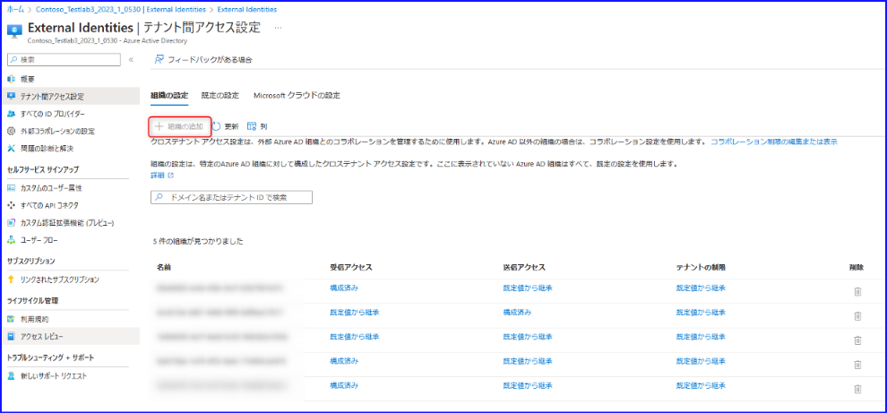
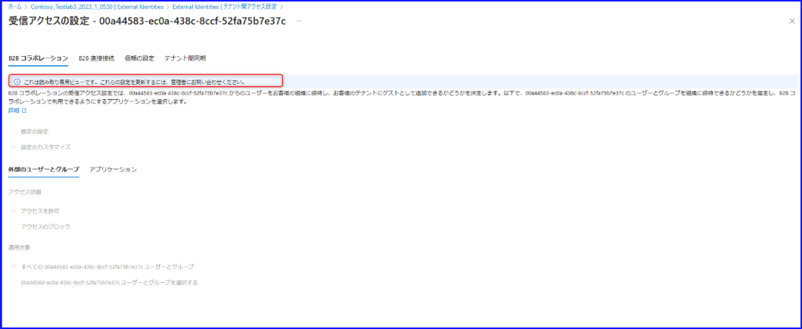
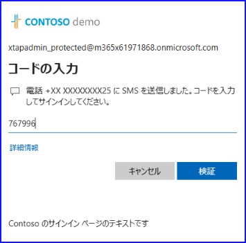
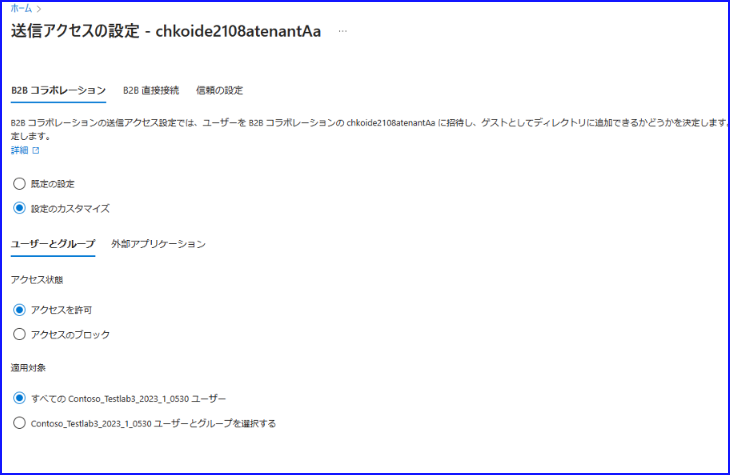

こんにちは！ Azure ID チームの小出です。

本記事は、 2023 年 8 月 30 日に公開されました [Cross-Tenant Access Settings Improvements! - Microsoft Community Hub](https://techcommunity.microsoft.com/t5/microsoft-entra-azure-ad-blog/cross-tenant-access-settings-improvements/ba-p/3822036) の記事を日本語に分かりやすくおまとめしなおした記事となります。

----

クロス テナント アクセス設定が一般公開されてから 1 年が経過しようとしています。 MFA の信頼の設定などを利用することで、エンド ユーザー体験を改善することができましたが、お客様からのフィードバックをもとに、新しく 3 つの機能が用意されました。

1. クロス テナント アクセス設定のためのカスタム ロールと保護されたアクションが利用できるようになりました。
2. クロス テナント アクセス設定で連携できる組織の数が無制限になりました。
3. 招待時にクロステナントのアクセス設定を尊重するようなユーザー体験に変わりました。

今回は、この新機能について、それぞれ概要や利用方法について詳細をご紹介します。

## 1-1. クロス テナント アクセス設定のためのカスタム ロール

多くのお客様からフィードバックをいただいた内容として、「クロステナントのアクセス設定を管理するために独自のロールを作成したい」というものがありました。クロス テナント アクセス設定を管理したい場合、グローバル管理者かセキュリティ管理者を利用することが必要でしたが、現在はカスタム ロールを利用して要件に合ったロールを作成できます。

例えば、クロス テナント アクセスの範囲内であればあらゆる操作ができるクロス テナント アクセス管理者、連携可能組織の管理ができるパートナー管理者、設定の閲覧だけができるクロス テナント アクセス閲覧者といったカスタムロールを利用されているお客様もいます。各カスタム ロールで推奨しているアクセス許可一覧をご案内しておりますので、[テナント間アクセスの概要](https://learn.microsoft.com/ja-jp/azure/active-directory/external-identities/cross-tenant-access-overview#custom-roles-for-managing-cross-tenant-access-settings) も併せてご覧ください。

なお、今回はこのうち「クロス テナント アクセス閲覧者」の権限の作成方法についてご案内します。

1. Azure ポータルにサインインします。
2. [Azure Active Directory] - [ロールと管理者] よりカスタム ロールを作成します。
3. カスタム ロールに名前と説明を付けます。
4. 必要なアクセス許可を選択します。以下の 4 つを選択します。

- microsoft.directory/crossTenantAccessPolicy/standard/read
- microsoft.directory/crossTenantAccessPolicy/default/standard/read
- microsoft.directory/crossTenantAccessPolicy/partners/identitySynchronization/standard/read
- microsoft.directory/crossTenantAccessPolicy/partners/standard/read

 

5. ロールを作成します。
6. ユーザーにロールを割り当ててサインインを行い、実際に設定を閲覧できるか確認します。

なお、カスタム ロールの実装に伴い、クロス テナント アクセス設定の表示もロールの保有状況に応じて変わるようになりました。適切な権限を持っていない場合は、たとえば下記図のように、設定がグレーアウトし「権限がない」旨を表示してくれます。今回のロールでは、閲覧権限はありますが編集権限はないため、「組織の追加」ボタンがグレーアウトしていることが確認できます。

 

ポリシーの詳細を開いた画面でも、下記のように設定の読み取りのみが可能です。

 

## 1-2. クロス テナント アクセス設定のための保護されたアクション
カスタム ロールのサポートに加えて、クロス テナント アクセス設定の権限も保護されたアクションとして対応しました。これにより、条件付きアクセス ポリシーで管理アクションを保護できます。例えば、クロス テナント アクセス設定内 B2B コラボレーションの既定の設定を変更する際に、 MFA を実行させるように構成できます。こちらの例も下記に手順を紹介します。

1. Azure ポータルにサインインし、条件付きアクセスを開きます。
2. [認証コンテキスト] のメニューを開き、「新しい認証コンテキスト」を追加します。名前と説明を追加してください。

 

3. 次に、条件付きアクセスの [ポリシー] メニューに移動し、新しい条件付きアクセス ポリシーを作成します。下記のように、対象となるターゲット リソースにて「認証コンテキスト」を選び、先ほど作成した認証コンテキストを選択ください。

 

4. 今回は「クロス テナント アクセス設定内 B2B コラボレーションのデフォルト設定を変更する際に、 MFA を実行させるように構成」したいので、MFA を要求するようチェックを入れてポリシーを作成します。保護されたアクションの追加方法などは、Azure AD 内の保護されたアクションの追加、テスト、または削除 - Microsoft Entra | Microsoft Learn もご覧ください。 

 

5. Azure ポータルより、[Azure Active Directory] - [ロールと管理者] - [保護されたアクション] を開きます。
6. [保護されたアクションの追加] をクリックし、保護したいアクセス許可を指定します。今回は、 B2B コラボレーションの設定を変更しようとしたときに MFA を要求させたいので、以下の 2 つを選択しました。

 

7. 条件付きアクセスと保護されたアクションの動作を確認します。検証ユーザーを上記ポリシーの対象とし、セキュリティ管理者ロールを割り当てておきます。
8. 検証ユーザーに MFA が要求されたときに対応できるよう、MFA 用の電話番号やアプリの設定を完了させておきます。
9. 検証ユーザーで Azure ポータルにサインインし、B2B コラボレーションの設定を変更するために下記の画面を開きます。すると、赤枠のように表示されているのでクリックします。

 

10. MFA が要求されるのでパスコードを入力し検証します。

 

11.読み取り専用ビューが解除され、設定を変更することが可能です。

 

保護されたアクションの概要は、[Azure AD 内の保護されたアクションとは](https://learn.microsoft.com/ja-jp/azure/active-directory/roles/protected-actions-overview) をご覧ください。

## 2. クロス テナント アクセス設定で連携できる組織の数が無制限になりました

クロス テナント アクセス設定には以前、コラボレーション可能な組織の数に制限がありましたが、何百、何千といった組織とコラボレーションを行う必要があるとのフィードバックを多くいただいていました。今回、パートナーのデータを保存するための新しい方法を作成したことから制限が撤廃され、必要な分の組織を追加できるようになりました。お客様から見たときには、画面上特に変更はなく、管理方法もこれまでと同様ですので、以前にあった制限の数を気にすることなく、組織を追加可能です。

2023 年 7 月以降より、クロス テナント アクセス設定を利用しているすべてのお客様に対し、この新しいモデルへの移行を実施しています。移行を行った際には、移行用監査ログが記録されることがありますが、特にお客様側で確認・対応いただく必要はございません。

## 3. 招待時、クロステナントのアクセス設定を尊重するようなエクスペリエンスに変わりました。

これまでは、クロス テナント アクセス設定で誰かをブロックしていたり、特定のパートナーしか許可していなかった場合でも、ブロックされている組織のユーザーに対し招待を送付することができました。これにより、招待メールを受け取ったユーザーがアクセスしようとしたときにエラーが発生し、招待を行ったリソース テナント側の管理者様からお問い合わせをいただくことが多くありました。また、この動作は、「管理者は招待ができ、ユーザーも招待を承諾できたのに、ポリシーによってアクセス がブロックされる」という混乱につながります。

このため、今回の変更で、「招待を送るときにクロス テナント アクセス設定を尊重する」ような動作へと変更しました。クロス テナント アクセス設定でブロックしている組織については、E メール アドレスを入力して招待を送る時点で招待が失敗します。招待を送付したい場合には、事前にポリシーを変更し、該当の組織に所属するユーザーとコラボレーションできるようにする必要があります。

これまでよくあった事例として、中国の 21vianet 環境のユーザーを招待できたもののアクセスができないといったものもございましたが、この変更により、管理者が招待を行う時点でエラーが発生するため、事前に設定を行わなければならないことなどが明確になりました。

クロス テナント アクセス設定の更新方法については、 [B2B コラボレーションのクロステナント アクセスを構成する](https://learn.microsoft.com/ja-jp/azure/active-directory/external-identities/cross-tenant-access-settings-b2b-collaboration#before-you-begin) をご覧ください。

クロス テナント アクセス設定の新しい機能のご紹介は以上となります。これまで以上に便利になったクロス テナント アクセス設定の機能をぜひご利用ください。
