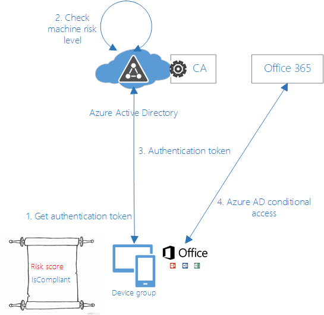
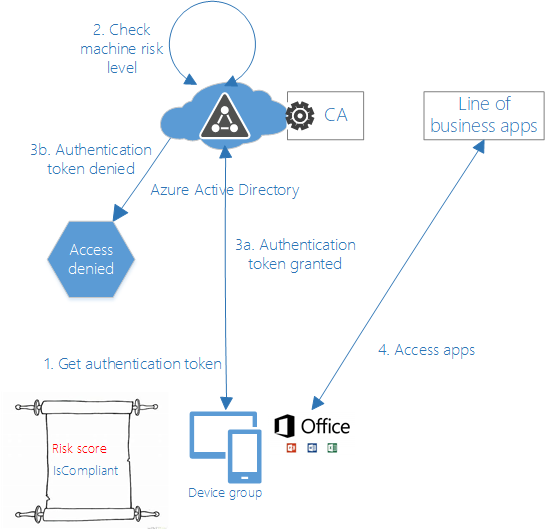

> 本記事は Technet Blog の更新停止に伴い https://blogs.technet.microsoft.com/jpazureid/2018/06/29/building-zero-trust-networks-with-microsoft-365/ の内容を移行したものです。
> 元の記事の最新の更新情報については、本内容をご参照ください。

# Microsoft 365 を用いたゼロ トラスト ネットワークの実現

本記事は、米国時間 2018 年 6 月 14 日に公開された [Building Zero Trust networks with Microsoft 365](https://cloudblogs.microsoft.com/microsoftsecure/2018/06/14/building-zero-trust-networks-with-microsoft-365/) の抄訳です。

----

従来の境界ベースのネットワーク制御は時代遅れとなりつつあります。 境界ベースのネットワークには、ネットワーク内のすべてのシステムが信頼できるという前提があります。 しかし、今日ますますモバイル ワーカーが増える中、パブリック クラウドサービスへの移行や BYOD (Bring Your Own Device) モデルの採用もあり、境界セキュリティの制御は意味をなさなくなってきています。従来有効とされていた制御方法を依然として使い続けているネットワークは、侵入に脆弱となります。信頼される境界として定義していた中に含まれるエンドポイントのたった一つからでも攻撃者の侵入を許すと、攻撃者はその後あっという間にネットワーク全体を支配下においていきます。

ゼロ トラスト ネットワークは、境界で囲まれたネットワークは信頼できるという考え方を用いません。 代わりに、ゼロ トラスト アーキテクチャは組織内のデータとリソースへのアクセスにデバイスおよびユーザーのクレーム情報を活用します。 一般的なゼロ トラスト ネットワークモデル (図 1) は通常、以下の要素で構成されます。

- ユーザーおよびユーザー関連の情報を保持する ID プロバイダ
- 対応するデバイス情報 (デバイスの種類、整合性など) に基づいて、会社のリソースにアクセスできるデバイスのリストを保持するデバイス ディレクトリ
- ユーザーまたはデバイスがセキュリティ管理者によって設定されたポリシーに準拠しているかどうかを判断するポリシー評価サービス
- 組織リソースへのアクセスを許可または拒否する上記の方式を利用したプロキシ

図 1. 一般的なゼロトラスト ネットワークモデルの基本構成

動的に信頼性を評価してリソースへのアクセスを制御することで、デバイスから特定のリソースへのアクセスを可能にし、一方で管理された準拠済みデバイス上の価値あるデータへのアクセスを制限することができます。標的型およびデータ漏洩を目的とした攻撃では、攻撃者は組織内の 1 つのデバイスに侵入し、盗んだ資格情報を使用してネットワーク全体を次々と横断的に移動していきます。ユーザーとデバイスに適切なポリシーが構成されたゼロ トラスト ネットワークに基づくソリューションは、盗まれたネットワーク資格情報を利用してネットワークにアクセスされるのを防ぐことができます。

ゼロ トラストの考え方は、ネットワーク セキュリティの進化系です。 サイバー攻撃の現状を鑑みるに、組織は「侵入されることが前提」として考える必要があります。しかし侵入への対応だけではなく、ゼロトラスト ネットワークは企業のデータとリソースを保護しながら、従業員がいつでもどこでもどのような方法であっても生産的でいられるようモダンな職場環境を得られるようにします。

## Azure AD 条件付きアクセスに基づくゼロ トラスト ネットワーキング

今日、従業員はさまざまなデバイスやアプリを使用して、どこからでも組織のリソースにアクセスできます。リソースにアクセスできるユーザーのみに焦点を当てたアクセス制御ポリシーは十分ではありません。セキュリティと生産性を高いバランスで保つために、セキュリティ管理者は、リソースへのアクセス方法も考慮する必要があります。

マイクロソフトは、ゼロ トラスト ネットワーキングに関する実績と戦略を持っています。お客様がゼロ トラスト ネットワークを実現するにあたり、[Azure Active Directory の条件付きアクセス](https://docs.microsoft.com/en-us/azure/active-directory/active-directory-conditional-access-azure-portal) が重要な構成要素となります。 条件付きアクセスと [Azure Active Directory Identity Protection](https://docs.microsoft.com/en-us/azure/active-directory/active-directory-identityprotection) は、すべてのリソース要求に対して、ユーザー、デバイス、場所、およびセッションのリスクに基づき動的にアクセス制御を実施します。 これらにより、(1) Windows デバイスのセキュリティ状態に関する [attested runtime signals](https://cloudblogs.microsoft.com/microsoftsecure/2018/04/19/introducing-windows-defender-system-guard-runtime-attestation/) (正常性を示す実行時の情報) と (2) ユーザー セッションと ID の信頼度を組み合わせることで、可能な限り強力なセキュリティ状態が得られるようにします。

条件付きアクセスには、ユーザーが企業のリソースにアクセスできる条件を制御するための一連のポリシーが用意されています。 アクセスの際に利用できる条件としては、ユーザーの役割、グループ メンバーシップ、デバイスの健全性やコンプライアンス (準拠状態)、モバイル アプリケーション、場所、サインインのリスクが挙げられます。これらの条件が、(1) アクセスを許可するか、(2) アクセスを拒否するか、または (3) 追加認証 (例えば多要素認証) の要求や利用規約の提示などのアクセス制限を行うかを決定するために使用されます。 条件付きアクセスは、Azure Active Directory と連携して動作する全てのアプリケーションで動作します。

図 2. 条件付きアクセスを用いてゼロトラスト ネットワークを実現するためのマイクロソフトのアプローチ (概要)

ゼロ トラスト モデルを実現するため、マイクロソフトは Windows Defender Advanced Threat Protection、Azure Active Directory、Windows Defender System Guard、Microsoft Intune など、Microsoft 365 におけるいくつかのコンポーネントと機能を統合して利用しています。

### Windows Defender Advanced Threat Protection

[Windows Defender Advanced Threat Protection](https://www.microsoft.com/en-us/windowsforbusiness/windows-atp?ocid=cx-blog-mmpc) (ATP) は、インテリジェンス駆動型の保護機能を有し、侵入後の検出、調査、および自動修復機能を提供するエンドポイント保護プラットフォーム (EPP: endpoint protection platform) です。また、エンドポイントでの検出と対応のための (EDR: endpoint detection response) 機能を持ちます。不審な動作の検出機能、機械学習、およびセキュリティ解析を組み合わせて、デバイスの状態を継続的に監視し、必要に応じて対処を行います。 Windows Defender ATP が侵入時の影響を軽減する独自の方法の 1 つとしては、侵入されたマシンとユーザーがこれ以上の影響を与えないようクラウド リソースへから自動的に分離することが挙げられます。

例えば、攻撃者は [Pass-the-Hash (PtH)](https://en.wikipedia.org/wiki/Pass_the_hash) と "Pass the ticket for Kerberos" という手法を使用して、侵入されたデバイスからハッシュされたユーザー資格情報を直接抽出します。攻撃者はハッシュされた資格情報を次々と別のシステムを乗っ取るために利用し、ついには特権を得るに至ります。[Windows Defender Credential Guard](https://docs.microsoft.com/en-us/windows/security/identity-protection/credential-guard/credential-guard) は、NTLM ハッシュとドメインの資格情報を保護してこれらの攻撃を防ぎますが、セキュリティ管理者としては攻撃が防がれただけではなく、そのような攻撃が発生したこと自体も把握したいと考えるでしょう。
Windows Defender ATP は、上記のような攻撃を管理者に報告し、侵入されたデバイスがどの程度危険かというリスク レベルを生成します。条件付きアクセスでは、Windows Defender ATP がデバイスのリスク レベルを生成し、この情報をもとにして、クライアント デバイスが企業内のリソースにアクセスするためのトークンを発行するかどうかを判断します。 Windows Defender ATP は、次のような幅広いセキュリティ機能を使用します。

- [豊富な機械学習と行動検出ライブラリ](https://cloudblogs.microsoft.com/microsoftsecure/2017/05/08/antivirus-evolved/)
- [脆弱性を利用した悪意ある行為からの保護](https://cloudblogs.microsoft.com/microsoftsecure/2017/10/23/windows-defender-exploit-guard-reduce-the-attack-surface-against-next-generation-malware/)
- [資格情報の保護](https://docs.microsoft.com/en-us/windows/security/identity-protection/credential-guard/credential-guard)
- [アプリケーションの分離](https://blogs.windows.com/msedgedev/2016/09/27/application-guard-microsoft-edge/)
- [ウイルス対策](https://cloudblogs.microsoft.com/microsoftsecure/2017/05/08/antivirus-evolved/)
- [ネットワーク保護](https://cloudblogs.microsoft.com/microsoftsecure/2017/10/23/windows-defender-exploit-guard-reduce-the-attack-surface-against-next-generation-malware/)
- [ウェブ保護](https://docs.microsoft.com/en-us/windows/security/threat-protection/windows-defender-smartscreen/windows-defender-smartscreen-set-individual-device)

### Windows Defender System Guard の実行時検証機能 (runtime attestation)

[Windows Defender System Guard](https://cloudblogs.microsoft.com/microsoftsecure/2017/10/23/hardening-the-system-and-maintaining-integrity-with-windows-defender-system-guard/) は、起動時にシステムの整合性を保護し、その後も維持し続けます。「侵入されることが前提」という考え方では、セキュリティ管理者は、デバイスのセキュリティ状態をリモートから証明することが重要です。 2018 年 4 月 の Windows 10 のアップデートでは、[Windows Defender System Guard の実行時検証機能 (runtime attestation)](https://cloudblogs.microsoft.com/microsoftsecure/2018/04/19/introducing-windows-defender-system-guard-runtime-attestation/) もデバイスの整合性を確立するのに効果的です。本機能は、デバイスの起動時および実行時に、ハードウェアハードの検証処理を行います。 これらの結果は、Windows Defender ATP によって処理され、そのデバイスのリスク レベルがどの程度であるか判断するのに用いられます。

Windows Defender System Guard の最も重要な目標は、システムの整合性が侵害されていないか検証することです。 このハードウェアに基づいた信頼性の高いフレームワークにより、ユーザーはデバイスのセキュリティ状態が改竄されていないことを (一定の範囲内で) 証明する署名付きのレポート得ることができます。 Windows Defender ATP のユーザーは、Windows Defender ATP ポータルを使用して、すべてのデバイスのセキュリティ状態を確認し、セキュリティ違反を検出したり修復したりできます。

Windows Defender System Guard の実行時検証機能 (runtime attestation) は、攻撃を検出するにあたり、[仮想化ベースのセキュリティ (VBS)](https://docs.microsoft.com/en-us/windows-hardware/design/device-experiences/oem-vbs) におけるハードウェアに基づくセキュリティ技術を活用しています。 バーチャル セキュア モード対応デバイスでは、Windows Defender System Guard の実行時検証機能 (runtime attestation) は分離された環境で実行されるため、カーネル レベルの攻撃にも耐性があります。

Windows Defender System Guard の実行時検証機能 (runtime attestation) は、実行時にシステム セキュリティの状態を継続的に監視します。 これら検証機能が生成する結果は、例えばプロセスの保護機能がデバイス上で無効化されるなど、Windows のセキュリティが意図しない状態となっていることを捉える目的で利用されます。

### Azure Active Directory

[Azure Active Directory](https://docs.microsoft.com/en-us/azure/active-directory/active-directory-whatis) は、企業がアプリケーションへのアクセスを管理し、クラウドとオンプレミスの両方でユーザー ID を保護するためのクラウド ID とアクセス管理ソリューションです。ディレクトリと ID 管理の機能に加えて、アクセス制御をつかさどる Azure AD は以下の機能を提供します。

- シングルサインオン: すべてのユーザーが単一の ID を持ち、企業をまたがるリソースにアクセスして高い生産性を確保します。 ユーザーは、クラウド サービスやオンプレミス Web アプリケーションにシングル サインオンするため、同じ職場または学校のアカウントを使用できます。多要素認証を利用すれば、より確実なユーザー検証が可能となります。
- アプリケーション アクセスの自動プロビジョニング: ユーザーが所属するグループのメンバーシップや地理的位置、雇用状況に基づいて、ユーザーによるアプリケーションへのアクセスを自動的にプロビジョニングまたは解除することができます。

Azure AD は、アクセス管理をつかさどるサービスとして、組織内のリソースへのアクセス許可を付与するかどうかの判断を以下の情報を用いて行います。

- グループとユーザーのアクセス許可
- アクセスしようとしているアプリケーション
- サインインに使用したデバイス (Intune のデバイス準拠情報など)
- サインインに使用されているデバイスのオペレーティング システム
- サインインの場所または IP 範囲
- ログインに使用したクライアント アプリ
- サインイン時間
- サインイン リスク (そのサインインが正規のユーザーによるものでない可能性)
(Azure AD Identity Protection の機械学習およびヒューリスティック検出による算出)
- ユーザー リスク (攻撃者が対象のユーザーに成りすましている可能性)
(連携している社外のセキュリティ パートナーから継続的に寄せられる情報を活用し、Azure AD Identity Protection の高度な機械学習により算出)
- その他にも今後様々な判断要素が追加される予定です

条件付きアクセス ポリシーは、ユーザーが Azure AD と連携したアプリケーション (例えば、SaaS アプリケーション、クラウドで実行されているカスタム アプリケーション、オンプレミス Web アプリケーションなど） にアクセスしようとすると、リアルタイムで評価および適用されます。 疑わしいアクティビティが検出された場合、Azure AD は、危険度の高いユーザーをブロックしたり、資格情報が侵害された場合にはユーザーのパスワードをリセットしたり、利用規約を強制したりするなど、復旧を支援します。

企業のアプリケーションへのアクセスが許可されると、クライアント デバイスにはアクセス トークンが与えられます。このトークンを発行するかどうかの判断を Azure AD 条件付きアクセス ポリシーが中心となって行います。要求が条件を満たしている場合は、トークンがクライアントに付与されます。ポリシーによっては、制限付きのアクセス (ダウンロードが許可されていないなど) を要求したり、Microsoft Cloud App Security でのセッション監視が行われたりする場合もあります。

### Microsoft Intune

Microsoft Intune は、組織内のモバイル デバイス、PC およびアプリケーションを管理するために使用されます。 Microsoft Intune と Azure を用いることで、価値ある資産とデータを管理・可視化でき、さらには [Azure Information Protection](https://docs.microsoft.com/en-us/information-protection/understand-explore/what-is-information-protection) や Asset Tagging、[Microsoft Cloud App Security](https://www.microsoft.com/en-us/cloud-platform/cloud-app-security) などの構成要素に基づいて、自然にセキュリティ要件が底上げされるような性質も持ち合わせています。

Microsoft Intune は、クライアント デバイスの導入、登録、および管理を担当します。 モバイルデバイス (Android および iOS)、ラップトップ (Windows および macOS)、従業員の BYOD デバイスなど、幅広いデバイスをサポートしています。 Intune は、Windows Defender ATP によって提供されるコンピューターのリスクレベルを他のコンプライアンス情報と組み合わせて、デバイスが準拠状態にあるかどうか ("isCompliant") を判断します。 Azure AD は、この準拠状態を利用することで、企業リソースへのアクセスをブロックするか許可するかを判断します。 条件付きアクセスポリシーは、以下のいずれかの方法で Intune から設定可能です。

- アプリケーション ベースの設定: 承認されたアプリケーションのみが企業リソースにアクセス可能
- デバイス ベースの設定: 承認され準拠しているデバイスのみが企業リソースにアクセス可能

[Intune におけるリスクベースの条件付きアクセスの準拠確認を構成する方法はこちら](https://cloudblogs.microsoft.com/enterprisemobility/2018/04/18/enhancing-conditional-access-with-machine-risk-data-from-windows-defender-advanced-threat-protection/)

## 条件付きアクセスの実行例

条件付きアクセスの価値を理解するには、実例を見るのが一番です。(注: このセクションで使用されている名前は架空のものですが、ここでは様々なシナリオにおいて如何にして条件付きアクセスが企業のデータとリソースを保護するかご覧いただけます)。

> "SurelyMoney" は世界で最も権威のある金融機関の一つであり、100 万人以上のユーザーに対して日々の取引がシームレスに行えるようサービスを提供しています。同社は Microsoft 365 E5 を使用しており、セキュリティ エンタープライズ管理者は条件付きアクセスを利用しています。
>
> 攻撃者は、企業の顧客情報と取引情報の詳細を盗もうとします。攻撃者はマルウェアの添付ファイルを含む一見すると無害な電子メールを従業員に送信します。ある従業員が企業のデバイス上でこの添付ファイルを無意識のうちに開くと、そのデバイスが侵害されます。この 1 人の従業員の操作によって、攻撃者はその従業員のユーザー資格情報を収集し、企業のアプリケーションにアクセスすることが可能となってしまいます。
>
> Windows Defender ATP は、デバイスの状態を継続的に監視し、侵入を検出しすると、デバイスが侵害されたとフラグを立てます。 このデバイス情報は、Azure AD と Intune に中継され、そのデバイスからアプリケーションへのアクセスが拒否されます。 侵害されたデバイスとユーザーの資格情報を用いても、企業リソースへのアクセスができないようブロックされます。 デバイスが Windows Defender ATP によって自動修復されると、修復されたデバイス上のユーザーにアクセス権が再付与されます。

上記のように、条件付きアクセスと Windows Defender ATP が連携することで、マルウェアの移動を防ぐとともに、攻撃の分離や企業リソースの確実な保護が行われます。

### Azure AD アプリケーション (Office 365、Exchange Online、SPO など)

> SurelyMoney の経営陣は、Office 365 アプリケーションである Microsoft SharePoint に企業秘密を含む文書を多数格納しています。攻撃者は侵入したデバイスを用いてこれらのドキュメントを盗もうとします。 ただし、O365 アプリケーションと条件付きアクセスは統合されているため、こういった事象は未然に防がれることになります。

Microsoft Word、Microsoft PowerPoint、Microsoft Excel などの Office 365 アプリケーションを用いることで、組織の従業員は連携して日々の業務を完了することができます。ただし、業務の機密性や性質、所属するグループやその他の要因によって、ユーザーは一人ひとり異なる権限を持っています。アプリケーションと条件付きアクセスは統合されているため、このような様々なユーザー権限のある環境であっても条件付きアクセスを用いることでアクセス管理が容易となります。条件付きアクセスにより、セキュリティ管理者はカスタム ポリシーを実装することができ、アプリケーションは目的のリソースに対する部分的または完全なアクセスを得ることができます。

  
図 3. Azure AD アプリケーションのゼロトラスト ネットワークモデル

### 業務アプリケーション

> SurelyMoney には、Azure AD と連携した、独自開発の取引追跡アプリケーションがあります。 このアプリケーションは、顧客が実行したすべての取引記録を保持しています。 攻撃者は、取得したユーザーの資格情報を使用してこのアプリケーションにアクセスしようとします。 しかし、条件付きアクセスがこの侵入を防ぎます。

どのような組織にも、従業員の生産性や事業の成功に直接かかわるミッション クリティカルなビジネス アプリケーションがあります。これらのアプリケーションには、通常、電子商取引システム、顧客情報の管理システム、文書管理システムなどのカスタム　アプリケーションが含まれます。Azure AD は、必要なコンプライアンスおよびリスク ポリシーを満たしていない場合、これらのアプリケーションにアクセス トークンを付与しません。つまりリソースへのアクセスを許可または拒否するかどうか明確な判断を下すことができます。

  
図 4. ビジネス アプリケーション向けに拡張されたゼロトラスト ネットワークモデル

### オンプレミス Web アプリケーション

今日、従業員はどこからでも、いつでも、どのデバイスからでも高い生産性を発揮することが求められています。また、タブレット、携帯電話、ノート PC に関わらず自分のデバイスを用いて仕事をしたいと考えているでしょう。 このとき社内のオンプレミス アプリケーションにアクセスできることも期待していると思われます。[Azure AD Application Proxy](https://docs.microsoft.com/en-us/azure/active-directory/active-directory-application-proxy-enable) は、外部公開したアプリケーションへのリモート アクセスを実現し、承認済みもしくは非承認済みのデバイスに対して条件に応じたアクセスを可能とします。

> SurelyMoney は、レガシーな独自のコード署名用のアプリケーションを保持しています。コード署名を行うチームメンバーのデバイスが攻撃者により侵入されたことがわかりました。オンプレミスのレガシー アプリケーションへの要求は、Azure AD Application Proxy 経由で行われます。 攻撃者は、侵害されたユーザーの資格情報を使用してこのアプリケーションにアクセスしようとしますが、条件付きアクセスによりアクセスは失敗します。
>
> 条件付きアクセスがなければ、攻撃者は悪意あるアプリケーションを作成およびコード署名し、さらには Intune 経由で展開することができます。 これら悪意あるアプリは、Intune に登録されているすべてのデバイスにプッシュされ、ハッカーはこれまでにない量の機密情報を取ることができます。 このような攻撃はこれまでにも確認されており、こういった攻撃の防御に企業は非常に強い関心を寄せています。

  
図 5. オンプレミス Web アプリケーションのゼロトラスト ネットワークモデル

## 継続的なイノベーション

現在、条件付きアクセスは Web アプリケーションとシームレスに動作します。 ゼロ トラストでは、厳密な意味で、すべてのネットワーク要求がアクセス制御プロキシを通過し、デバイスとユーザーの信頼モデルに基づいてすべての評価が行われることが必要です。 これらのネットワーク要求には、従来のさまざまなレガシー通信プロトコルや、FTP、RDP、SMB などのアクセス方式も含まれます。

条件付きアクセスは、デバイスとユーザーのクレーム情報を利用して組織リソースへのアクセスを制御することで、ユーザーの生産性を確保しながら企業データを保護するための包括的で柔軟なポリシーを提供します。マイクロソフトは、ユーザーが企業ネットワークの境界を越えて生産性を発揮できる最新の職場環境が脅威にさらされないよう、技術的な革新を続けていきます。

**Sumesh Kumar, Ashwin Baliga, Himanshu Soni, Jairo Cadena**  
Enterprise & Security
