# MFA に Microsoft Authenticator アプリをスマートフォンのみでセットアップする手順

こんにちは、Azure Identity サポート チームの 長谷川 です。

先日 [MFA に Microsoft Authenticator アプリをセットアップする手順](../azure-active-directory/authenticator-setup.md) を紹介していますが、この手順は PC とスマートフォンを利用した手順でした。PC を利用せずにスマートフォンのみで完結させる手順の要望がありましたので今回はこちらを紹介します。なお、この手順は Android を利用して作成していますが iOS でもそれほど差なく利用できる手順になっています。

## セットアップ手順

1. スマートフォンに Play ストア (Android) もしくは App Store (iOS) から Microsoft Authenticator アプリをインストールします。

    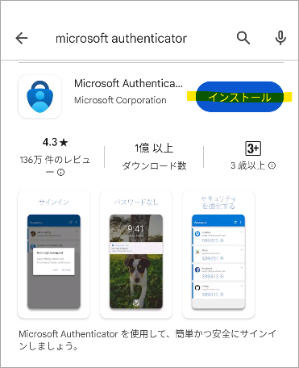

2. スマートフォンのブラウザーで https://aka.ms/mysecurityinfo にアクセスし Microsoft Authenticator アプリをセットアップしたいユーザーの ID/Password を入力してサインインします。

3.  [サインイン方法の追加] を選択します。

    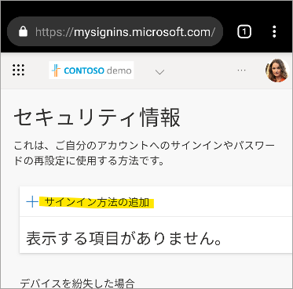

4. [方法を選択します] を選択します。

    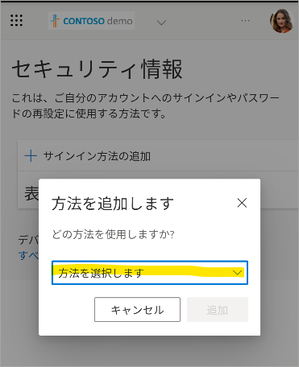

5. [認証アプリ] を選択します。

    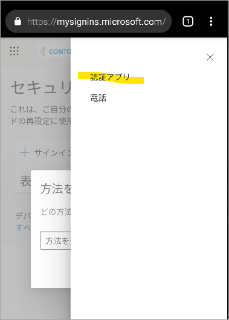

6. [追加] を選択します。

    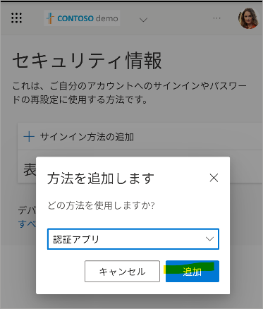

7. [次へ] を選択します。

    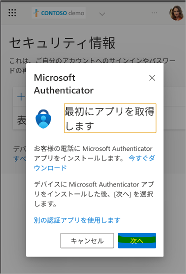

8. [このリンクをクリックして、アカウントをアプリにペアリングします。] を選択します。

    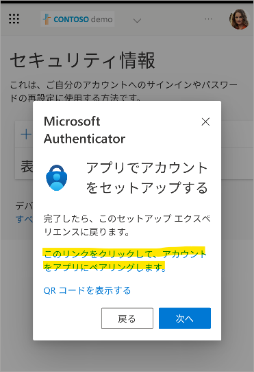

9. Microsoft Authenticator アプリにリダイレクトされますので、[Microsoft はお客様のプライバシーの保護に努めています] は [同意] を選択します。

    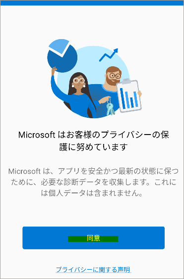

10. [Microsoft Authenticator の品質向上にご協力ください] は任意選択して [続行] を選択します。

    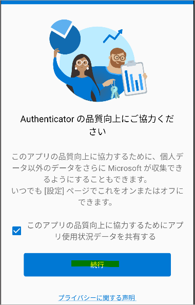

11. [アカウントは正常に追加されました。] と表示され、次の画面に遷移します。

    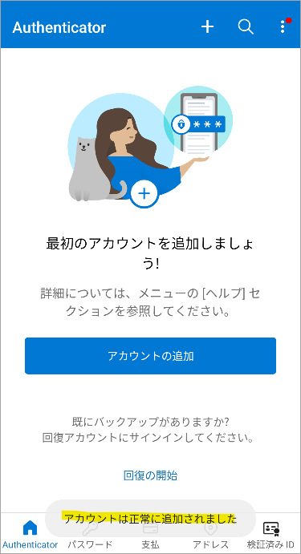

12. 以下のようにアカウントが追加されたことを確認してブラウザーに戻ります。

    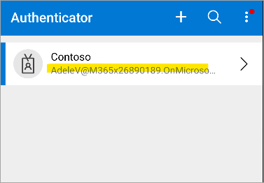

13. [次へ] を選択します。

    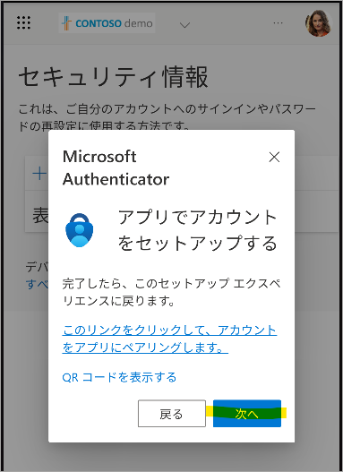

14. 下図のように数値の一致入力が求められますので [サインインを承認しますか？] を選択します。

    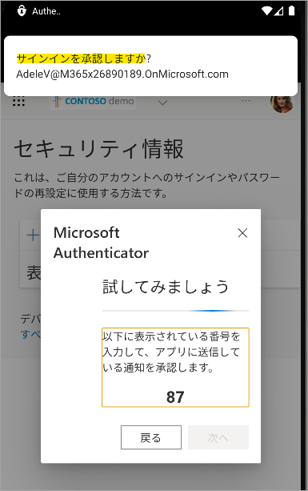

15. 次のような画面が表示されますが、もし入力すべき数字が見えない場合は [番号が表示されません] を選択します。

    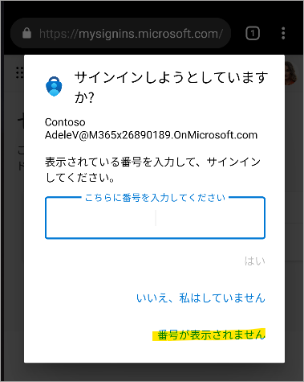

16. [番号が表示されません] を選択すると入力画面が 3 秒間消え、後ろに表示された数字を確認できます。

    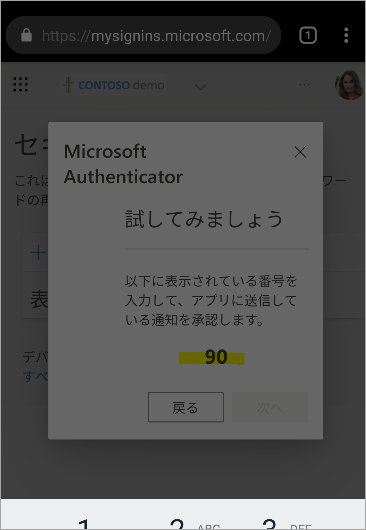

17. 確認した数値を入力し [はい] を選択します。

    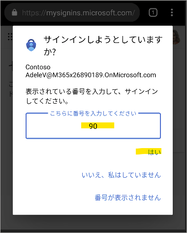

18. 通知が承認されましたと表示されるので [次へ] を選択します。

    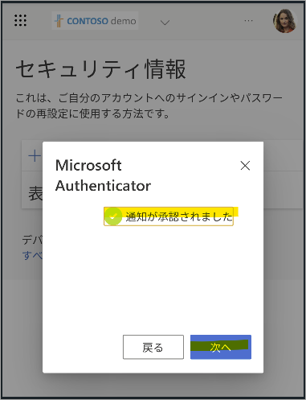

19. [Microsoft Authenticator アプリが正常に登録されました] と表示されセットアップ作業終了です。

    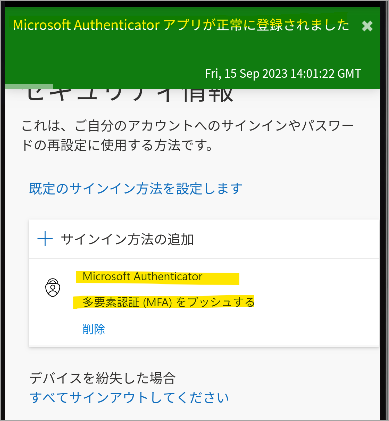

## おわりに

以上、スマートフォンのみで Microsoft Authenticator アプリをセットアップする手順をお送りしました。本記事を活用して多くの方に Microsoft Authenticator アプリをご利用いただければ幸いです。製品動作に関する正式な見解や回答については、お客様環境などを十分に把握したうえでサポート部門より提供しますので、ぜひ弊社サポート サービスをご利用ください。
