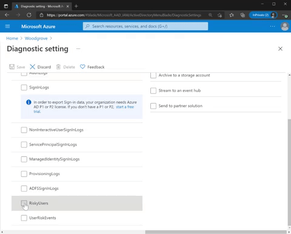
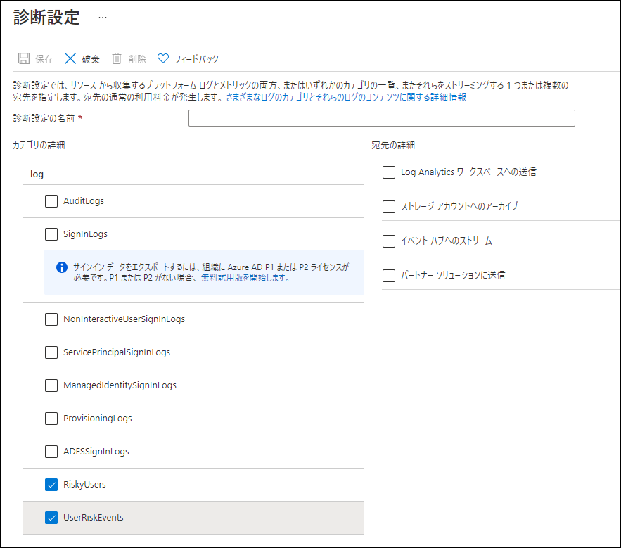
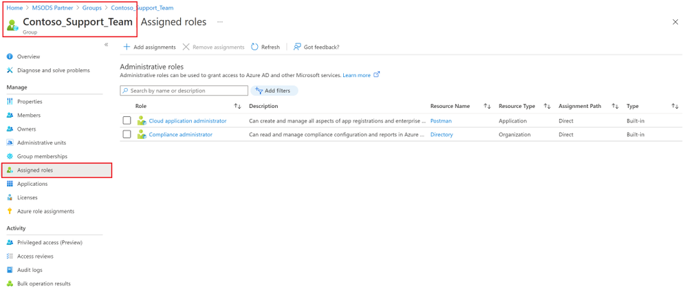

---
title: 外部 ID ユーザー フローをより簡単に設定
date: 2021-08-20 9:00
tags:
  - Azure AD
  - US Identity Blog
---
# 8 月のアップデート : Identity Protection 診断設定のご紹介
こんにちは、Azure Identity サポート チームの 村上 です。本記事は、2021 年 8 月 18 日に米国の Azure Active Directory Identity Blog で公開された [Introducing diagnostic settings for Identity Protection — August identity updates](https://techcommunity.microsoft.com/t5/azure-active-directory-identity/introducing-diagnostic-settings-for-identity-protection-august/ba-p/2464365) を意訳したものになります。ご不明点等ございましたらサポート チームまでお問い合わせください。
---

皆さん、こんにちは。
今回は、管理者開発者、ユーザーの利便性を向上させる Active Azure Directory の最新情報や新機能をご紹介します。これらのアップデートは、セキュアなアイデンティティとアクセス管理を簡易化し、さらにカスタマイズやコントロールを強化しています。

## 診断設定を使用した危険なユーザーとリスク検出の追跡
Azure AD Identity Protection の診断設定がパブリック プレビューとなったことで、リスク検出や危険なユーザーのアクティビティに関するログを、ストレージ アカウント、Event Hubs、Azure Monitor　に送信することができます。
これにより、セキュリティ リスクの追跡、そして、資格情報の漏洩から組織を守ることが容易になります。また、このデータを 30 日間の既定期間を超えて保持することが可能です。
診断設定を利用することで、以下のことが実現できます。
- カスタムワークブックスを作成し、組織内の資格情報漏洩の傾向を追跡
- 特定の脅威に対してリスク データを参照し、リスクのトラブル シュートに利用
- 危険なユーザとリスク検出データをサード パーティのセキュリティ情報・イベント管理（SIEMs）に送信し、既存のセキュリティ オペレーション センターの手順に、このデータを組み込む
## [リスク保護のための診断設定](https://docs.microsoft.com/ja-jp/azure/azure-monitor/essentials/diagnostic-settings?tabs=CMD) を 2 ステップで設定
- Azure ポータルにサインイン ＞ [Azure Active Directory] ＞ [診断設定] ＞ [設定の編集] に進みます。
  - 設定していない場合は、[診断設定を追加する] から設定を追加します
- 危険なユーザーのデータは [RiskyUsers] を、ユーザーのリスク検出データは [UserRiskEvents] を選択します。
- [宛先] を選択し、[保存] をクリックします。

## グループを使用し、ロールの割り当てをより簡単に管理

[Azure AD グループへのロールの割り当て](https://docs.microsoft.com/ja-jp/azure/active-directory/roles/groups-assign-role) が、より簡単に設定できるようになりました。個々のユーザーにロールを割り当てる代わりに、[特権ロール管理者] または [グローバル管理者] が、グループに対してロールを割り当てることができます。その後、既に設定しているワーク フローに沿って承認・監査を行い、適切なユーザーのみがメンバーであることを確認します。このグループへのロール割り当て機能は、一般提供 (GA) されております。
また、管理者がグループのオーナーを割り当てることで、[特権ロール管理者] や [グローバル管理者] 以外のメンバーも、グループを管理することができます。グループのオーナーは、グループのメンバーシップを管理し、誰にロールを割り当てるかを管理します。まずは Azure AD グループでご利用可能ですが、将来的にはオンプレミスのグループにもこの機能が拡張される予定です。

## オーストラリア国内で B2C ユーザー データを保管する
オーストラリアにおける Azure AD B2C の一般提供 (GA) が開始され、B2C ユーザーのデータをオーストラリア国内に保存できるようになり、オーストラリアでホストされているアプリケーションのレイテンシーが改善されます。既に B2C テナントをお持ちのお客様は、[オーストラリアの Azure ポータル](https://azure.microsoft.com/en-au/) で B2C を検索することで、お試しいただけます。初めてご利用されるお客様は、新しい Azure AD B2C テナントの作成時に、国/地域としてオーストラリアまたはニュージーランドを選択することで、この機能を試すことができます。 
皆様のご意見をお待ちしております。Azure フォーラムや Twitter で [@AzureAD](http://twitter.com/azuread) をメンションして、新機能に関するフィードバックをお寄せください。
