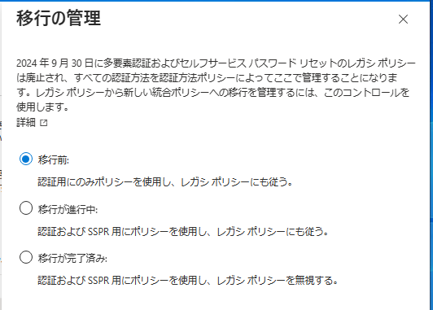
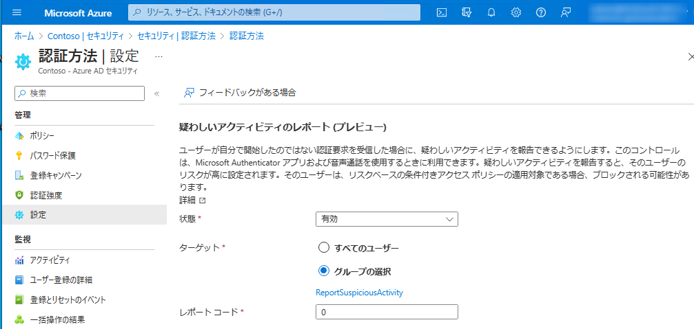

# 認証方法の管理画面を刷新

こんにちは、Azure Identity サポート チームの 長谷川 です。

本記事は、2023 年 5 月 9 日に米国の Microsoft Entra (Azure AD) Blog で公開された [Modernizing Authentication Management](https://techcommunity.microsoft.com/t5/microsoft-entra-azure-ad-blog/modernizing-authentication-management/ba-p/2365669) を意訳したものになります。ご不明点等ございましたらサポート チームまでお問い合わせください。

---

この度、お客様の認証体験の管理方法について 2 つの重要なアップデートを発表できることを嬉しく思います。一つ目が統合された認証方法の一般提供 (GA) 開始と、もう一つが刷新された多要素認証 (MFA) の疑わしいアクティビティのレポートのパブリック プレビューです。

統合された認証方法の一般提供 (GA) により、認証やパスワード リセットに使用されるすべての方法を一元管理できるとともに、対象ユーザーやグループを絞った細かい制御が可能となりました。

MFA における最新の "疑わしいアクティビティ" のパブリック プレビューでは、設定箇所が認証方法ポリシーに組み込まれ、このユーザーから報告された疑わしい MFA 要求の情報を Identity Protection に統合しました。

## 統合された認証方法

従来は、MFA 用とセルフサービス パスワード リセット用の認証方法を別々に管理する必要がありました。現在では、FIDO2 セキュリティ キーや証明書ベースの認証のようなパスワードレス認証の方法と併せ、1 つの画面で両方を管理することができるようになりました。新たに追加された認証方法には、SMS、音声通話、サードパーティ製 OATH ソフトウェア トークン、電子メール ワンタイム パスコード認証があります。

認証方法をよりきめ細かく管理できるようになり、すべてのユーザーではなく特定のユーザーやグループに対して認証方法を有効にしたり、ユーザーのグループを対象から除外したりする機能が追加されました。つまり、試験的に一部のグループで認証方法を試したり、SMS や音声通話などのセキュリティ レベルの低い認証方法の利用については、少数のユーザー グループに限定したりすることもできます。

また、従来の MFA および セルフサービス パスワード リセット ポリシーから統合された認証方法に管理を移行する際に利用できる移行の制御機能も追加されました。この機能を使用することで、認証方法を個別に移行したりテストしたりしたうえで、従来のポリシーで認証方法を無効にするということができます。

2024 年後半には、レガシー ポリシーで認証方法を管理する機能を廃止する予定です。統合された認証方法への移行にあたっては、[セキュリティ対策を強化するために、これを機に SMS や音声通話の認証を取りやめ](https://techcommunity.microsoft.com/t5/microsoft-entra-azure-ad-blog/it-s-time-to-hang-up-on-phone-transports-for-authentication/ba-p/1751752)、Microsoft Authenticator や FIDO2 セキュリティ キーなど、より安全な認証方法を有効にすることをお勧めします (まだの方は、ぜひご検討ください)。

[認証方法の管理](https://learn.microsoft.com/ja-jp/azure/active-directory/authentication/concept-authentication-methods-manage) と [認証方法ポリシーへの移行](https://learn.microsoft.com/ja-jp/azure/active-directory/authentication/how-to-authentication-methods-manage) の詳細を確認し、できるだけ早く移行ください !

## 疑わしいアクティビティのレポート

Azure Active Directory (Azure AD) には、Microsoft Authenticator アプリや電話で受け取った疑わしい MFA 要求をユーザーが報告できる "MFA の不正アクセス アラート" 機能がありました。この機能によりブロック ストに追加されたユーザーはそのリストから消されるまで MFA 要求を受け取らないようになりますが、ブロック リストからの削除は管理者の手動作業でした。また、不正アクセスのアラートとブロック リストの管理にはすべてグローバル管理者権限が必要でした。今回、不正アクセスのアラートを疑わしいアクティビティのレポートと共に刷新し、この機能の設定を認証方法ポリシーに移動するとともに、他の認証関連の設定と同じ場所で設定できるようにしました。また、ユーザーが不審なプロンプトを報告した際に、より包括的なアクションをとれるようにアラート イベントを Identity Protection に統合しました。

疑わしいアクティビティのレポートを有効にし、全ユーザーか一部ユーザーをその対象とするには、認証方法の画面にある新しい "設定" から行うか、または認証方法の Microsoft Graph API を使用ください。

この機能が有効になると、ユーザーが Microsoft Authenticator アプリのプッシュ通知や音声での MFA 要求を疑わしいと報告した場合、そのユーザー アカウントはユーザー リスク高とマークされます。その後、リスクベースのポリシーを使用して、これらのユーザーの回復方法をより細かく制御することができます。例えば、セルフサービスのパスワード リセットによる即時のパスワード変更を要求したり、リスクが改善されるまですべての認証に MFA を要求したり、リスクが改善されるまで認証をブロックするなどが挙げられます。

もし Azure AD Premium P2 ライセンスをお持ちでない場合は、レガシー MFA ブロック リストと同様の機能として、リスク イベントを使用して、リスクが改善されるまでアカウントを無効にすることも可能です。

疑わしいアクティビティのレポート機能は、プレビュー中は従来の MFA の不正なアクセスのアラート機能と並行して機能するため、不正なアクセスのアラート機能を有効にして自動ブロックしている場合は、ユーザーの修復を行う際に、疑わしいアクティビティのレポート機能の適用範囲内のユーザーのリスクを改善することに加えて、MFA のブロック リストからユーザーを削除する必要もあります。

[疑わしいアクティビティのレポート機能](https://learn.microsoft.com/ja-jp/azure/active-directory/authentication/howto-mfa-mfasettings#report-suspicious-activity) の構成と [リスクベースのポリシー](https://learn.microsoft.com/ja-jp/azure/active-directory/identity-protection/concept-identity-protection-policies) の詳細を確認いただき、今すぐ疑わしいアクティビティのレポート機能をお試しください。

いつものように、フィードバックをお聞かせください。よろしくお願いします。

Alex Weinert ([@Alex_T_Weinert](https://twitter.com/Alex_T_Weinert))  
VP Director of Identity Security, Microsoft
