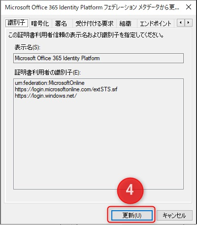
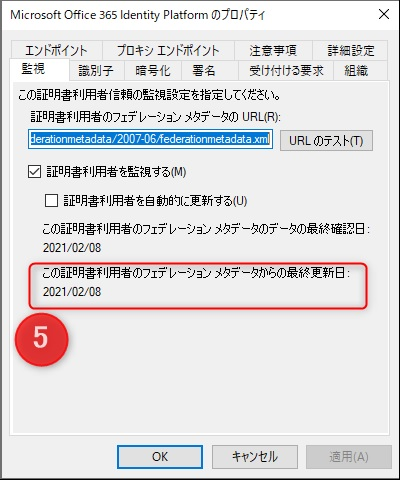

# AD FS 証明書利用者信頼 に登録している Office 365 のフェデレーション メタデータの更新が検知された場合の対処方法について

こんにちは。 Azure Identity チームの山口です。

2021 年 1 月中旬頃より AD FS と信頼関係を結んでいる Office 365 (Azure AD) の証明書利用者信頼の「監視」のタブに下記画面ショットのようにフェデレーション メタデータの更新が検知されたことを知らせる警告メッセージに関するお問い合わせを多くいただいております。

本 Blog の記事ではフェデレーション メタデータに関する説明と更新影響の有無、また、お客様よりよくいただいておりますご質問内容について Q&A 形式で記載いたします。

## このメッセージの意味

AD FS 側ではなく、連携している証明書利用者信頼 (サービス側) のフェデレーション メタデータが更新されたことを示します。
本記事では、証明書利用者信頼が  Office 365 (Azure AD) の場合についてご案内いたします。

## このフェデレーション メタデータは何に使われているのか

Office 365 (Azure AD)  のフェデレーション メタデータの実体は、 URL 「 https://nexus.microsoftonline-p.com/federationmetadata/2007-06/federationmetadata.xml 」  になり、ブラウザーで URL をクリックすると XML 形式のメタデータの中身を実際に確認できます。

このフェデレーションメタデータには、Azure AD が AD FS など別の IdP と認証連携をする場合に必要となる、Azure AD 側の情報が含まれています。
具体的には、IdP で認証を行った後にトークンを送信するエンドポイントや、発行されたトークンで利用できるサービスの識別子、また IdP に送信する認証リクエストの署名に利用される証明書などが含まれています。

AD FS などの IdP 側でも同様の情報をメタデータとして保持しており、認証連携する際には、お互いにデータの交換をして相手の情報を保持します。
つまり、AD FS のフェデレーションメタデータは Office 365 (Azure AD) 側にインポートし、Office 365 (Azure AD) 側のフェデレーションメタデータは AD FS 側にインポートして、お互いの情報を交換することで認証連携を行います。

今回の警告メッセージは、Office 365 (Azure AD) 側のフェデレーションメタデータが更新されたことを AD FS が検知して表示しているものです。

ここからは、上述の内容を踏まえまして、お客様より多くいただいておりますご質問内容についてそれぞれ Q&A 形式で回答いたします。

## Q. なぜ警告が検知されたのか

A. Azure AD Connect を利用したり、Powershell モジュールを利用して Office 365 (Azure AD) と AD FS の間にフェデレーション信頼を結んだ場合、「証明書利用者を監視する」にチェックが自動的に入ります。

このチェックが入っている場合、24 時間に 1 回の頻度で対象のフェデレーション メタデータに更新があるかどうかのチェックを行います。

逆に申し上げますと、「証明書利用者を監視する」にチェックが入っていない場合は、 Azure AD フェデレーション メタデータに更新があったとしても検知できないので、警告が表示されることもありません。
また、監視のチェックに加えて「証明書利用者を自動的に更新する」にチェックが入っている場合には、更新を検知すると自動的に AD FS は変更を反映する動作となり、この場合にも警告が表示されることはありません。

## Q. 更新すると影響が出るのか。

A. 原則、影響はございません。
影響が及ぶような大きな変更がなされる場合には、事前に情報公開されることが想定されます。
基本的には、常に最新のメタデータに更新されることをお勧めいたします。

## Q. 更新する方法 (警告を解消する方法) について教えてください

A. フェデレーション メタデータの更新方法は、手動と自動 2 通りの方法があります。

手動で更新する場合は、証明書利用者信頼の一覧から「Microsoft Office 365 Identity Platform」を右クリックすることで表示される「フェデレーションメタデータから更新」を選択します。

下記画面がポップアップ表示されますので「更新」をクリックします。

フェデレーション メタデータからの最終更新日が手動更新を行った日時に更新されていることを確認します。

自動で更新を行いたい場合には、下記画面ショットにあります「証明書利用者を自動的に更新する」にチェックを入れ「適用」をクリックすることで、AD FS サーバーが 24 時間に 1 回の頻度で Azure AD フェデレーション メタデータの構成を確認し、構成の内容が変更されている場合に、自動的にフェデレーション メタデータの内容に沿って更新を行います。

## Q. 更新しなくても問題はないのか

A. これまでに、更新しないことで影響が出るようなメタデータの変更は行われたことがございません。
影響が及ぶような大きな変更がなされる場合には、事前に情報公開をする予定です。
実際に、「証明書利用者を監視する」のチェックを外して監視を行わずに、クローズドな環境で運用されているお客様もいらっしゃいます。
ただし、可能な場合には、Azure AD フェデレーションメタデータの更新を検知できるようにし、更新を検知した際には更新ができるようにする運用を推奨いたします。

## Q. AD FS のトークン署名証明書などとの関連はないのか

A.  今回ご案内している警告は、AD FS と連携している証明書利用者信頼 (Azure AD) 側のメタデータが変更されたことを検知しているもので、AD FS 側のトークン署名証明書とは関連はありません。
以下の「トークン署名証明書」、「トークン暗号化解除証明書」は、AD FS 側のフェデレーションメタデータに含まれるものであり、Office 365 (Azure AD) などのサービス側でインポート、更新が必要となるものです。

## Q. 今後も Azure AD  フェデレーション メタデータが更新される可能性はあるのか。

A. ございます。
AD FS 側で更新されないことで影響が出るような大きな変更の場合には、事前に情報公開する予定ではありますが、可能な場合には更新を検知し、最新の状態に反映していただく運用をお勧めいたします。
