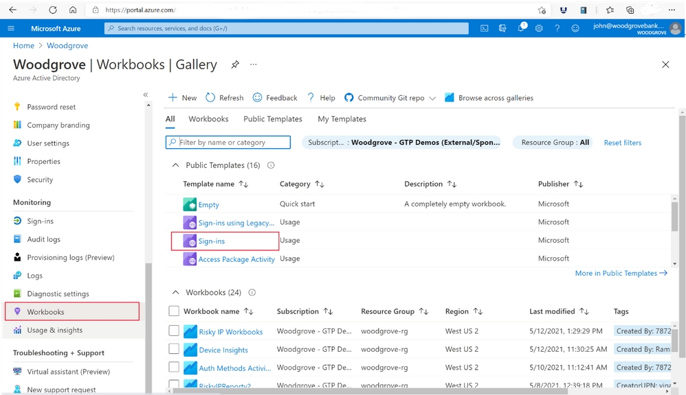

# Microsoft Authentication Library と Microsoft Graph への移行は完了済みでしょうか？

こんにちは、Azure Identity サポート チームの竜と村上です。

本記事は、米国の Azure Active Directory Identity Blog で公開された [Have you updated your applications to use the Microsoft Authentication Library and Microsoft Graph?](https://techcommunity.microsoft.com/t5/azure-active-directory-identity/have-you-updated-your-applications-to-use-the-microsoft/ba-p/1144698) を意訳したものになります。ご不明点等ございましたらサポート チームまでお問い合わせください。

----

皆さん、こんにちは。

2020 年に、アプリケーションを開発する際に [Microsoft Authentication Library (MSAL)](https://docs.microsoft.com/ja-jp/azure/active-directory/develop/msal-overview#languages-and-frameworks) と [Microsoft Graph API](https://docs.microsoft.com/ja-jp/graph/overview) を使用することを、[開発者の皆さまへ推奨しました](https://techcommunity.microsoft.com/t5/azure-active-directory-identity/update-your-applications-to-use-microsoft-authentication-library/ba-p/1257363)。それ以降、MSAL および Microsoft Graph 双方へのパフォーマンス、セキュリティ、信頼性の向上など機能追加に継続して取り組んで参りました。また、[継続的なアクセス評価 (CAE)](https://docs.microsoft.com/ja-jp/azure/active-directory/develop/app-resilience-continuous-access-evaluation) に対応した API や、Microsoft Graph への [条件付きアクセス認証コンテキスト](https://docs.microsoft.com/ja-jp/azure/active-directory/develop/developer-guide-conditional-access-authentication-context) の追加など、数百もの新しい API を追加しました。MSAL を使用している開発者の皆様がこれらを利用できるようになり、[ゼロトラスト対応](https://www.microsoft.com/security/blog/2021/01/19/using-zero-trust-principles-to-protect-against-sophisticated-attacks-like-solorigate/) のアプリケーションを構築できるようになりました。

2022 年 6 月 30 日をもちまして Active Directory Auth Library (ADAL) および Azure Active Directory Graph のサポートを終了するため、MSAL および Microsoft Graph を使用するよう、アプリのアップデートを推奨します。また、まだ ADAL を使用しているアプリを簡単に見つけることができるようにいたしました。

## ADAL と Azure AD Graph をまだ使用しているアプリケーションを特定する

Azure AD Monitor Workbook を使用することで、ADAL を使用しているアプリケーションを特定可能です。Azure AD Monitor workbook は、Azure AD サインイン ログの情報を収集して視覚化する一連のクエリを使用しています。[こちらのサインイン ログ スキーマ](https://docs.microsoft.com/ja-jp/azure/active-directory/reports-monitoring/reference-azure-monitor-sign-ins-log-schema) を使用して、サインイン ログを直接参照することもできます。

ワークブックにアクセスするには:

1. [Azure ポータル](https://portal.azure.com/) にサインインします。
2. **Azure Active Directory** > **監視** > **Workbooks** に移動します。
3. 使用状況のセクションから **サインインの Workbook** を開きます。

 

サインイン Workbook では、ページ下部に新しい表が追加され、最近使用したアプリが ADAL を使用しているかどうかがわかるようになりました。また、これらのアプリの一覧をエクスポートすることもできます。

ADAL を使用しているアプリを特定したら、[MSAL の移行ガイド](https://docs.microsoft.com/ja-jp/azure/active-directory/develop/msal-migration) の活用もご検討ください。Azure AD Graph を使用しているアプリを見つけるには、ソースコード内を "graph.windows.net" という文字列で検索してから、[Microsoft Graph の移行ガイド](https://docs.microsoft.com/ja-jp/graph/migrate-azure-ad-graph-planning-checklist?view=graph-rest-1.0) を使用ください。

ご質問や問題、機能リクエストがございましたら、[azure-ad-adal-deprecation](https://docs.microsoft.com/en-us/answers/topics/azure-ad-adal-deprecation.html) または [azure-ad-graph-deprecation](https://docs.microsoft.com/en-us/answers/topics/azure-ad-graph-deprecation.html) タグを使用して Microsoft Q&A にてお知らせください。

いつものように、ご意見やご提案をお待ちしています。以下のコメント欄または [Azure AD フィードバックフォーラム](https://feedback.azure.com/forums/169401-azure-active-directory)で、ご意見をお聞かせください。

Alex Simons (Twitter: [@Alex_A_Simons](http://twitter.com/alex_a_simons))  
Corporate Vice President of Program Management  
Microsoft Identity Division
