# Azure AD に登録できる 「アプリ」と「リソース」、「API 権限」を理解する

こんにちは、Azure ID チームの埴山です。


本記事は [Azure Tech Advent Calendar](https://qiita.com/advent-calendar/2020/microsoft-azure-tech) 4 日目の記事です。

今回はトラブルシューティングの方法ではなく、Azure AD を利用したアプリケーション開発における、"API 権限" について説明します。特に Microsoft Graph API を題材に API エコシステムの中身を見ていきます。

Azure AD を利用してアプリ開発を検討している方や、Azure AD における OAuth の実装について詳しく知りたい方への記事となります。
チュートリアルなどについては、一通り動かしたことのある方を対象とした記事ですので、Azure AD で保護されたアプリケーション開発の基礎については [Microsoft ID プラットフォームのドキュメント | Microsoft Docs](https://docs.microsoft.com/ja-jp/azure/active-directory/develop/) の公開ドキュメントをご確認ください。

## OAuth と Azure AD

OAuth は「リソース」へのアクセス権を安全に委譲し、API を保護するための「トークン」を発行する仕組みのデファクトスタンダードです。Microsoft では Exchange Online や SharePoint Online といった「リソース」に対するアクセスするための「API」を OAuth の仕組みを使って保護しており、ユーザーは必要な権限を必要に応じて「クライアント」であるアプリに払い出すことが可能です。これらの権限管理を行っているのが Azure AD です。

ここでは OAuth の基礎については説明を省きますが、Azure AD にアプリを登録することで、Microsoft が管理する Azure AD で保護された「リソース」へのアクセスを行う「クライアント」を作成したり、自社で開発した API を「リソース」として登録し Azure AD で保護したりすることができます。リソースへのアクセス権は Azure AD では API のアクセス許可とよばれます。
API のアクセス許可は「トークン」という形で「クライアント」であるアプリに受け渡されます。例えばユーザーが、ユーザー情報を取得できる API のアクセス許可を、クライアントであるアプリに許可することが可能です。アクセス許可を付与されたアプリケーションは、アクセス トークンという
トークンを取得し、ユーザーの情報を取得する API を呼び出すことが可能になります。

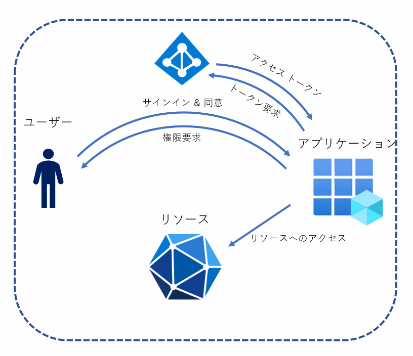

アプリが取得できる権限として、ユーザー委任のアクセス許可と、アプリケーション権限のアクセス許可の二つがあります。前者がユーザーの同意を得て、ユーザーの権限相当のアクセス権を取得できるのに対し、後者は管理者がアプリに権限を付与 (管理者の同意) することで、アプリケーション自身に権限を付与し、アプリ自身が API のアクセス権を得ることができます。

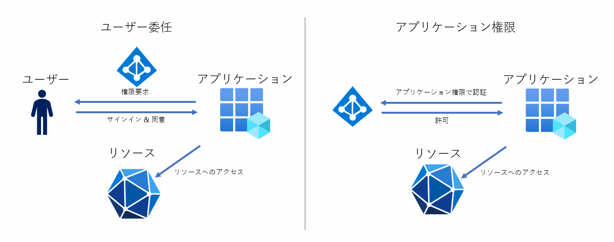


ただし、あくまでここで取得できる権限は API のアクセス許可であり、実際のリソースへのアクセス権はリソースオーナー、つまり Exchange Online や SharePoint Online が管理していることに注意してください。たとえば、あるユーザーがユーザー委任のメールの読み込み権限をアプリに付与したからといって、対象のユーザーがアクセスできないメールボックスの読み込みを行うことはできません。つまり、ユーザーがアクセスできるリソースの範囲は、API のアクセス許可と、リソース側の権限管理の両方で制御されています。

本記事ではこれらの API のアクセス許可の実体について深堀していきます。

## サンプルアプリを動作させる

まずは実際に Microsoft Graph API を呼び出すサンプルを動かし、その動作を見てみましょう。

後程、テナントに同意された権限などを確認するために、テナントのグローバル管理者権限が必要となってきます。そのためサンプルの動作はテストテナントを作成しお試しいただくことをお勧めします。
また今回紹介するアプリの実際の動作のためには [Node.js](https://nodejs.org/en/) のインストールが必要です。

> Microsoft Graph API を呼び出すちょうどいいサンプルが、node.js だったので

### アプリの登録とサンプルのダウンロード

Azure Active Directory > [アプリの登録](https://portal.azure.com/#blade/Microsoft_AAD_IAM/ActiveDirectoryMenuBlade/RegisteredApps) から新規アプリを登録します。

名前は `MS Graph Client Sample` としましょう。


設定はデフォルトのまま作成します。そのまま`クイック スタート`をクリックし、`シングルページ アプリケーション (SPA)` を選択します。

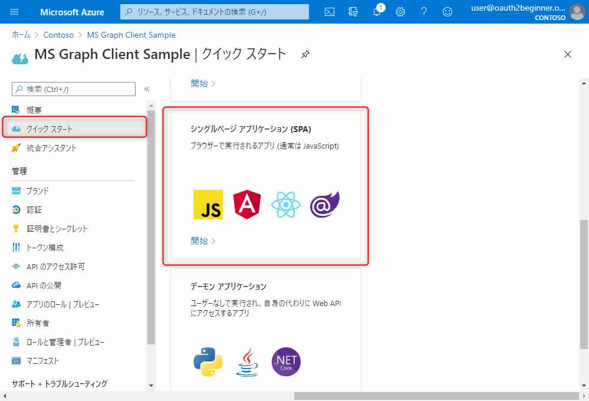

続いて JavaScript (認証コード フロー) を選択します。

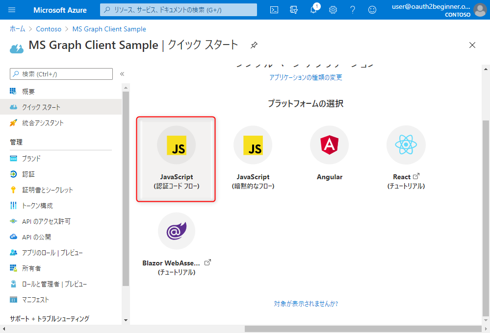

`これらの変更を行います` ボタンをクリックし、サンプルの動作に必要な設定を変更します。

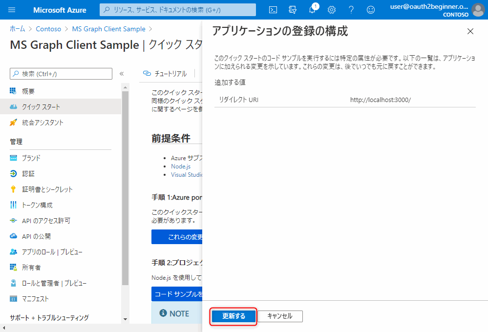

続けてプロジェクトのダウンロードです。 `コード サンプルをダウンロードします` をクリックしダウンロードした zip ファイルを適当な場所に展開します。

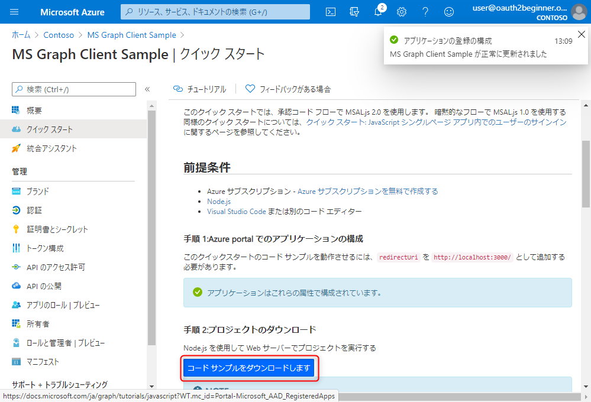

### サンプルの動作

PowerShell を起動し、コードサンプルを展開したフォルダーに移動します。ちなみにエクスプローラーの検索窓に powershell と入力すると、開いているフォルダーから PowerShell を起動できます。


クイック スタートにある通り npm install および npm start コマンドを実行します。

```powershell
npm install
npm start
```

`http://localhost:3000/` でアプリが起動しますので、ブラウザーでアクセスします。

### 動作の確認

`Sign In` ボタンをクリックし、ユーザーの資格情報を入力すると　API のアクセス許可の同意画面が出てきます。


`承諾` をクリックするとこで、サインインが完了します。この際、Azure AD からアプリに対し ID トークンとアクセス トークンが発行されています。

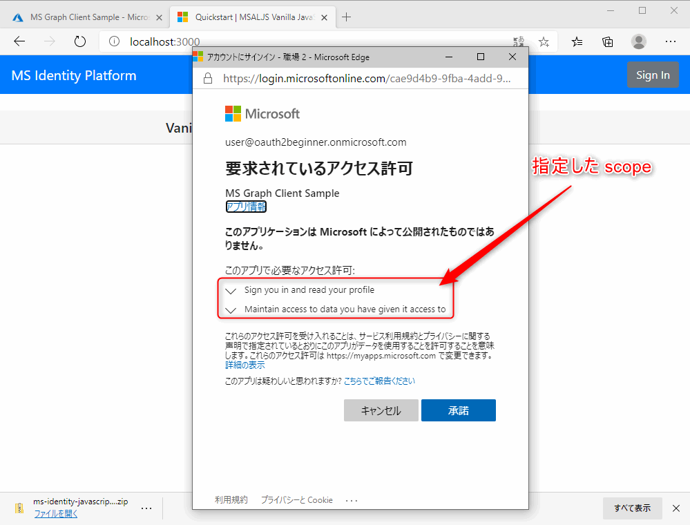

> ※ 今回は ID トークンの詳細や使い道については説明しません。

`See Profile` ボタンをクリックすることで、取得したアクセス トークンを使ってユーザーのプロファイル情報を取得できます。

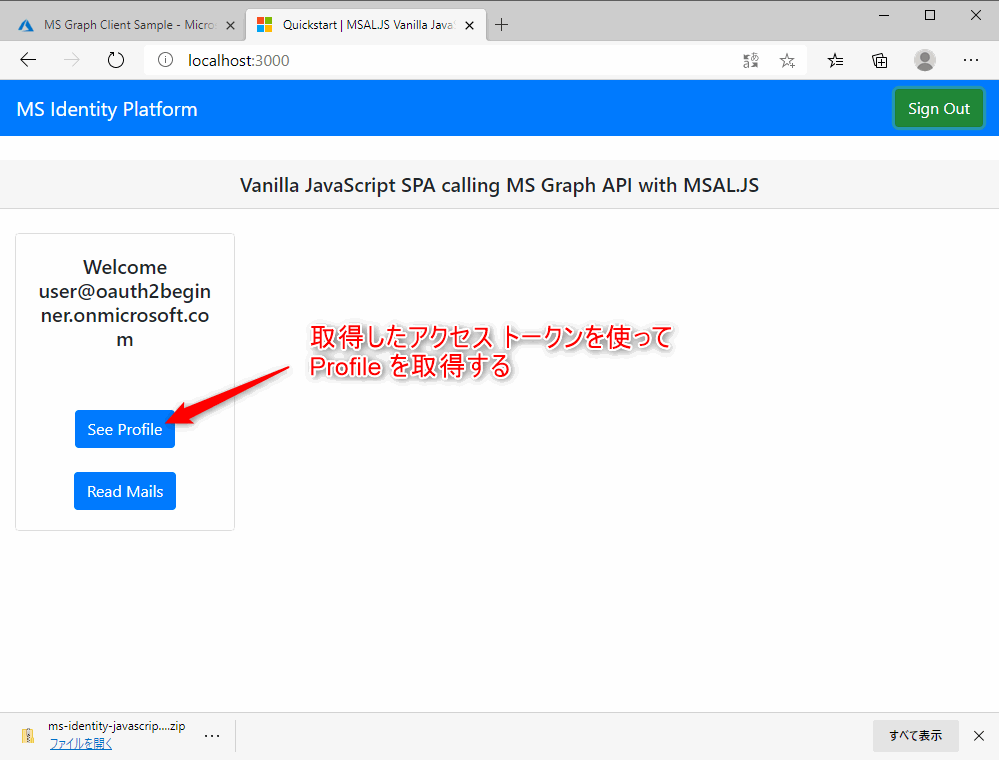
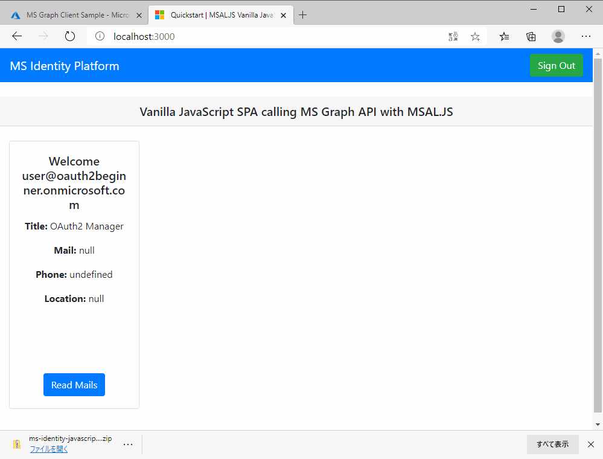

次に `Read Mails` ボタンをクリックしてみましょう。
すると、新たに `Read your mail` の API のアクセス許可を求める同意画面が表示され、`同意` をクリックすることでメールを読み込むためのトークンが取得されます。

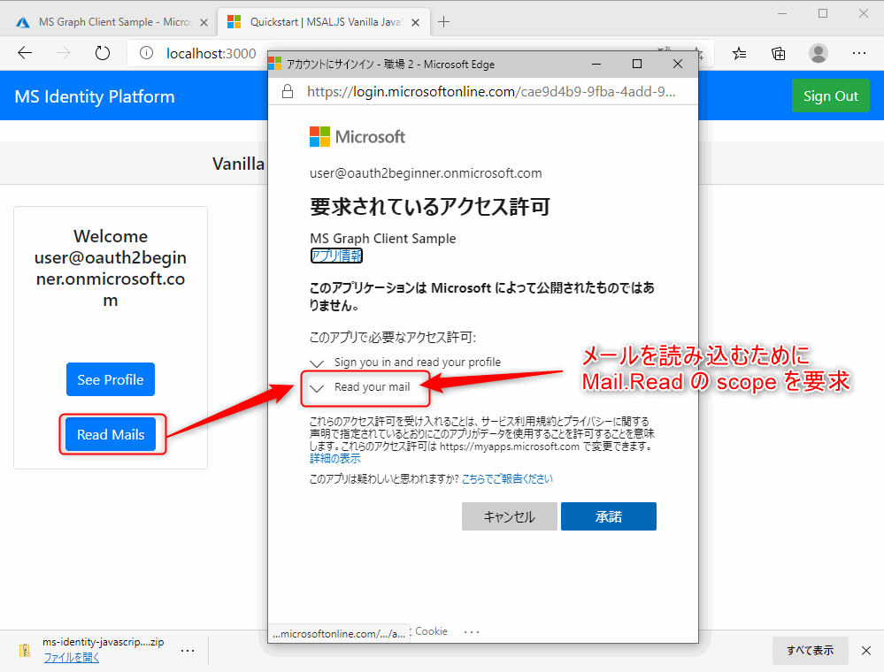

※ テストユーザーは Exchange Online のライセンスを持っていなかったので API の呼び出しには失敗しています。

## 何がおこったのか

これまでの操作をまとめてみましょう。
今回、新しいアプリケーションを Azure AD に登録し、ユーザー プロファイルの表示ができる API のアクセス許可と、メールの読み込みの API のアクセス許可を要求しました。


要求に対しユーザーの同意画面が現れ、同意を行うことでアプリがアクセス トークンを取得できるようになりました。
アプリは取得したアクセス トークンを使って Microsoft Graph API を呼び出し、ユーザー情報やメールの読み込みを行いました。

これらの裏でどのようなことが起こっていたのでしょうか。より詳細に見てみましょう。

### エンタープライズ アプリケーションと API のアクセス許可

ユーザーが作成したクライアント アプリは、Azure ポータルの "アプリの登録" に登録されます。と、同時に API の権限の同意結果を保存する "エンタープライズ アプリケーション" が作成されます。
詳細を確認するために作成したアプリのプロパティに表示される "ローカル ディレクトリでのマネージド アプリケーション" をクリックしてみましょう。(`Azure Active Directory` > `エンタープライズ アプリケーション` と移動し検索しても OK です。)


表示されたサービス プリンシパルの `アクセス許可` を確認します。ユーザー同意のタブを見ると、先ほどユーザーが同意した API のアクセス許可が登録されています。

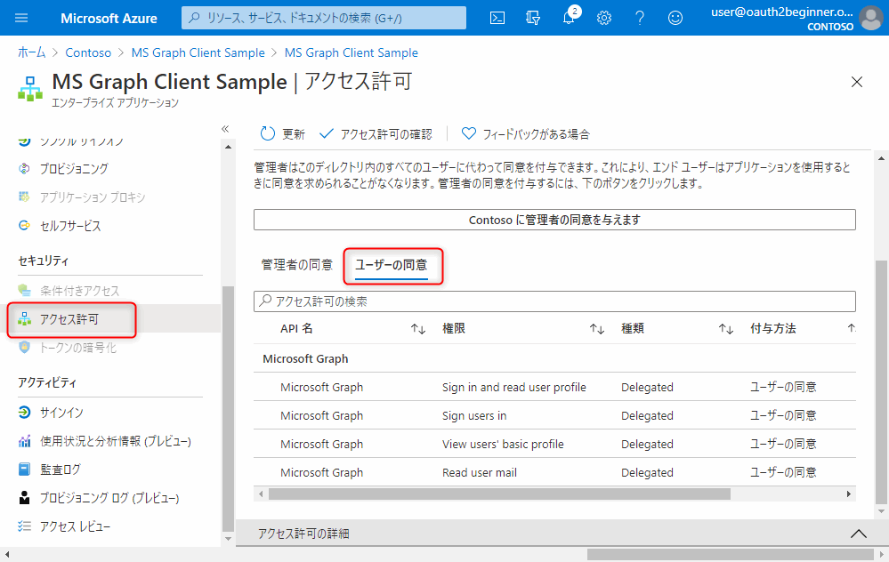

詳細を確認すると、たとえば `User.Read` のスコープに同意済みであることなどが確認できます。

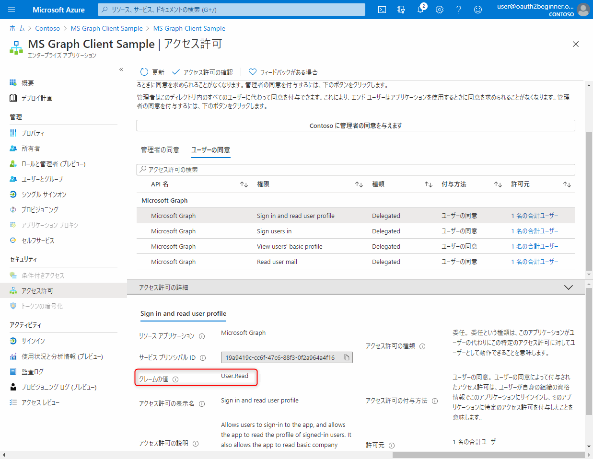

4 つのアクセス許可をよく見てみると、クレームの値が `openid`, `profile`, `User.Read`, `Mail.Read` であることが確認できるかと思います。

### API のアクセス許可と scope

これらの 4 つのクレームの値は何を表しているのでしょうか。

実は先ほどのサインイン時に、アプリケーションは Azure AD の認可エンドポイントに対し、scope を指定し[認可要求 (承認コードを要求)](https://docs.microsoft.com/ja-jp/azure/active-directory/develop/v2-oauth2-auth-code-flow#request-an-authorization-code)を送っていました。
要求するパラメーターはサンプルの `app/authConfig.js` 内で、以下のように指定されています。

```js
// Add here the scopes that you would like the user to consent during sign-in
const loginRequest = {
    scopes: ["User.Read"]
};

// Add here the scopes to request when obtaining an access token for MS Graph API
const tokenRequest = {
    scopes: ["User.Read", "Mail.Read"],
    forceRefresh: false // Set this to "true" to skip a cached token and go to the server to get a new token
};
```

コードを確認していただければわかりますが `loginRequest` がサインイン時に、`tokenRequest` がメール読み込み時に要求される scope です。

> ※ msal.js では loginPopup 呼び出し時、自動で socpe に openid profile を追加するため、最終的に同意した API の権限は、`openid`, `profile`, `User.Read`, `Mail.Read` の 4 つとなります。

つまり、ユーザー委任の API のアクセス許可イコール、scope と呼ばれる単位で管理されていることがわかります。

このようにユーザーがアプリに同意を行うことで、ユーザーの同意情報がサービス プリンシパルに保存され、アプリはユーザーの代わりに API の呼び出しを実施することが可能になるのです。


## Microsoft Graph API

では、ここで同意された `User.Read` のスコープとはなんなのでしょうか。Microsoft Graph API の API のアクセス許可であることはご存じだと思いますが、これらのスコープはどこに定義されて、同意した権限はどのように保存されているのでしょうか。

### OAuthPermissionGrants を確認する

これを理解するためには、Azure AD に登録されたサービス プリンシパルについて確認することが必要です。

先ほど "アプリの登録" からアプリを作成したと思います。その際エンタープライズ アプリケーションも同時に作成されると言いましたが、このエンタープライズ アプリケーションこそがサービス プリンシパルと呼ばれるオブジェクトです。正確にはエンタープライズ アプリケーションがサービス プリンシパルの一種ですが基本的には "サービス プリンシパル" と "エンタープライズ アプリケーション" はほぼ同義だと考えて OK です。

テナントに登録された ["サービス プリンシパル" オブジェクト](https://docs.microsoft.com/ja-jp/graph/api/resources/serviceprincipal?view=graph-rest-1.0) の一覧は、Azure AD PowerShell モジュールや Microsoft Graph API で取得できます。
ここでは [Microsoft Graph PowerShell SDK](https://github.com/microsoftgraph/msgraph-sdk-powershell) を利用して、サービス プリンシパルの一覧を取得してみましょう。

```powershell
Install-Module Microsoft.Graph
Select-MgProfile -Name "v1.0"
```

OAuth の権限を取得するため、`Directory.Read.All` の権限が必要ですので、あらかじめ指定しておきます。この後の Connect-Graph 実行時にはテナントのグローバル管理者でのサインインが必要です。

```powershell
Connect-Graph -Scopes Directory.Read.All
# To sign in, use a web browser to open the page https://microsoft.com/devicelogin and enter the code HMCYSET2L to authenticate. 
# 注: URL にアクセスし、code を入力しグローバル管理者権限でサインインと同意を完了させます。

Get-MgServicePrincipal |Select-Object AppDisplayName, Id, AppId

# AppDisplayName                          Id                                   AppId
# --------------                          --                                   -----
# Microsoft password reset service        11fc006f-2cb4-4f3c-9c43-c3a3d7f76184 93625bc8-bfe2-437a-97e0-3d0060024faa
# Office 365 Configure                    134ad4d8-2e42-46a6-8508-c9585c67b30f aa9ecb1e-fd53-4aaa-a8fe-7a54de2c1334
# Microsoft Graph                         19a9419c-cc6f-47c6-88f3-0f2a964a4f16 00000003-0000-0000-c000-000000000000
# Windows Azure Active Directory          29a26a86-d50a-4b2a-a40a-4c014aa9e416 00000002-0000-0000-c000-000000000000
# MS-PIM                                  2a71ba9d-de5b-4f9a-a9df-73e68bc5ddcf 01fc33a7-78ba-4d2f-a4b7-768e336e890e
# AAD Request Verification Service - PROD 3dd23bd7-8280-490f-984e-616873819772 c728155f-7b2a-4502-a08b-b8af9b269319
# MS Graph Client Sample                  439775c2-70a1-4e08-a3e7-cd39c50e918d 2d6aced0-40ae-4519-a2e5-8e23944fc046
# Windows Azure Service Management API    62fc0cd5-d157-4ee0-befb-877a367210e2 797f4846-ba00-4fd7-ba43-dac1f8f63013
# O365 Demeter                            96909691-743c-49e3-80d4-a5428bd47108 982bda36-4632-4165-a46a-9863b1bbcf7d
# Microsoft.Azure.SyncFabric              a6069499-077b-45a8-9fa2-ac9ca80c5df6 00000014-0000-0000-c000-000000000000
# Microsoft App Access Panel              a6eb38c8-78c9-47cd-981f-2136273824c3 0000000c-0000-0000-c000-000000000000
# Microsoft Graph PowerShell              b42a2cf1-3551-4e3a-bcd7-bf299f12cb3c 14d82eec-204b-4c2f-b7e8-296a70dab67e
# Microsoft.SMIT                          b8a15564-fd40-4802-b2e9-cd5a2ae6715b 8fca0a66-c008-4564-a876-ab3ae0fd5cff
# Azure ESTS Service                      c0a8c459-1611-4405-8f89-4008de7b7988 00000001-0000-0000-c000-000000000000
# Signup                                  c51b3541-6e7a-4aff-8582-729c8174f66d b4bddae8-ab25-483e-8670-df09b9f1d0ea
# Microsoft Graph Change Tracking         d3a24af2-a630-4c87-8d17-013aa3e576e1 0bf30f3b-4a52-48df-9a82-234910c4a086
# MCAPI Authorization Prod                d9c70c10-16ff-4021-a6dc-25916de5a7b9 d73f4b35-55c9-48c7-8b10-651f6f2acb2e
# IAM Supportability                      e2619bb6-17d5-47e4-93e5-4b8fd5a836dd a57aca87-cbc0-4f3c-8b9e-dc095fdc8978
# AzureSupportCenter                      e883ba61-437b-4b80-bee2-f3106fcb9221 37182072-3c9c-4f6a-a4b3-b3f91cacffce
# Azure Portal                            f131b178-6dda-4f79-9247-cc744d946491 c44b4083-3bb0-49c1-b47d-974e53cbdf3c
```

このテナントはテスト用に作成したテナントなので、これだけしか出力されませんが、実際のテナントでは Microsoft が管理しているアプリや、サードパーティー製のアプリ、自社で開発しているアプリなど、大量に出力されると思います。
これらの多くのアプリケーションは Azure ポータルの [エンタープライズ アプリケーション](https://portal.azure.com/#blade/Microsoft_AAD_IAM/StartboardApplicationsMenuBlade/AllApps/menuId/) にも表示されていますが、Microsoft が管理されている一部のサービス プリンシパルはポータルに表示されないものもあります。

今回作成したアプリは `MS Graph Client Sample` ですので、当該のサービス プリンシパル取得しておきます。

```powershell
$myAppSp = Get-MgServicePrincipal -Filter "displayName eq 'MS Graph Client Sample'"
```

次に、先ほど同意を行った API のアクセス許可を取得します。API のアクセス許可は [OAuth2Permissions](https://docs.microsoft.com/ja-jp/graph/api/serviceprincipal-list-oauth2permissiongrants?view=graph-rest-1.0&tabs=http) として保存されているため、以下のコマンドで取得可能です。

```powershell
$oAuth2Permissions = Get-MgServicePrincipalOauth2PermissionGrant -ServicePrincipalId $myAppSp.Id
$oAuth2Permissions | fl *

# ClientId             : 439775c2-70a1-4e08-a3e7-cd39c50e918d
# ConsentType          : Principal
# ExpiryTime           : 2021/05/28 4:12:42
# Id                   : wnWXQ6FwCE6j5805xQ6RjZxBqRlvzMZHiPMPKpZKTxZ1aL_h6m71R6v57ub13Wy-
# PrincipalId          : e1bf6875-6eea-47f5-abf9-eee6f5dd6cbe
# ResourceId           : 19a9419c-cc6f-47c6-88f3-0f2a964a4f16
# Scope                :  User.Read openid profile Mail.Read
# StartTime            : 0001/01/01 0:00:00
# Keys                 : {}
# Values               : {}
# AdditionalProperties : {}
# Count                : 0
```

先ほどのサンプルで同意した API のアクセス許可である User.Read, openid, profile, Mail.Read が表示されています。
また PrincipalId は、先ほど同意処理を実施したユーザーの ObjectId であることが確認できます。

```powershell
Get-MgUser -UserId  e1bf6875-6eea-47f5-abf9-eee6f5dd6cbe

# Id                                   DisplayName Mail UserPrincipalName                   UserType
# --                                   ----------- ---- -----------------                   --------
# e1bf6875-6eea-47f5-abf9-eee6f5dd6cbe user             user@oauth2beginner.onmicrosoft.com Member
```

つまり、この情報から上記ユーザーが、"User.Read, openid, profile, Mail.Read" の権限を、クライアントであるサービス プリンシパル "439775c2-70a1-4e08-a3e7-cd39c50e918d" (MS Graph Client Sample) に委任した、ということが確認できます。
そして、それらの情報は [OAuth2Permissions](https://docs.microsoft.com/ja-jp/graph/api/resources/oauth2permissiongrant?view=graph-rest-1.0) として保存されていることがわかります。

さて、この API 権限 (OAuth2Permissions) ですがサンプルを動作させた皆様なら、"Microsoft Graph API" の権限であることはお分かりかと思います。
では、その情報はどこで確認できるのでしょうか。

OAuth2PermissionGrant の内容を確認すると ResourceId "19a9419c-cc6f-47c6-88f3-0f2a964a4f16" とあります。
この ResourceId を指定し、サービス プリンシパルを取得してみましょう。

```powershell
Get-MgServicePrincipal -ServicePrincipalId 19a9419c-cc6f-47c6-88f3-0f2a964a4f16 | Select-Object DisplayName, AppId

# DisplayName     AppId
# -----------     -----
# Microsoft Graph 00000003-0000-0000-c000-000000000000
```

> ※ 表示される ResourceId はテナントごとに異なります。

### リソースの正体

当たり前といえば当たり前ですが、ResourceId が指示していたのは Microsoft Graph API でした。
そしてその正体は、テナントに登録されている "Microsoft Graph" という名前のサービス プリンシパルなのです。

実は Azure AD の "サービスプリンシパル" は、OAuth の文脈では "クライアント" を表すこともあれば、"リソース" を表すこともあります。(あるいはその両方を表すこともあります)
そして ResourceId に表示されている通り、Microsoft Graph は Azure AD に登録されたリソースとしてのサービス プリンシパルである、ということです。


それでは早速 Microsoft Graph API のリソースを表す、"Microsoft Graph" の "サービスプリンシパル" の中身を見てみましょう。
サービスプリンシパルは先ほどの ResourceId を指定するか、もしくは、Microsoft Graph の AppId は "00000003-0000-0000-c000-000000000000" と決まっているので、以下のようにフィルターしても OK です。

```powershell
$msGraph = Get-MgServicePrincipal -Filter "appId eq '00000003-0000-0000-c000-000000000000'"
```

取得したサービス プリンシパルを確認してみましょう。

```powershell
$msGraph | Format-List *

# AccountEnabled                     : True
# AddIns                             : {}
# AlternativeNames                   : {}
# AppDescription                     :
# AppDisplayName                     : Microsoft Graph
# AppId                              : 00000003-0000-0000-c000-000000000000
# AppOwnerOrganizationId             : f8cdef31-a31e-4b4a-93e4-5f571e91255a
# AppRoleAssignedTo                  :
# AppRoleAssignmentRequired          : False
# AppRoleAssignments                 :
# AppRoles                           : {ba7b8302-40ad-475c-a768-5b990aa1dba1, 57f0b71b-a759-45a0-9a0f-cc099fbd9a44, 673cd
#                                      294-c6eb-43f7-8bc9-cee7da70d759, 107747da-618e-4e26-bcaf-6adac31d8dae...}
# ApplicationTemplateId              :
# ClaimsMappingPolicies              :
# CreatedObjects                     :
# DeletedDateTime                    :
# Description                        :
# DisplayName                        : Microsoft Graph
# Endpoints                          :
# HomeRealmDiscoveryPolicies         :
# Homepage                           :
# Id                                 : 19a9419c-cc6f-47c6-88f3-0f2a964a4f16
# Info                               : Microsoft.Graph.PowerShell.Models.MicrosoftGraphInformationalUrl
# KeyCredentials                     : {}
# LoginUrl                           :
# LogoutUrl                          :
# MemberOf                           :
# Notes                              :
# NotificationEmailAddresses         : {}
# Oauth2PermissionGrants             :
# Oauth2PermissionScopes             : {2884dbf9-deb7-4665-a380-2a5a11805f09, a4633e44-d355-4474-99df-8c2de6b0e39e, 3660b
#                                      e8e-a561-4754-bf45-278f6f4d38f3, ac0981dc-81a3-4a1d-af5b-d664bef4bbf7...}
# OwnedObjects                       :
# Owners                             :
# PasswordCredentials                : {}
# PreferredSingleSignOnMode          :
# PreferredTokenSigningKeyThumbprint :
# ReplyUrls                          : {}
# SamlSingleSignOnSettings           : Microsoft.Graph.PowerShell.Models.MicrosoftGraphSamlSingleSignOnSettings
# ServicePrincipalNames              : {00000003-0000-0000-c000-000000000000/ags.windows.net, 00000003-0000-0000-c000-000
#                                      000000000, https://canary.graph.microsoft.com, https://graph.microsoft.com...}
# ServicePrincipalType               : Application
# Tags                               : {}
# TokenEncryptionKeyId               :
# TokenIssuancePolicies              :
# TokenLifetimePolicies              :
# TransitiveMemberOf                 :
# Keys                               : {createdDateTime, resourceSpecificApplicationPermissions, signInAudience, verified
#                                      Publisher}
# Values                             : {2020-11-29T03:54:06Z, System.Object[], AzureADMultipleOrgs, System.Collections.Ge
#                                      neric.Dictionary`2[System.String,System.Object]}
# AdditionalProperties               : {[createdDateTime, 2020-11-29T03:54:06Z], [resourceSpecificApplicationPermissions,
#                                       System.Object[]], [signInAudience, AzureADMultipleOrgs], [verifiedPublisher, Syst
#                                      em.Collections.Generic.Dictionary`2[System.String,System.Object]]}
# Count                              : 4

```

設定値がいくつか表示されますね。たとえば `PublisherName` は `Microsoft Services` で、`AppOwnerOrganizationId` が `f8cdef31-a31e-4b4a-93e4-5f571e91255a` であるので、Microsoft が管理しているサービス プリンシパルであると判別できます。

ここで今回注目すべきは **[Oauth2PermissionScopes](https://docs.microsoft.com/ja-jp/graph/api/resources/permissionscope?view=graph-rest-1.0)** です。
少し中身を確認してみましょう。

```powershell
$msGraph.Oauth2PermissionScopes | Select-Object Value, UserConsentDescription -First 10

# Value                             UserConsentDescription
# -----                             ----------------------
# SensitiveInfoType.Read.All        Allow the app to get the list of available sensitive types, including out of box a...
# SensitivityLabel.Evaluate         Allow the app to determine if there is any sensitivity label to be applied automat...
# DataLossPreventionPolicy.Evaluate Allow the app to evaluate the inputs provided against the Data Loss Prevention pol...
# SensitiveInfoType.Detect          Allow the app to scan the text in the input to detect the sensitive information ty...
# APIConnectors.ReadWrite.All       Allows the app to read, create and manage the API connectors used in user authenti...
# APIConnectors.Read.All            Allows the app to read the API connectors used in user authentication flows, on yo...
# TeamsTab.ReadWriteForUser         Allows a Teams app to read, install, upgrade, and uninstall all tabs for you.
# TeamsTab.ReadWriteForTeam         Allows a Teams app to read, install, upgrade, and uninstall all tabs to teams you ...
# TeamsTab.ReadWriteForChat         Allows a Teams app to read, install, upgrade, and uninstall all tabs in chats you ...
# ChatMessage.Read                  Allows an app to read one-to-one or group chat messages in Microsoft Teams, on you...
```

そうです、もうお分かりですね。Microsoft Graph API の scope 一覧は、この Oauth2PermissionScopes に定義されています。
ちなみに `User.Read` 権限は、ユーザーをアプリにサインインさせ、プロファイルを表示させる権限と定義されています。

```powershell
$ $msGraph.Oauth2PermissionScopes | ?{ $_.Value -eq "User.Read"}  | Select-Object Value, UserConsentDescription

Value     UserConsentDescription
-----     ----------------------
User.Read Allows you to sign in to the app with your organizational account and let the app read your profile. It al...
```

Microsoft Graph API のアクセス許可の一覧は、[Microsoft Graph のアクセス許可のリファレンス - Microsoft Graph | Microsoft Docs](https://docs.microsoft.com/ja-jp/graph/permissions-reference) にあります。
ユーザー権限の API のアクセス許可、すなわち scope はこのうち委任されたアクセス許可に該当します。


<!-- 
API を呼び出す際の動作をブラウザーの開発者ツール (F12 で起動し、`See Profile` ボタンクリック時の通信を Network タブを確認します) で見てみると、アクセストークンの値を確認できます。あるいは JavaScript のデバッグ ツールで、トークンの値を確認してもよいでしょう。

Authorization ヘッダーに付与されたアクセス トークンの値をコピーし、[https://jwt.ms](https://jwt.ms) に張り付けると、トークンの scp (scope) として `Mail.Read` `openid` `profile` `User.Read` `email` が含まれていることが確認できます。

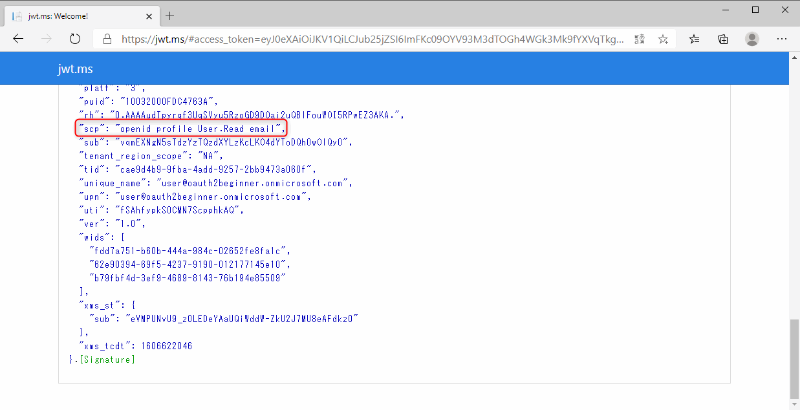

今回アプリ内で呼び出した、[ユーザーの取得 API](https://docs.microsoft.com/ja-jp/graph/api/user-get?view=graph-rest-1.0&tabs=http) は、最低限 `User.Read` のユーザー委任の権限が必要ですので、`User.Read` のスコープが含まれたアクセス トークンを提示すれば API にアクセスができるようになります。 -->

### ユーザー委任の API のアクセス許可のまとめ

Microsoft Graph API をユーザー委任の権限で呼び出すアプリを実装しました。
アプリは scope と呼ばれる単位で、ユーザーに API のアクセス許可の同意を要求し、ユーザーが同意することでそれらのアクセス許可を委任されます。

ユーザーの同意済みスコープはエンタープライズ アプリケーション (サービス プリンシパル) に保存されますが、これらのスコープはもともと Microsoft Graph のサービス プリンシパルに OAuth2PermissionScopes として定義されています。
API の呼び出しに必要な scope を含むアクセス トークンを取得することで、Microsoft Graph API を呼び出すことができました。

## アプリケーションのアクセス許可

ここまではユーザー委任のアクセス許可について説明しましたが、アプリケーションのアクセス許可についても少し説明します。とはいえ、ユーザー委任の権限に比べると少しシンプルです。

ユーザー委任の権限は、scope という単位で、アクセス時にユーザーに同意を求める動作でした。  
それに対し、アプリケーションのアクセス許可はアプリの作成時に事前に定義を行います。

### アプリケーションを作成し、アクセス許可を付与する

アプリケーションのアクセス許可の付与方法については、以前ブログで [ユーザーの最終サインイン日時を取得するスクリプト](https://github.com/jpazureid/get-last-signin-reports/tree/use-signin-activity-beta-api) を紹介しましたので、こちらをサンプルとして利用します。

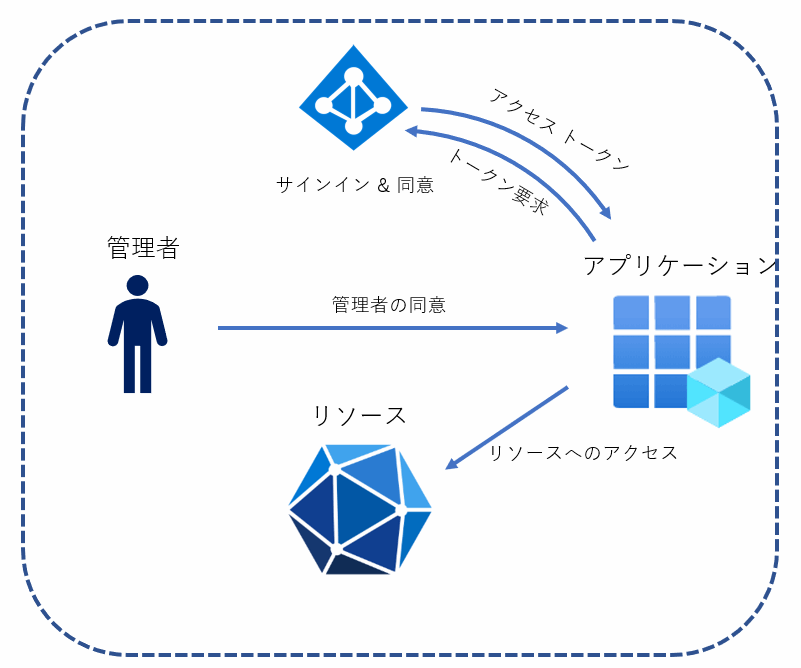

上記サンプルでは、`User.Read.All` と `AuditLog.Read.All` のアプリケーションのアクセス許可をアプリに付与し、管理者の同意を実施していました。

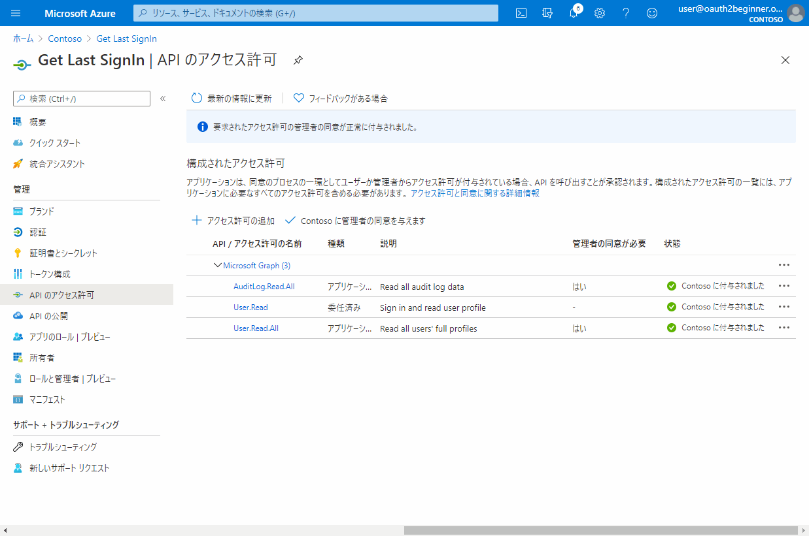

そしてアプリは保存されたクライアント シークレットや証明書を利用し、Microsoft Graph API を呼び出すためのアクセス トークンを取得しています。

### アプリケーションの権限を付与することで何が起きたのか

先ほどと同様に、クライアントとして登録したアプリのサービス プリンシパルを確認してみましょう。
アクセス許可を確認すると、種類が Application となっており、クレームの値は User.Read.All となっています。また、付与方法が "管理者の同意" となっていることも確認できます。


つまり、今回も User.Read.All の scope に同意したということなのでしょうか。


先ほどと同じように、同意済みの scope を Get-MgOauth2PermissionGrant コマンドで確認してみましょう。

```powershell
$myAppSp = Get-MgServicePrincipal -Filter "displayName eq 'Get Last SignIn'"
$oAuth2Permissions = Get-MgServicePrincipalOauth2PermissionGrant -ServicePrincipalId $myAppSp.Id
$oAuth2Permissions | fl *

# ClientId             : 383b27b3-1525-4362-a92b-4ca0625ff497
# ConsentType          : AllPrincipals
# Id                   : syc7OCUVYkOpK0ygYl_0l5xBqRlvzMZHiPMPKpZKTxY
# PrincipalId          :
# ResourceId           : 19a9419c-cc6f-47c6-88f3-0f2a964a4f16
# Scope                : User.Read
# Keys                 : {}
# Values               : {}
# AdditionalProperties : {}
# Count                : 0
```

残念ながら、デフォルトで設定されている `User.Read` ※ のユーザー権限のアクセス許可のみが表示されており、`User.Read.All` や `AuditLog.Read.All` のアクセス許可は見当たりません。

> ※ デフォルトで設定されている `User.Read` のアクセス許可は、サインインログの取得に特に必要ない権限ですが特に削除の必要もないため削除しておりませんでした。ユーザー委任のアクセス許可にもこのように管理者の同意ができます。

### アプリケーション権限の正体

結論を述べると、アプリケーション権限の正体は scope ではありません。
アプリケーション権限のアクセス許可は AppRole であり、同意済みの権限は [AppRoleAssignments](https://docs.microsoft.com/ja-jp/graph/api/serviceprincipal-list-approleassignedto?view=graph-rest-1.0&tabs=http) と呼ばれ PowerShell だと以下のコマンドで取得できます。


```powershell
$appRoleAssignments = Get-MgServicePrincipalAppRoleAssignment -ServicePrincipalId $myAppSp.Id
$appRoleAssignments | fl *

# AppRoleId            : df021288-bdef-4463-88db-98f22de89214
# CreatedDateTime      : 2020/11/29 13:11:35
# DeletedDateTime      :
# Id                   : syc7OCUVYkOpK0ygYl_0l4kLNbV1-qFJl5eXj-YK7xo
# PrincipalDisplayName : Get Last SignIn
# PrincipalId          : 383b27b3-1525-4362-a92b-4ca0625ff497
# PrincipalType        : ServicePrincipal
# ResourceDisplayName  : Microsoft Graph
# ResourceId           : 19a9419c-cc6f-47c6-88f3-0f2a964a4f16
# Keys                 : {}
# Values               : {}
# AdditionalProperties : {}
# Count                : 0
# 
# AppRoleId            : b0afded3-3588-46d8-8b3d-9842eff778da
# CreatedDateTime      : 2020/11/29 13:11:35
# DeletedDateTime      :
# Id                   : syc7OCUVYkOpK0ygYl_0l714yGEg10ZHlHTmMMwK0Cc
# PrincipalDisplayName : Get Last SignIn
# PrincipalId          : 383b27b3-1525-4362-a92b-4ca0625ff497
# PrincipalType        : ServicePrincipal
# ResourceDisplayName  : Microsoft Graph
# ResourceId           : 19a9419c-cc6f-47c6-88f3-0f2a964a4f16
# Keys                 : {}
# Values               : {}
# AdditionalProperties : {}
# Count                : 0
```

先ほどと同じように、ResourceId `19a9419c-cc6f-47c6-88f3-0f2a964a4f16` の Microsoft Graph の権限が 2 つ現れました。
おそらくどちらかが `User.Read.All` で、どちらかが `AuditLog.Read` のはずなのですが、これらの情報からどうやって確認すればよいのでしょうか。

もちろん、これらの値は Microsoft Graph のサービス プリンシパルに定義されています。
実ははアプリケーションの権限の API のアクセス許可は [AppRole](https://docs.microsoft.com/en-us/graph/api/resources/approle?view=graph-rest-1.0) として定義されています。

```powershell
$msGraph = Get-MgServicePrincipal -ServicePrincipalId 19a9419c-cc6f-47c6-88f3-0f2a964a4f16
$msGraph.AppRoles| Select-Object Value, Id, DisplayName -First 10

# Value                             Id                                   DisplayName
# -----                             --                                   -----------
# DataLossPreventionPolicy.Evaluate ba7b8302-40ad-475c-a768-5b990aa1dba1 Evaluate Data Loss Prevention policy
# SensitivityLabel.Evaluate         57f0b71b-a759-45a0-9a0f-cc099fbd9a44 Evaluate sensitivity labels
# SensitiveInfoType.Detect          673cd294-c6eb-43f7-8bc9-cee7da70d759 Detect sensitive information types
# SensitiveInfoType.Read.All        107747da-618e-4e26-bcaf-6adac31d8dae Read available sensitive information types
# APIConnectors.ReadWrite.All       1dfe531a-24a6-4f1b-80f4-7a0dc5a0a171 Read and write API connectors for authenticat...
# APIConnectors.Read.All            b86848a7-d5b1-41eb-a9b4-54a4e6306e97 Read API connectors for authentication flows
# TeamsTab.ReadWriteForUser.All     425b4b59-d5af-45c8-832f-bb0b7402348a Allow the app to manage all tabs for all users
# TeamsTab.ReadWriteForTeam.All     6163d4f4-fbf8-43da-a7b4-060fe85ed148 Allow the Teams app to manage all tabs for al...
# TeamsTab.ReadWriteForChat.All     fd9ce730-a250-40dc-bd44-8dc8d20f39ea Allow the Teams app to manage all tabs for al...
# ChatMessage.Read.All              b9bb2381-47a4-46cd-aafb-00cb12f68504 Read all chat messages
```

Id からアクセス許可の値を逆引きすると、アプリに割り当てられた AppRole の権限を確認することができます。

```powershell
$appRoleId = $appRoleAssignments | %{ $_.AppRoleId }
$msGraph.AppRoles| ?{ $appRoleId.Contains($_.Id) } | Select-Object Value, Id, DisplayName

# Value             Id                                   DisplayName
# -----             --                                   -----------
# AuditLog.Read.All b0afded3-3588-46d8-8b3d-9842eff778da Read all audit log data
# User.Read.All     df021288-bdef-4463-88db-98f22de89214 Read all users' full profiles
```

<!-- アクセス ログを取得するスクリプトの中で、アクセス トークンを出力し、[jwt.ms](https://jwt.ms) に張り付けると、roles (AppRoles) として、`User.Read.All` と `AuditLog.Read.All` が含まれていることが確認できます。

 -->

### アプリケーション権限の API のアクセス許可まとめ

まとめると、アプリケーション権限のアクセス許可は、AppRole として定義されていることを確認しました。
アプリケーション オブジェクトに API のアクセス許可を設定し、管理者の同意を行うことでサービス プリンシパルに AppRoleAssignment として許可された API のアクセス許可が保存されます。

そしてアクセス トークンには roles として、API のアクセス許可が含まれ、Microsoft Graph API ではこのクレームをもとに、API アクセスを制御できることを確認しました。

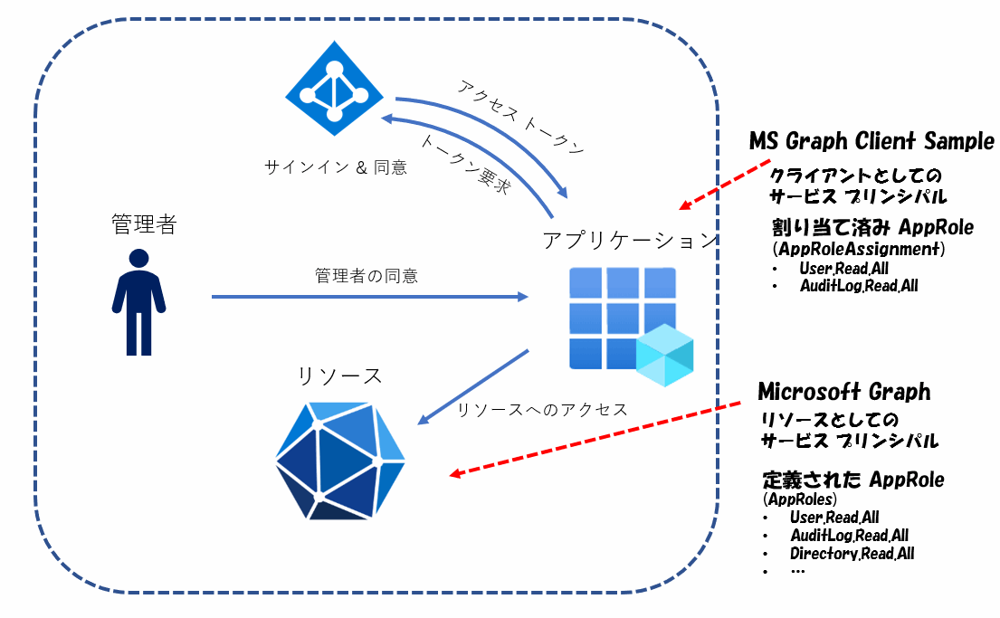


## Nest Step

ここまでは、Microsoft Graph API の scope と AppRole について解説をしてきましたが、Microsoft ID プラットフォームでは独自の API を作成し、Azure AD で保護することも可能です。

Azure AD 上にリソースとしてのアプリを登録し、scope や AppRole を定義することにより、自社の API を Azure AD の ID エコシステムを利用し保護することが可能です。つまり、Azure AD 上で特定のユーザーのみがアクセス可能なように制御したり、条件付きアクセスポリシーで不正なアクセスから保護するといったことが可能になります。

### サンプルアプリ

Azure AD で API を保護するには、API 用のアプリを登録し、scope や AppRole を定義します。
API 側では MSAL ライブラリを利用することにより、提示されたアクセス トークンを検証し、正規のトークンを所持するユーザー以外のアクセスをブロックすることが可能です。

具体的なサンプルは [クイックスタート: Microsoft ID プラットフォームによって保護されている ASP.NET Web API を呼び出す](https://docs.microsoft.com/ja-jp/azure/active-directory/develop/quickstart-v2-dotnet-native-aspnet) をご参照ください。また [各種言語のサンプル](https://github.com/Azure-Samples?q=webapi&type=&language=) は GitHub に公開されているか探してみてください。

今回は JavaScript の [API サンプル](https://github.com/Azure-Samples/active-directory-javascript-nodejs-webapi-v2)を動かし、先ほど作った MS Graph Client Sample から独自の API を呼び出してみます。
最終的な構成は以下のようなイメージです。


### アプリの登録

まずはクライアント アプリ同様に、アプリの登録画面から API を登録します。


#### scope の登録

scope つまり、OAuth2Permissions つまり、ユーザー委任のアクセス許可は API の公開から登録します。
scope を登録するには、事前にアプリケーション ID の URI (Identifier) を設定します。これは OAuth の audience (aud)、リソースを表す識別子となります※。例えば Microsoft Graph API では "https://graph.microsoft.com" です。

この値はグローバルで一意である必要があり、初期設定では "api://appid" です。

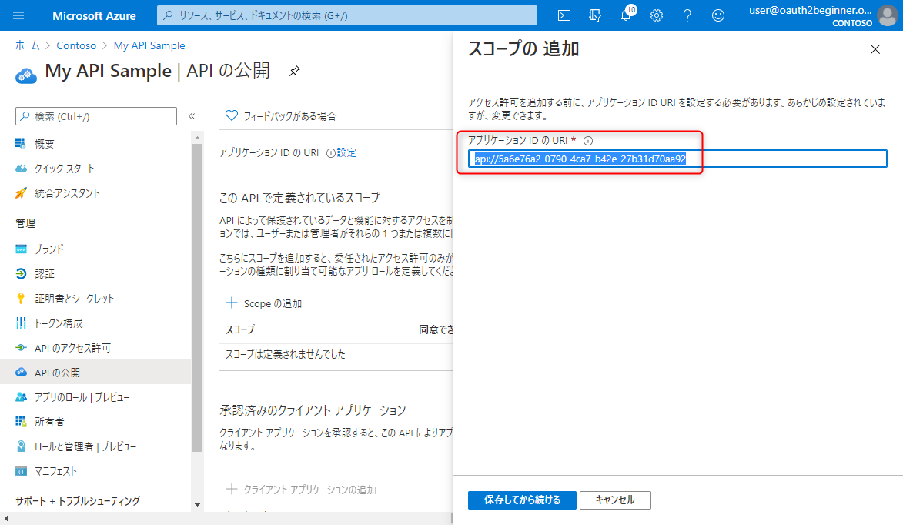

> ※ アクセス トークン (V2) に含まれる aud の値はアプリケーション ID で固定です

スコープ名は Microsoft Graph API に倣って XXX.Read のように設定しましたがアプリの構成に従い好きな名前をつけて OK です。細かいスコープを切らない場合、Microsoft のサービスでは "user_impersonation" がよく利用されます。


`スコープの追加` をクリックすると、スコープが追加されます。


scope を指定する際には、本来このアプリケーション ID の URI と scope の値を `/` でつなげて指定する必要があります。今回の例では "api://5a6e76a2-0790-4ca7-b42e-27b31d70aa92/Data.Read" が指定すべき scope の値になります。

> scope の指定時にアプリケーション ID の URI を省略すると暗黙的に "https://graph.microsoft.com" が指定されます。
#### AppRole の追加

実は AppRole の設定は最近 Azure ポータルから行えるようになりました。
`アプリのロール (プレビュー) ` にアクセスし、`アプリ ロールの作成`をクリックします。

アプリケーションに付与できる権限を定義する場合には、`許可されたメンバーの種類` を "アプリケーション" か、"両方" を選択します。
なぜ、アプリケーション権限の実態である Role をユーザーに対しても割り当てられるんだと思われるかもしれませんが、実はアプリケーションの AppRole だけでなく、ユーザーの AppRole を Azure AD に定義することもできます。[アプリ ロールを追加してトークンから取得する](https://docs.microsoft.com/ja-jp/azure/active-directory/develop/howto-add-app-roles-in-azure-ad-apps) により詳細が記載されているので、ロールベースのアクセス許可を Azure AD で実現されたい方はご覧ください。


このように、AppRole についても Azure ポータルから設定が可能となっています。

> 2020/12/4 現在 日本語の表示に不具合があり、ロールが有効でも "無効" と表示されてしまっています。

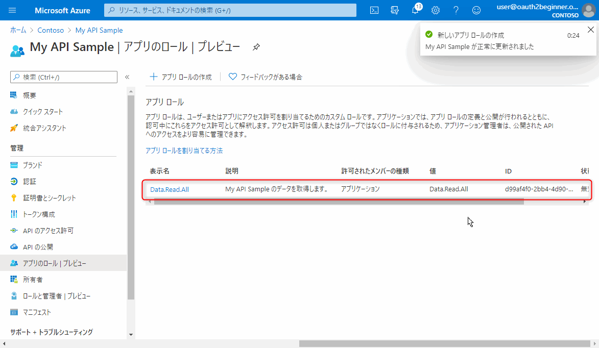


`マニフェスト` に移動し、後の動作確認のために accessTokenAcceptedVersion を 2 に設定し、保存します。
AppRole についてもマニフェストを確認することで、実際に有効になっているか確認できますので、不安な方はこちらをご覧ください。


### 動作の確認

最後に、定義した API のアクセス許可の動作を確認してみます。

#### クライアントの修正

まず自作の API を呼び出すためのアクセス トークンを取得します。アプリケーション権限の付与方法は、Graph API の場合と同じく、API のアクセス許可からアプリケーション権限の API を選択するだけですので省略します。

ユーザー権限のアクセス許可については、クイックスタートのサンプル (MS Graph Client Sample) を改造して呼び出しのイメージをつかんでみましょう。
いくつか修正点があるので順に説明します。

まずは、`authConfig.json` に `myAPITokenRequest` オブジェクトを作成しましょう。もともとの `tokenRequest` の scopes を "api://5a6e76a2-0790-4ca7-b42e-27b31d70aa92/Data.Read" に変更するだけです。

authConfig.json
```js
// my api token request
const myAPITokenRequest = {
    scopes: ["api://5a6e76a2-0790-4ca7-b42e-27b31d70aa92/Data.Read"],
    forceRefresh: false // Set this to "true" to skip a cached token and go to the server to get a new token
};
```

API 呼び出し部分は、callMSGraph メソッドを流用し、`http://localhot:5000/api` を呼び出します。

authPopup.js
```js
function callMyAPI() {
    getTokenPopup(myAPITokenRequest).then(response => {
        callMSGraph("http://localhost:5000/api", response.accessToken, updateUI);
    }).catch(error => {
        console.error(error);
    });
}
```

ui.js と index.html にもコードを追加します。

ui.js
```js
    if (endpoint === graphConfig.graphMeEndpoint) {
        const title = document.createElement('p');
        title.innerHTML = "<strong>Title: </strong>" + data.jobTitle;
        const email = document.createElement('p');
        email.innerHTML = "<strong>Mail: </strong>" + data.mail;
        const phone = document.createElement('p');
        phone.innerHTML = "<strong>Phone: </strong>" + data.businessPhones[0];
        const address = document.createElement('p');
        address.innerHTML = "<strong>Location: </strong>" + data.officeLocation;
        profileDiv.appendChild(title);
        profileDiv.appendChild(email);
        profileDiv.appendChild(phone);
        profileDiv.appendChild(address);

    } else if (endpoint === graphConfig.graphMailEndpoint) {
        if (data.value.length < 1) {
            alert("Your mailbox is empty!")
        } else {
            const tabList = document.getElementById("list-tab");
            tabList.innerHTML = ''; // clear tabList at each readMail call
            const tabContent = document.getElementById("nav-tabContent");

            data.value.map((d, i) => {
                // Keeping it simple
                if (i < 10) {
                    const listItem = document.createElement("a");
                    listItem.setAttribute("class", "list-group-item list-group-item-action")
                    listItem.setAttribute("id", "list" + i + "list")
                    listItem.setAttribute("data-toggle", "list")
                    listItem.setAttribute("href", "#list" + i)
                    listItem.setAttribute("role", "tab")
                    listItem.setAttribute("aria-controls", i)
                    listItem.innerHTML = d.subject;
                    tabList.appendChild(listItem)

                    const contentItem = document.createElement("div");
                    contentItem.setAttribute("class", "tab-pane fade")
                    contentItem.setAttribute("id", "list" + i)
                    contentItem.setAttribute("role", "tabpanel")
                    contentItem.setAttribute("aria-labelledby", "list" + i + "list")
                    contentItem.innerHTML = "<strong> from: " + d.from.emailAddress.address + "</strong><br><br>" + d.bodyPreview + "...";
                    tabContent.appendChild(contentItem);
                }
            });
        }
    //追加
    } else if(endpoint === "http://localhost:5000/api"){
        const apiResponseDiv = document.getElementById("api-response-div");
        apiResponseDiv.innerHTML = JSON.stringify(data);
    }
```

index.html
```html
        <button class="btn btn-primary" id="seeProfile" onclick="seeProfile()">See Profile</button>
        <br>
        <br>
        <button class="btn btn-primary" id="readMail" onclick="readMail()">Read Mails</button>
        <br>
        <br>
        <button class="btn btn-primary" id="callMyAPI" onclick="callMyAPI()">Call MyAPI</button>
        <br>
        <br>
        <div id="api-response-div"></div>
```

これでクライアント部分の実装は終了です。
#### API の実装

API では提示されたトークンが正規のものか、署名を検証し、必要なクレームの値 (例えば aud など) が含まれているかを検証する必要があります。
定義した API を保護するためのサンプルとしては、JavaScript の Passport を利用した以下のものを利用します。

- [Azure-Samples/active-directory-javascript-nodejs-webapi-v2: A small Node.js Web API that is protected with Azure AD v2.0 to validate access tokens and accepts authorized calls.](https://github.com/Azure-Samples/active-directory-javascript-nodejs-webapi-v2)

config.json を以下のように修正します。

```json
    "credentials": {
        "tenantID": "cae9d4b9-9fba-4add-9257-2bb9473a060f", //テナント ID
        "clientID": "2d6aced0-40ae-4519-a2e5-8e23944fc046", //MS Graph Client Sample のアプリケーション ID
        "audience": "5a6e76a2-0790-4ca7-b42e-27b31d70aa92" //My API Sample のアプリケーション ID
    },
    "resource": {
        "scope": ["Data.Read"] //My API で作成した scope の値
    },
```

修正後、以下のコマンドで API を起動します。正常に起動できれば http://localhost:5000 で API サーバーが動き出します。

```sh
npm install
npm start
```

#### 動作確認

最後に http://localhost:3000 にアクセスして、アプリにサインインしましょう。`Call MyAPI` をクリックすると先ほど定義した scope に同意するよう求められます。

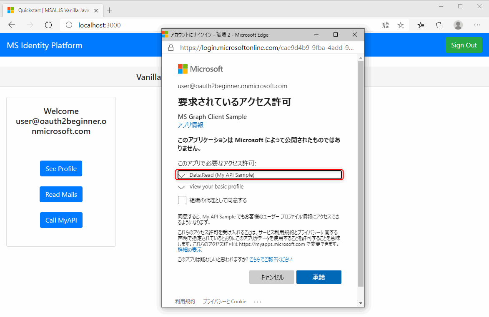

承諾をクリックすると、`http://localhost:5000/api` の API を呼び出すためのトークンが取得され、無事 API を呼び出すことに成功します。

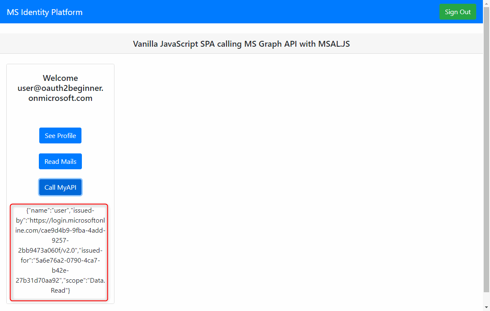

最終的な構成はこのようなイメージです。


## まとめ

今回は Microsoft Graph API を呼び出すサンプルと、独自の API を定義することで、Azure AD 上で OAuth の scope や AppRole の定義方法やその実体を見てみました。チュートリアルをこなすだけでは見えてこない詳細なイメージがつかめたのではないでしょうか。

スコープや AppRole について理解することは、独自のアプリを実装するときだけでなく Microsoft が提供する API を利用する際にも非常に役に立つと思います。

さらに、独自のアプリを実装するに当たっては、[Azure AD のシングルテナント アプリとマルチテナント アプリ](https://docs.microsoft.com/ja-jp/azure/active-directory/develop/single-and-multi-tenant-apps) の違いを理解したり、Microsoft が推奨する[ベストプラクティスのチェックリスト](https://docs.microsoft.com/ja-jp/azure/active-directory/develop/identity-platform-integration-checklist)を確認したりするのがよいと思います。

皆様もぜひ、Azure AD を利用したセキュアなアプリ開発を実践してみてください。
